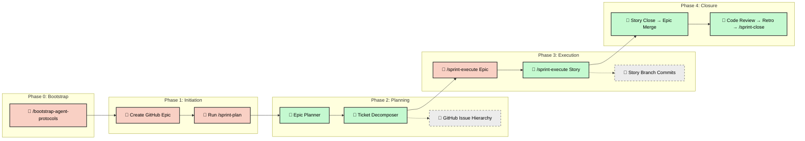

# Software Development Life Cycle (SDLC) Workflow

Version 5 uses **Epic-Centric GitHub Orchestration** — a ticketing-native
approach where GitHub Issues, Labels, and Projects V2 serve as the Single Source
of Truth. No local playbooks, no sprint directories, no JSON state files.

---

## Core Principles

- **GitHub as SSOT**: All project logic, work breakdown, and task status lives
  in GitHub Issues. No local state files.
- **Provider Abstraction**: Orchestration flows through `ITicketingProvider`, an
  abstract interface with a shipped GitHub implementation.
- **Story-Level Branching**: All Tasks within a Story execute sequentially on a
  shared `story/` branch, minimizing branch proliferation and merge conflicts.
- **Agentic Autonomy**: Planning and execution are decoupled. Agents pick up
  tasks from the backlog, implement on Story branches, and sync state back to
  GitHub in real-time.
- **Human-in-the-Loop (HITL)**: Humans define the vision (Epics), trigger
  planning, and approve high-risk tasks. Everything else is autonomous.

---

## End-to-End Process



---

## Phase 0: Bootstrap (One-Time Setup)

Before running any sprint workflows, bootstrap your GitHub repository to create
the labels and project fields the orchestration engine depends on.

1. **Configure**: Copy `.agents/default-agentrc.json` to `.agentrc.json` at your
   project root and fill in the `orchestration` block (owner, repo, etc.).
2. **Authenticate**: Ensure a valid GitHub token is available (see the
   Authentication section in [README.md](README.md)).
3. **Run bootstrap**: Execute `/bootstrap-agent-protocols` (or
   `node .agents/scripts/bootstrap-agent-protocols.js`). This idempotently
   creates 24 labels and optional GitHub Project V2 fields.

> [!NOTE] Bootstrap only needs to run once per repository. It is safe to re-run
> — existing labels and fields are skipped.

---

## Phase 1: Initiation (Human)

The product lead defines the objective by creating a GitHub Issue labeled
`type::epic`.

1. **Write the Epic**: Clear, plain-English description of the goal and scope.
1. **Trigger planning**: Run `/sprint-plan [EPIC_ID]` in the agentic IDE.

---

## Phase 2: Planning (Autonomous)

The framework reads the Epic and autonomously builds the entire work breakdown.

1. **Epic Planner** (`epic-planner.js`):
   - Synthesizes the Epic body with project documentation.
   - Generates a **PRD** (`context::prd`) and **Tech Spec**
     (`context::tech-spec`) as linked GitHub Issues.

1. **Ticket Decomposer** (`ticket-decomposer.js`):
   - Recursively decomposes specs into a 4-tier hierarchy:

     ```text
     Epic (type::epic)
     ├── PRD (context::prd)
     ├── Tech Spec (context::tech-spec)
     ├── Feature (type::feature)
     │   ├── Story (type::story)
     │   │   ├── Task (type::task)     ← atomic agent work unit
     │   │   │   ├── - [ ] subtask 1
     │   │   │   └── - [ ] subtask 2
     │   │   └── Task (type::task)
     │   └── Story (type::story)
     └── Feature (type::feature)
     ```

   - **Wiring**: Each ticket is linked using `blocked by #NNN` syntax and
     GitHub's native sub-issues API.
   - **Metadata**: Each Task is stamped with persona, model recommendations,
     estimated files, and agent prompts.

1. **Roadmap Update**: `generate-roadmap.js` detects the new Epic/Features and
   updates `docs/ROADMAP.md`.

---

## Phase 3: Execution (Agentic)

Execution is driven by the **Dispatcher** and **Context Hydrator**, optimized
for **Story-level grouping** to minimize integration friction.

### Story-Centric Branching

Unlike legacy models where every Task lives on its own branch, Version 5 uses
**shared Story branches**:

- **Format**: `story/epic-[EPIC_ID]/[STORY_SLUG]`
- **Goal**: Minimize merge conflicts and consolidation waves by grouping related
  tasks on the same context slice.
- **Model Tiering**: Stories labeled `complexity::high` automatically upgrade
  all child tasks to `model_tier: high`. Standard stories use `fast` prompts.

### Dispatch

`/sprint-execute [EPIC_ID]` builds the dependency DAG across all Stories and
identifies the current "wave" of executable work. It outputs a dispatch manifest
with progress bars and completion checkboxes.

### Story Execution Lifecycle

When the operator picks a Story from the manifest, the following automated
lifecycle executes:

1. **Initialization** (`sprint-story-init.js`):
   - Verifies all upstream dependencies are satisfied.
   - Syncs the Epic base branch with `main`.
   - Creates or checks out the Story branch.
   - Transitions child Tasks to `agent::executing`.

2. **Task Implementation**: The agent executes each Task sequentially on the
   shared Story branch, committing after each Task completion.

3. **Closure** (`sprint-story-close.js`):
   - Runs shift-left validation (lint, format, test).
   - Merges the Story branch into the Epic base branch.
   - Transitions Tasks → `agent::done`, cascades to Story → Feature.
   - Cleans up the merged Story branch.

### Context Hydration

When an agent runs `/sprint-execute #[STORY_ID]`, the Context Hydrator assembles
a self-contained prompt:

1. `agent-protocol.md` (universal rules)
1. Persona and skill directives (from Task labels)
1. Hierarchy context (Story → Feature → Epic → PRD → Tech Spec)
1. **Story Branch Context**: Automatic checkouts to the shared story branch.
1. Task-specific instructions and subtask checklist

### State Sync

Agents update their state in real-time on GitHub:

- **Labels**: `agent::ready` → `agent::executing` → `agent::review` →
  `agent::done`
- **Tasklists**: Check off subtasks in the ticket body (`- [ ]` → `- [x]`)
- **Friction**: Friction logs are posted as structured comments on the Task

### Dependency Unblocking

When a Task reaches `agent::done`, the Dispatcher re-evaluates the DAG and
dispatches any newly-unblocked Tasks. This continues until all waves complete.

### HITL Gates

Tasks labeled `risk::high` are held for explicit human approval before dispatch.
The notification engine fires an `approval-required` event via webhook.

---

## Phase 4: Integration & Closure (Agentic)

Once Story waves complete, the bookend lifecycle begins.

1. **Story Branch Merging**: Stories are merged into the Epic base branch
   automatically during Story closure (`sprint-story-close.js`). This replaces
   the legacy `/sprint-integration` step.

1. **Completion Cascade**: When the last Task in a Story reaches `agent::done`,
   status cascades upward:

   ```text
   Task Done → Story Done → Feature Done
   ```

   **Note**: Epics, PRDs, and Tech Specs are explicitly excluded from the
   auto-cascade to ensure final verification occurs during Formal Closure.

1. **Lifecycle phases**:
   - **Code Review**: `/sprint-code-review` for comprehensive review
   - **Retro**: `/sprint-retro` summarizes wins and friction from the ticket
     graph
   - **Close**: `/sprint-close` merges the Epic branch to `main`, validates
     documentation freshness, bumps the version, tags the release, and closes
     the Epic issue (including PRD/Tech Spec context tickets).

---

## Static Analysis & Audit Orchestration

Version 5 introduces an automated, gate-based static analysis and audit
orchestration pipeline. This replaces manual auditing with an intelligent,
MCP-driven system.

### Audit Triggering

Audits are selectively invoked by the orchestrator at four specific sprint
lifecycle gates (`gate1` through `gate4`). The `audit-orchestrator.js` evaluates
rules defined in `.agents/schemas/audit-rules.json` to determine which audits to
run based on:

1. **Gate Configuration:** Which gate is currently being triggered.
2. **Contextual Keywords:** The Epic or Task body contents (e.g., triggering
   security audits if "auth" or "encrypt" is found).
3. **File Patterns:** Which files have changed compared to the base branch
   (e.g., triggering privacy audits if `user-profile` files were modified).

### Sprint Lifecycle Gates

| Gate   | When                            | What Runs                                  |
| ------ | ------------------------------- | ------------------------------------------ |
| Gate 1 | After Story completion          | Content-triggered audits (clean-code, etc) |
| Gate 2 | Pre-integration                 | Dependency + DevOps audits                 |
| Gate 3 | Code review phase               | Full automated audit pass                  |
| Gate 4 | Sprint close (before Epic→main) | `audit-sre` production readiness gate      |

### Review and Feedback Loop

When audits produce findings, the orchestrator compiles a structured Markdown
report and posts it as a ticket comment via the `ITicketingProvider`.

- **Maintainability Ratchet:** The orchestrator enforces code quality by relying
  on maintainability checks (`check-maintainability.js`), which fail if the
  codebase's composite score drops below the established baseline.
- **Auto-Fixing:** If High or Critical findings are detected, the system halts
  for human review. A human can reply to the ticket with `/approve` or
  `/approve-audit-fixes` (processed by `handle-approval.js`).
- **Implementation:** Approved fixes automatically transition the ticket to
  `agent::executing`, dispatching an agent to implement and verify the fixes.

---

## Notification System

Notifications are dispatched through two channels:

1. **GitHub @mention** — Informational updates posted on the relevant ticket.
1. **Webhook** — Action-required events pushed to external services (Pushover,
   Slack, Discord).

| Event               | Type       | Channel            | Operator Action         |
| ------------------- | ---------- | ------------------ | ----------------------- |
| `task-complete`     | **INFO**   | @mention           | Review when convenient  |
| `feature-complete`  | **INFO**   | @mention           | Informational only      |
| `epic-complete`     | **INFO**   | @mention + webhook | Final review            |
| `review-needed`     | **ACTION** | @mention + webhook | Review and approve PR   |
| `approval-required` | **ACTION** | webhook            | Approve to unblock      |
| `blocked`           | **ACTION** | webhook            | Investigate and unblock |

---

## Quick Reference

| Command                           | Purpose                                          |
| --------------------------------- | ------------------------------------------------ |
| `/sprint-plan [EPIC_ID]`          | Generate PRD, Tech Spec, and full task hierarchy |
| `/sprint-execute [EPIC_ID]`       | Dispatch manifest and launch Story waves         |
| `/sprint-execute [STORY_ID]`      | Initialize Story branch and implement all Tasks  |
| `/sprint-code-review`             | Comprehensive code review                        |
| `/sprint-retro`                   | Retrospective from ticket graph                  |
| `/sprint-close`                   | Merge to main, tag release, close Epic           |
| `/roadmap-sync`                   | Sync ROADMAP.md from GitHub Epics status         |
| `/create-epic`                    | Create a well-structured Epic issue              |
| `/bootstrap-agent-protocols`      | Initialize repo labels and project fields        |
| `/git-commit-all`                 | Stage and commit all changes                     |
| `/git-push`                       | Stage, commit, and push to remote                |
| `/ci-auto-heal`                   | Manual CI self-remediation trigger               |
| `/delete-epic-branches [EPIC_ID]` | Hard reset: delete Epic branches                 |
| `/delete-epic-tickets [EPIC_ID]`  | Hard reset: delete Epic issues                   |
