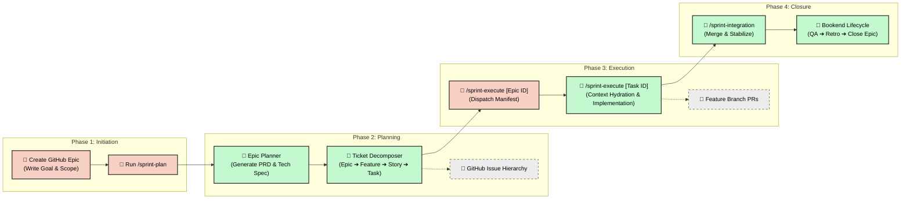

# Software Development Life Cycle (SDLC) Workflow

Our SDLC is designed for an AI-native engineering environment, leveraging
**v5 Epic-Centric GitHub Orchestration**. This model replaces the legacy local
playbook pipeline with a ticketing-native approach where GitHub Issues and
Project Board fields serve as the Single Source of Truth (SSOT).

---

## 💡 Core Guiding Principles

- **Ticketing as SSOT**: No local state files (like `playbook.md`). All project
  logic, work breakdown, and task status lives in GitHub.
- **Provider Abstraction**: While v5 ships with a reference GitHub provider, the
  logic is abstracted behind `ITicketingProvider` for future portability.
- **Agentic Autonomy**: Planning and execution are decoupled. Agents "pick up"
  tasks from the backlog, implementation happens on isolated feature branches,
  and state syncs back to GitHub in real-time.
- **Human-in-the-Loop (HITL)**: Humans define the vision (Epics), trigger
  planning, and approve high-risk tasks.

---

## 🗺️ The End-to-End SDLC Process

---

## ⚡ Phase 1: Initiation (Manual)

The human product lead defines the "North Star" by creating a GitHub Issue
labeled with `type::epic`.

- **Goal**: Clear, plain-English description of the objective.
- **Scope**: (Optional) High-level bullet points.
- **Initiation**: The human runs `/sprint-plan [EPIC_ID]` in the agentic IDE.

---

## 🚀 Phase 2: Planning (Agentic)

The framework fetches the Epic and autonomously builds the work breakdown.

1.  **Epic Planner (`epic-planner.js`)**:
    - Synthesizes the Epic body + project documentation.
    - Generates a **PRD** (`context::prd`) and **Tech Spec** (`context::tech-spec`)
      as linked GitHub Issues.
2.  **Ticket Decomposer (`ticket-decomposer.js`)**:
    - Recursively decomposes the specs into a 4-tier hierarchy:
      `Epic ➔ Feature ➔ Story ➔ Task`.
    - **Wiring**: Each ticket is linked using GitHub's `blocked by #NNN` and
      tasklist syntax.
    - **Metadata**: Each Task is stamped with persona, model recommendations,
      estimated files, and agent prompts.
3.  **Roadmap Update**: The automated roadmap generator (`generate-roadmap.js`)
    detects the new Epic/Features and updates `docs/roadmap.md`.

---

## 🏗️ Phase 3: Execution (Agentic)

Execution is driven by the **Dispatcher** and **Context Hydrator**.

1.  **Dispatch Manifest**: `/sprint-execute [EPIC_ID]` builds the dependency DAG
    across all Tasks and identifies the current "wave" of executable work. It
    outputs a manifest table in the IDE.
2.  **Context Hydration**: When an agent runs `/sprint-execute #[TASK_ID]`, the
    **Context Hydrator** assembles a self-contained prompt string:
    - `agent-protocol.md` (Universal rules)
    - Persona & Skill directives
    - Hierarchy context (Story ➔ Feature ➔ Epic)
    - Task-specific instructions
3.  **State Sync**: Agents update their state in real-time on GitHub:
    - **Labels**: `agent::ready` ➔ `agent::executing` ➔ `agent::review` ➔ `agent::done`.
    - **Tasklists**: Check off atomic subtasks in the ticket body.
    - **Telemetry**: Friction logs are posted as comments on the Task issue.

---

## 🏁 Phase 4: Integration & Closure (Agentic)

Once Task waves are complete, the bookend lifecycle begins.

1.  **Integration**: `/sprint-integration` merges PRs into the Epic base branch,
    running a stabilization suite on ephemeral candidate branches.
2.  **Completion Cascade**: When a Task is integrated, status cascades up:
    `Task Done ➔ Story Done ➔ Feature Done ➔ Epic Done`.
3.  **Lifecycle Phases**:
    - **QA**: Runs `/sprint-testing` on the integrated Epic branch.
    - **Retro**: Runs `/sprint-retro` to summarize wins/friction from the ticket graph.
    - **Close-Out**: `/sprint-close-out` merges the Epic to `main`, tags the
      release, and closes the Epic issue.
