# Software Development Life Cycle (SDLC) Workflow

Our SDLC is designed for an AI-native engineering environment, heavily
leveraging **Dual-Track Agile**. This ensures we are continuously planning the
_next_ sprint while the _current_ one is being built, minimizing idle time and
maximizing architectural coherence.

At the core of this methodology is a highly automated pipeline combining human
product vision, deterministic scaffolding scripts, and parallel AI agent
orchestration.

For a complete example of the expected artifacts and formatting, see the
[Reference Samples](./sample-docs) directory.

---

## 💡 Core Guiding Principles

- **Flexibility over Rigidity**: Our protocols avoid overengineering. We
  maintain a lightweight framework that empowers models to leverage their native
  capabilities rather than being constrained by overly brittle rules.
- **Zero-Dependency Core**: All core agent logic (like Context Retrieval) is
  implemented with local, zero-SaaS/API dependencies to prioritize speed and
  security.

---

## 🗺️ The End-to-End SDLC Process

The following diagram illustrates the complete flow from high-level roadmap
definition down to code review and sprint retrospective.

```mermaid
    graph LR
    classDef manual fill:#f9d0c4,stroke:#333,stroke-width:2px,color:#000;
    classDef agentic fill:#c4f9d0,stroke:#333,stroke-width:2px,color:#000;
    classDef artifact fill:#ececec,stroke:#333,stroke-width:1px,stroke-dasharray: 5 5,color:#000;
    classDef LegendNode fill:transparent,stroke:transparent,font-size:12px;

    %% Legend
    Legend["🟥 Human-led task (👤)<br/>🟩 Agentic Execution (🤖)<br/>⬜ Artifact (📄)"]:::LegendNode

    %% Phase 1: Product Strategy
    subgraph Phase1 ["Phase 1: Product Strategy"]
        direction TB
        B["👤 Update roadmap.md<br/>• Define Sprints<br/>• Define Future Horizons"]:::manual
        D["👤 Execute /plan-sprint"]:::manual
        B --> D
    end

    %% Phase 2: Automated Planning
    subgraph Phase2 ["Phase 2: Sprint Planning"]
        direction TB
        F["🤖 /sprint-generate-prd"]:::agentic
        G["🤖 /sprint-generate-tech-spec"]:::agentic
        H["🤖 /sprint-generate-playbook"]:::agentic

        F --> G
        G --> H

        F -.-> F_Art["📄 prd.md"]:::artifact
        G -.-> G_Art["📄 tech-spec.md"]:::artifact
        H -.-> H_Art["📄 playbook.md<br/>📄 task-manifest.json"]:::artifact
    end

    %% Phase 3: Execution & Closure
    subgraph Phase3 ["Phase 3: Sprint Execution"]
        direction TB
        I["👤 Load playbook.md"]:::manual
        J["🤖 Agentic Execution<br/>(Sequential & Parallel Sessions)"]:::agentic
        K["🤖 /sprint-integration"]:::agentic
        K_Fix["🤖 /sprint-hotfix"]:::agentic
        L["🤖 /sprint-testing"]:::agentic
        O["🤖 /sprint-code-review"]:::agentic
        P["🤖 /sprint-retro"]:::agentic
        Q2["🤖 /sprint-close-out"]:::agentic

        I --> J
        J --> K
        K -- "Fail" --> K_Fix
        K_Fix -- "Retry" --> K
        K -- "Pass" --> O
        O --> L
        L --> P
        P --> Q2

        L -.-> L_Art["📄 sprint-[##]/test-plan.md"]:::artifact
        J -.-> J_Log["📄 sprint-[##]/agent-friction-log.json"]:::artifact
        P -.-> Q["📄 architecture.md<br/>📄 data-dictionary.md<br/>📄 roadmap.md"]:::artifact
        P -.-> R["📄 sprint-[##]/retro.md"]:::artifact
    end

    style Phase1 fill:#fffce5,stroke:#d4d4d4,padding:0px
    style Phase2 fill:#f0f7ff,stroke:#d4d4d4,padding:0px
    style Phase3 fill:#f0fff4,stroke:#d4d4d4,padding:0px

    D --> F
    H_Art --> I
```



---

## 🚦 Phase 1: Product Strategy (Manual w/ AI Assistance)

Before any AI planning can begin, the "North Star" must be defined. The PM
(assisted by an AI thinking partner) manually manages operations inside the
`docs/roadmap.md` file.

- **Roadmap Management**: Features are categorized into future horizons (Now,
  Next, Later). Use the `/sprint-roadmap-review` workflow to decompose upcoming
  sprints into atomic, high-quality feature definitions.
- **Sprint Definition**: Upcoming features are locked into a numbered sprint
  layout.
- **Goal Alignment**: Acceptance criteria boundaries are defined so downstream
  workflows understand the "definition of done."
- **Initiation**: The human operator initiates the
  `/plan-sprint [SPRINT_NUMBER]` command in their "Director's Chair" (PM chat
  interface).

---

## ⚡ Phase 2: Sprint Planning (Agentic)

Once the human executes the plan command, the agentic pipeline takes over. It
performs a deterministic crawl of your project documentation to build a
structured execution plan.

### Sequential Generation Steps

0. **Context Indexing (`node .agents/scripts/context-indexer.js index`)**:
   - Scans the repository documentation and builds a local semantic index.
   - Enables efficient, high-context retrieval for sub-agents without blowing
     out token limits.

1. **Product Discovery (`/sprint-generate-prd`)**:
   - Reads `roadmap.md` for the target sprint items.
   - Generates a strict **Product Requirements Document (PRD)** focusing on
     Problem Statements, User Stories, and Acceptance Criteria.
   - Saves to: `docs/sprints/sprint-[##]/prd.md`.

2. **Architecture Review (`/sprint-generate-tech-spec`)**:
   - Cross-references the PRD with `data-dictionary.md` and `architecture.md`.
   - Drafts an explicit **Technical Specification** mapping out Turso/Drizzle
     schema changes and Hono API routes.
   - Saves to: `docs/sprints/sprint-[##]/tech-spec.md`.

3. **Playbook Generation (`/sprint-generate-playbook`)**:
   - Synthesizes the PRD and Tech Spec into a structured `task-manifest.json`
     file.
   - Executes `.agents/scripts/generate-playbook.js` to render the **Sprint
     Playbook**.
   - Saves artifacts to: `docs/sprints/sprint-[##]/task-manifest.json` and
     `docs/sprints/sprint-[##]/playbook.md`.

---

## 🏗️ Phase 3: Sprint Execution (Manual + Agentic)

Once the `playbook.md` is generated, the transition from "Planning" to
"Execution" begins.

### 🔑 The Hand-Off (Manual)

The developer or operator must manually "load" the generated playbook into their
AI Development Agent Manager (e.g., Google Antigravity or Claude Code). This
ensures a human is in the loop before code modifications begin.

### 🤖 Agentic Execution Strategy

The agent framework parses the playbook and manages the complex orchestration of
tasks:

- **Sequential Foundation**: Initial sessions lock database schemas, migrations,
  and API routes to provide a stable foundation.
- **Concurrent Execution**: Once the core is locked, parallel sessions handle
  Frontend development, QA automation, and non-blocking documentation.
- **Decoupled Task Tracking**: Agents push state updates (`executing`,
  `committed`) to the `taskStateRoot` directory defined in `.agentrc.json`
  (defaults to `temp/task-state/`) as tasks skip manual `playbook.md` updates.
  The playbook itself only tracks starting intent (`[ ]`) and final integrated
  resolution (`[x]`). This decoupling prevents Git race conditions and history
  bloat during concurrent execution.
- **Verification Logic**: Task prerequisites are evaluated by the
  `verify-prereqs.js` script, which checks both the playbook's `[x]` markers and
  the individual decoupled state files for `committed` status.
- **Task Completion Notifications**: When a task is pushed to a feature branch,
  agents broadcast a status update as a JSON payload to the
  `notificationWebhookUrl` (if defined in `.agentrc.json`) to ensure real-time
  synchronization across the swarm.
- **Observability & Feedback Loop**: Agents use
  `.agents/scripts/diagnose-friction.js` whenever they encounter operational
  difficulties (tool errors, ambiguities). This script acts as both a passive
  telemetry logger (appending to `agent-friction-log.json`) and an active
  diagnostic tool (providing structured remediation help). This serves as a
  continuous feedback mechanism to identify and resolve gaps in the project's
  `agent-protocols`.
- **Execution Guardrails (Anti-Thrashing)**: To prevent long-running tasks or
  agent "thrashing," agents are mandated to halt and re-plan if they hit a
  threshold of consecutive errors or research steps without making progress.
  These thresholds are configurable via `frictionThresholds` in `.agentrc.json`.
- **FinOps & Economic Guardrails**: Agents track token usage against a
  configurable sprint target (`maxTokenBudget`). Execution automatically
  triggers subjective soft-warnings via webhooks at threshold levels and
  hard-stops if the budget is breached, fostering intelligent agentic cost
  management.
- **HITL Risk Gates**: High-latency security checks driven by LLM-based semantic
  classification. During the technical specification phase, architects evaluate
  proposed changes against a set of semantic heuristics (e.g., unrecoverable
  mutations, structural anomalies). Tasks flagged by this assessment
  automatically stall the execution loop and require explicit Human-In-The-Loop
  approval before proceeding.
- **Friction Logging Thresholds**: The sensitivity for logging repetitive
  sequences or automation candidates is also configurable in the same config
  file via `frictionThresholds.repetitiveCommandCount`.
- **Dynamic Golden-Path Harvesting (Agentic RLHF)**: To reinforce
  architecture-compliant patterns, the `/sprint-finalize-task` workflow
  automatically harvests instruction-to-diff mappings from "zero-friction" task
  completions. These records are stored in `.agents/golden-examples/` and
  injected as few-shot examples into future playbooks, enabling the agent swarm
  to autonomously converge on the repository's established "Golden Path"
  standards.
- **Shift-Left Agentic Testing**: To prevent the "happy path" anti-pattern,
  agents are mandated to run isolated tests on their feature branch before
  finalizing a task. A successful run generates a `[TASK_ID]-test-receipt.json`
  which serves as a cryptographic-like evidence of green state. The
  `/sprint-integration` workflow acts as a strict gatekeeper, only merging
  branches that possess a valid test receipt.
- **Hybrid Integration & Blast-Radius Containment**: Implements "Option 3" of
  the concurrency protocols. Instead of merging directly into the shared sprint
  branch, the `/sprint-integration` workflow performs merges on ephemeral
  candidate branches.
- **Zero-Touch Remediation Loop**: If an integration candidate fails, the system
  automatically triggers a **Zero-Touch Remediation Loop**. The agent
  immediately transitions into the `/sprint-hotfix` workflow, uses diagnostic
  information captured by the framework to resolve the regression on the feature
  branch, and recursively re-attempts integration until success or until hitting
  the `maxIntegrationRetries` threshold. This minimizes human intervention
  during the blast-radius containment process.
- **Advanced Concurrency Protocols**: To handle structural merge conflicts that
  inevitably arise from parallel execution, agents use a hybrid approach. During
  planning, `focusAreas` in the manifest soft-lock large architectural changes
  into sequential steps. During execution, agents perform a mandatory **Runtime
  Rebase Wait-Loop** where they pull and resolve structural conflicts against
  the base branch locally _before_ running their shift-left validation tests.
- **Workspace & File Hygiene**: To keep the repository clean, agents are
  required to store all temporary artifacts and scratch scripts in the root
  `/temp/` directory, which is excluded from Git.

### 🏁 Closing the Loop (Agentic)

Every sprint concludes with a mandatory bookend pipeline that enforces codebase
health and prepares the documentation for the next cycle. To preserve execution
context, these tasks are consolidated into two Chat Sessions:

#### 1. Merge & Verify Phase

1. **`/sprint-integration`**: Discovers all `task/sprint-N/*` feature branches
   and performs **Hybrid Integration Candidate** verification. Each branch is
   merged into an ephemeral `integration-candidate-[ID]` branch and verified
   against the full project test suite.
   - **Success**: The candidate is merged into the sprint base, the task is
     marked Complete (`[x]`), and the feature branch is deleted.
   - **Failure**: The candidate is purged (Blast-Radius Contained), and the
     failure is logged. The feature is kicked back for remediation via
     **`/sprint-hotfix`** on the original branch.
2. **`/sprint-code-review`**: Scans all sprint diffs for security
   vulnerabilities, unnecessary coupling, and architectural drift.
3. **`/sprint-testing`**: Maintains test data and seeds, generates and updates
   the sprint test plan documentation, and executes the `/run-test-plan`
   workflow against the now-integrated codebase.

#### 2. Sprint Administration Phase

1. **`/sprint-retro`**: Synthesizes challenges and wins, captures new **Action
   Items** into the roadmap, makes permanent updates to global project
   documents, and creates the final sprint records. It also triggers
   **`/run-context-pruning`** to archive stale decisions and ensure the Local
   RAG index reflects only the most current technical architecture.
2. **`/run-red-team`**: An adversarial pre-release hardening workflow. The
   `security-engineer` persona is called on-demand to cross-examine a specific
   target scope (branch or directory), writing and executing local fuzz scripts
   to seek and exploit structural vulnerabilities before functional QA.
3. **`/sprint-close-out`**: The terminal step — asserts all playbook tasks are
   `[x]`, merges `sprint-N` into `main` via `--no-ff`, cleans up the sprint
   branch (local + remote), and verifies no stale branches remain.

**Artifact Lifecycle:**

- **Updated**: `docs/architecture.md`, `docs/data-dictionary.md`,
  `docs/roadmap.md`.
- **Created**: `docs/sprints/sprint-[##]/retro.md`,
  `docs/sprints/sprint-[##]/test-plan.md`.

---

## 📂 Project Documentation Structure (`docs/`)

To ensure this entire machine operates smoothly, all projects using these
protocols MUST adhere to the following `docs/` folder structure.

For a complete "Golden Sample" of this exact folder and artifact structure,
including a reference roadmap, architecture, and a pre-planned sprint, see the
[./sample-docs](./sample-docs) directory.

```text
docs/
├── architecture.md          # Core system design and tech stack
├── data-dictionary.md       # Database schema and validation rules
├── decisions.md             # Architecture Decision Records (ADRs) and "why" contexts
├── patterns.md              # Established coding patterns and library rules
├── style-guide.md           # (Optional) Aesthetic constraints and UI copywriting rules
├── archive/                 # Pruned documentation (stale decisions/patterns)
├── roadmap.md               # High-level sprint goals and feature list
├── sprints/                 # Sprint-specific planning artifacts
│   └── sprint-[##]/
│       ├── prd.md           # Product Requirements (User Stories, ACs)
│       ├── tech-spec.md     # Technical Specification (implementation plan)
│       ├── task-manifest.json # Generated structured dependency graph
│       ├── playbook.md      # Actionable tasks for AI agents rendered from manifest
│       ├── agent-friction-log.json # Structured telemetry feedback loop
│       ├── test-plan.md     # Sprint-specific test execution record
│       └── retro.md         # Final reflections and updates
└── test-plans/              # Domain-specific QA test plans
```
