# Software Development Life Cycle (SDLC) Workflow

Our SDLC is designed for an AI-native engineering environment, heavily
leveraging **Dual-Track Agile**. This ensures we are continuously planning the
_next_ sprint while the _current_ one is being built, minimizing idle time and
maximizing architectural coherence.

At the core of this methodology is a highly automated pipeline combining human
product vision, deterministic scaffolding scripts, and parallel AI agent
orchestration.

For a complete example of the expected artifacts and formatting, see the
[Reference Samples](./sample-docs) directory.

---

## 🗺️ The End-to-End SDLC Process

The following diagram illustrates the complete flow from high-level roadmap
definition down to code review and sprint retrospective.

```mermaid
    graph LR
    classDef manual fill:#f9d0c4,stroke:#333,stroke-width:2px,color:#000;
    classDef agentic fill:#c4f9d0,stroke:#333,stroke-width:2px,color:#000;
    classDef artifact fill:#ececec,stroke:#333,stroke-width:1px,stroke-dasharray: 5 5,color:#000;
    classDef LegendNode fill:transparent,stroke:transparent,font-size:12px;

    %% Legend
    Legend["🟥 Human-led task (👤)<br/>🟩 Agentic Execution (🤖)<br/>⬜ Artifact (📄)"]:::LegendNode

    %% Phase 1: Product Strategy
    subgraph Phase1 ["Phase 1: Product Strategy"]
        direction TB
        B["👤 Update roadmap.md<br/>• Define Sprints<br/>• Define Future Horizons"]:::manual
        D["👤 Execute /plan-sprint"]:::manual
        B --> D
    end

    %% Phase 2: Automated Planning
    subgraph Phase2 ["Phase 2: Sprint Planning"]
        direction TB
        F["🤖 /sprint-generate-prd"]:::agentic
        G["🤖 /sprint-generate-tech-spec"]:::agentic
        H["🤖 /sprint-generate-playbook"]:::agentic

        F --> G
        G --> H

        F -.-> F_Art["📄 prd.md"]:::artifact
        G -.-> G_Art["📄 tech-spec.md"]:::artifact
        H -.-> H_Art["📄 playbook.md<br/>📄 task-manifest.json"]:::artifact
    end

    %% Phase 3: Execution & Closure
    subgraph Phase3 ["Phase 3: Sprint Execution"]
        direction TB
        I["👤 Load playbook.md"]:::manual
        J["🤖 Agentic Execution<br/>(Sequential & Parallel Sessions)"]:::agentic
        K["🤖 /sprint-integration"]:::agentic
        L["🤖 /plan-qa-testing"]:::agentic
        O["🤖 /sprint-code-review"]:::agentic
        P["🤖 /sprint-retro"]:::agentic
        Q2["🤖 /sprint-close-out"]:::agentic

        I --> J
        J --> K
        K --> L
        L --> O
        O --> P
        P --> Q2

        L -.-> L_Art["📄 sprint-[##]/test-plan.md"]:::artifact
        J -.-> J_Log["📄 sprint-[##]/agent-friction-log.json"]:::artifact
        P -.-> Q["📄 architecture.md<br/>📄 data-dictionary.md<br/>📄 roadmap.md"]:::artifact
        P -.-> R["📄 sprint-[##]/retro.md"]:::artifact
    end

    style Phase1 fill:#fffce5,stroke:#d4d4d4,padding:0px
    style Phase2 fill:#f0f7ff,stroke:#d4d4d4,padding:0px
    style Phase3 fill:#f0fff4,stroke:#d4d4d4,padding:0px

    D --> F
    H_Art --> I
```



---

## 🚦 Phase 1: Product Strategy (Manual w/ AI Assistance)

Before any AI planning can begin, the "North Star" must be defined. The PM
(assisted by an AI thinking partner) manually manages operations inside the
`docs/roadmap.md` file.

- **Roadmap Management**: Features are categorized into future horizons (Now,
  Next, Later). Use the `/sprint-roadmap-review` workflow to decompose upcoming
  sprints into atomic, high-quality feature definitions.
- **Sprint Definition**: Upcoming features are locked into a numbered sprint
  layout.
- **Goal Alignment**: Acceptance criteria boundaries are defined so downstream
  workflows understand the "definition of done."
- **Initiation**: The human operator initiates the
  `/plan-sprint [SPRINT_NUMBER]` command in their "Director's Chair" (PM chat
  interface).

---

## ⚡ Phase 2: Sprint Planning (Agentic)

Once the human executes the plan command, the agentic pipeline takes over. It
performs a deterministic crawl of your project documentation to build a
structured execution plan.

### Sequential Generation Steps

1. **Product Discovery (`/sprint-generate-prd`)**:
   - Reads `roadmap.md` for the target sprint items.
   - Generates a strict **Product Requirements Document (PRD)** focusing on
     Problem Statements, User Stories, and Acceptance Criteria.
   - Saves to: `docs/sprints/sprint-[##]/prd.md`.

2. **Architecture Review (`/sprint-generate-tech-spec`)**:
   - Cross-references the PRD with `data-dictionary.md` and `architecture.md`.
   - Drafts an explicit **Technical Specification** mapping out Turso/Drizzle
     schema changes and Hono API routes.
   - Saves to: `docs/sprints/sprint-[##]/tech-spec.md`.

3. **Playbook Generation (`/sprint-generate-playbook`)**:
   - Synthesizes the PRD and Tech Spec into a structured `task-manifest.json`
     file.
   - Executes `.agents/scripts/generate-playbook.js` to render the **Sprint
     Playbook**.
   - Saves artifacts to: `docs/sprints/sprint-[##]/task-manifest.json` and
     `docs/sprints/sprint-[##]/playbook.md`.

---

## 🏗️ Phase 3: Sprint Execution (Manual + Agentic)

Once the `playbook.md` is generated, the transition from "Planning" to
"Execution" begins.

### 🔑 The Hand-Off (Manual)

The developer or operator must manually "load" the generated playbook into their
AI Development Agent Manager (e.g., Google Antigravity or Claude Code). This
ensures a human is in the loop before code modifications begin.

### 🤖 Agentic Execution Strategy

The agent framework parses the playbook and manages the complex orchestration of
tasks:

- **Sequential Foundation**: Initial sessions lock database schemas, migrations,
  and API routes to provide a stable foundation.
- **Concurrent Execution**: Once the core is locked, parallel sessions handle
  Frontend development, QA automation, and non-blocking documentation.
- **Auto-Tracking**: Agents update the playbook state (`- [x]`) in real-time as
  tasks are completed, providing a live dashboard of sprint progress.
- **Task Completion Notifications**: When a task is pushed to a feature branch,
  agents broadcast a status update as a JSON payload to the
  `AGENT_NOTIFICATION_WEBHOOK` (if defined in `AGENTS.md`) to ensure real-time
  synchronization across the swarm.
- **Observability & Feedback Loop**: Agents append telemetry to
  `agent-friction-log.json` whenever they encounter operational difficulties
  (tool errors, ambiguities). This serves as a continuous feedback mechanism to
  identify and resolve gaps in the project's `agent-protocols`.
- **Execution Guardrails (Anti-Thrashing)**: To prevent long-running tasks or
  agent "thrashing," agents are mandated to halt and re-plan if they hit a
  threshold of consecutive errors or research steps without making progress. See
  `.agents/instructions.md` for specific thresholds.
- **Workspace & File Hygiene**: To keep the repository clean, agents are
  required to store all temporary artifacts and scratch scripts in the root
  `/temp/` directory, which is excluded from Git.

### 🏁 Closing the Loop (Agentic)

Every sprint concludes with a mandatory bookend pipeline that enforces codebase
health and prepares the documentation for the next cycle. To preserve execution
context, these tasks are consolidated into two Chat Sessions:

#### 1. Merge & Verify Phase

1. **`/sprint-integration`**: Discovers all `sprint-N/*` feature branches,
   merges them sequentially into `sprint-N` via `--no-ff`, transitions the
   playbook from Committed to Complete, and cleans up remote branches.
2. **`/plan-qa-testing`**: Maintains test data and seeds, generates and updates
   the sprint test plan documentation, and executes the `/run-test-plan`
   workflow against the now-integrated codebase.

#### 2. Sprint Administration Phase

1. **`/sprint-code-review`**: Scans all sprint diffs for security
   vulnerabilities, unnecessary coupling, and architectural drift.
2. **`/sprint-retro`**: Synthesizes challenges and wins, captures new **Action
   Items** into the roadmap, makes permanent updates to global project
   documents, and creates the final sprint records.
3. **`/sprint-close-out`**: The terminal step — asserts all playbook tasks are
   `[x]`, merges `sprint-N` into `main` via `--no-ff`, cleans up the sprint
   branch (local + remote), and verifies no stale branches remain.

**Artifact Lifecycle:**

- **Updated**: `docs/architecture.md`, `docs/data-dictionary.md`,
  `docs/roadmap.md`.
- **Created**: `docs/sprints/sprint-[##]/retro.md`,
  `docs/sprints/sprint-[##]/test-plan.md`.

---

## 📂 Project Documentation Structure (`docs/`)

To ensure this entire machine operates smoothly, all projects using these
protocols MUST adhere to the following `docs/` folder structure.

For a complete "Golden Sample" of this exact folder and artifact structure,
including a reference roadmap, architecture, and a pre-planned sprint, see the
[./sample-docs](./sample-docs) directory.

```text
docs/
├── architecture.md          # Core system design and tech stack
├── data-dictionary.md       # Database schema and validation rules
├── decisions.md             # Architecture Decision Records (ADRs) and "why" contexts
├── patterns.md              # Established coding patterns and library rules
├── roadmap.md               # High-level sprint goals and feature list
├── sprints/                 # Sprint-specific planning artifacts
│   └── sprint-[##]/
│       ├── prd.md           # Product Requirements (User Stories, ACs)
│       ├── tech-spec.md     # Technical Specification (implementation plan)
│       ├── task-manifest.json # Generated structured dependency graph
│       ├── playbook.md      # Actionable tasks for AI agents rendered from manifest
│       ├── agent-friction-log.json # Structured telemetry feedback loop
│       ├── test-plan.md     # Sprint-specific test execution record
│       └── retro.md         # Final reflections and updates
└── test-plans/              # Domain-specific QA test plans
```
