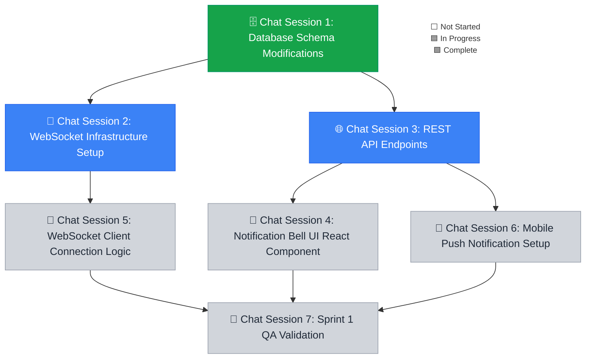

# Sprint 001 Playbook: Realtime Notifications

> **Playbook Path**: `docs/sprints/sprint-001/playbook.md`

## Sprint Summary

Introduce realtime notifications via WebSockets across web and mobile platforms
to replace manual dashboard refreshing.

## Fan-Out Execution Flow



### 💬 🗄️ Chat Session 1: Database Schema Modifications (Concurrent)

- [x] **1.1.1 Database Schema Modifications**

**Mode:** Planning **Model:** Claude Sonnet 4.6 (Thinking)

```text
Sprint 1.1.1: Adopt the `backend-engineer` persona from `.agents/personas/`.

**AGENT EXECUTION PROTOCOL (STRICT ADHERENCE REQUIRED):**
1. **Execution**: Perform the task instructions below.
2. **Finalization**: Execute the `finalize-sprint-task` workflow explicitly for sprint step `1.1.1`.

Create migrations for the new `notifications` and `notification_preferences` tables. Ensure foreign keys map to the `users` table correctly.
```

### 💬 🔌 Chat Session 2: WebSocket Infrastructure Setup

- [/] **1.2.1 WebSocket Infrastructure Setup**

**Mode:** Planning **Model:** Claude Sonnet 4.6 (Thinking)

```text
Sprint 1.2.1: Adopt the `backend-engineer` persona from `.agents/personas/`.

**AGENT EXECUTION PROTOCOL (STRICT ADHERENCE REQUIRED):**
1. **Execution**: Perform the task instructions below.
2. **Finalization**: Execute the `finalize-sprint-task` workflow explicitly for sprint step `1.2.1`.

Implement the `wss://api.example.com/events` endpoint. Handle JWT authentication upon connection. Wire up Redis Pub/Sub for cross-instance messaging.
```

### 💬 🌐 Chat Session 3: REST API Endpoints

- [/] **1.3.1 REST API Endpoints**

**Mode:** Planning **Model:** Gemini 3.1 Pro (High)

```text
Sprint 1.3.1: Adopt the `backend-engineer` persona from `.agents/personas/`.

**AGENT EXECUTION PROTOCOL (STRICT ADHERENCE REQUIRED):**
1. **Execution**: Perform the task instructions below.

Implement endpoints to fetch history, mark notifications as read, and update user preferences.
```

### 💬 🔔 Chat Session 4: Notification Bell UI React Component

- [ ] **1.4.1 Notification Bell UI React Component**

**Mode:** Fast **Model:** Claude Sonnet 4.6 (Thinking)

```text
Sprint 1.4.1: Adopt the `frontend-engineer` persona from `.agents/personas/`.

**AGENT EXECUTION PROTOCOL (STRICT ADHERENCE REQUIRED):**
1. **Execution**: Perform the task instructions below.

Create a `NotificationBell` component with an unread badge. Integrate it into the main navigation layout.
```

### 💬 📡 Chat Session 5: WebSocket Client Connection Logic

- [ ] **1.5.1 WebSocket Client Connection Logic**

**Mode:** Planning **Model:** Claude Sonnet 4.6 (Thinking)

```text
Sprint 1.5.1: Adopt the `frontend-engineer` persona from `.agents/personas/`.

**AGENT EXECUTION PROTOCOL (STRICT ADHERENCE REQUIRED):**
1. **Execution**: Perform the task instructions below.

Implement a global hook to manage the WebSocket connection. Implement exponential backoff on disconnect. Listen for incoming `notification` events and update the global state.
```

### 💬 📱 Chat Session 6: Mobile Push Notification Setup

- [ ] **1.6.1 Mobile Push Notification Setup**

**Mode:** Planning **Model:** Claude Sonnet 4.6 (Thinking)

```text
Sprint 1.6.1: Adopt the `mobile-engineer` persona from `.agents/personas/`.

**AGENT EXECUTION PROTOCOL (STRICT ADHERENCE REQUIRED):**
1. **Execution**: Perform the task instructions below.

Integrate Firebase Cloud Messaging (FCM) to deliver notifications to iOS and Android devices.
```

### 💬 🧪 Chat Session 7: Sprint 1 QA Validation

- [ ] **1.7.1 Sprint 1 QA Validation**

**Mode:** Planning **Model:** Claude Sonnet 4.6 (Thinking)

```text
Sprint 1.7.1: Adopt the `qa-engineer` persona from `.agents/personas/`.

**AGENT EXECUTION PROTOCOL (STRICT ADHERENCE REQUIRED):**
1. **Execution**: Perform the task instructions below.

Execute the `plan-qa-testing` workflow for `1`.
```
