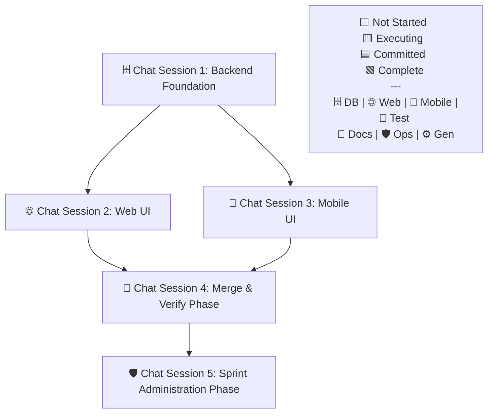

# Sprint Playbook Template Reference

> **NOTE:** This file is a **reference document** showing the expected output
> format of the `scripts/generate-playbook.js` scaffold script. You do NOT need
> to copy or fill in this template manually. The script generates the playbook
> deterministically from a `task-manifest.json` file.
>
> For instructions on how to generate a playbook, see the
> `sprint-generate-playbook` workflow.

---

## Expected Output Structure

The script produces a `playbook.md` with the following structure:

### 1. Title

```markdown
# Sprint [N] Playbook: [Sprint Name]
```

### 2. Sprint Summary

```markdown
## Sprint Summary

[2-3 sentence summary from the manifest's `summary` field.]
```

### 3. Fan-Out Execution Flow

A dynamically generated Mermaid diagram showing the actual Chat Session
dependency graph. This is NOT hardcoded — it reflects the real task
dependencies.

````markdown
## Fan-Out Execution Flow


````

### 4. Chat Sessions

Each Chat Session is rendered with a header, execution rule, and tasks:

````markdown
### 🗄️ Chat Session 1: Backend Foundation (Sequential)

_Execution Rule: These tasks must be run sequentially in a single chat window._

- [ ] **99.1.1 Database Schema Migrations**

**Mode:** Planning **Model (First Choice):** Claude Opus 4.6 (Thinking) **Model
(Second Choice):** Gemini 3.1 Pro (High)

```text
Sprint 99.1.1: Adopt the `engineer` persona from `.agents/personas/`.

**AGENT EXECUTION PROTOCOL (STRICT ADHERENCE REQUIRED):**
1. **Mark Executing**: Create/update the state file at `[TASK_STATE_ROOT]/{taskId}.json` with `{"status": "executing", "timestamp": "..."}` (decoupled state).
2. **Prerequisite Check**: Execute the `sprint-verify-task-prerequisites` workflow for sprint step `99.1.1` and verify dependencies in `playbook.md`. If it fails, **STOP** and alert the user.
3. **Execution**: Perform the task instructions below.
4. **Finalization**: Execute the `sprint-finalize-task` workflow explicitly for sprint step `99.1.1`.

**Active Skills:** `database/turso, backend/sqlite-drizzle-expert`

[Detailed task instructions with explicit file paths.]
```
````

---

## Chat Session Grouping Rules (Implemented by the Script)

The script automatically groups tasks into Chat Sessions using these rules:

1. **Dependency Layers:** Tasks are assigned a "layer" based on their depth in
   the dependency graph. Root tasks (no dependencies) are layer 0.
2. **Scope Grouping:** Tasks at the same layer sharing a `scope` (e.g.,
   `@repo/web`) are grouped into one sequential Chat Session.
3. **Concurrent Execution:** Tasks at the same layer with different scopes (or
   no scope) become separate concurrent Chat Sessions.
4. **Bookend Tasks:** Bookend flags (`isIntegration`, `isQA`, `isCodeReview`,
   `isRetro`, `isCloseSprint`) are grouped into two consolidated chat sessions
   at the end of the pipeline: **Merge & Verify Phase** (Integration/QA), and
   **Sprint Administration Phase** (Code Review/Retro/Close).

## Example Scenarios

| Sprint Type                 | Result                                                                       |
| --------------------------- | ---------------------------------------------------------------------------- |
| Full-stack feature          | Backend → Web + Mobile (concurrent) → Merge & Verify → Sprint Administration |
| 10 independent bug fixes    | 10 concurrent sessions → Merge & Verify → Sprint Administration              |
| 5 web bugs + 5 mobile tests | 5 web (concurrent) + 5 mobile (concurrent) → Merge & Verify → Sprint Admin   |
| Pure backend pipeline       | Sequential chain → Merge & Verify → Sprint Administration                    |
