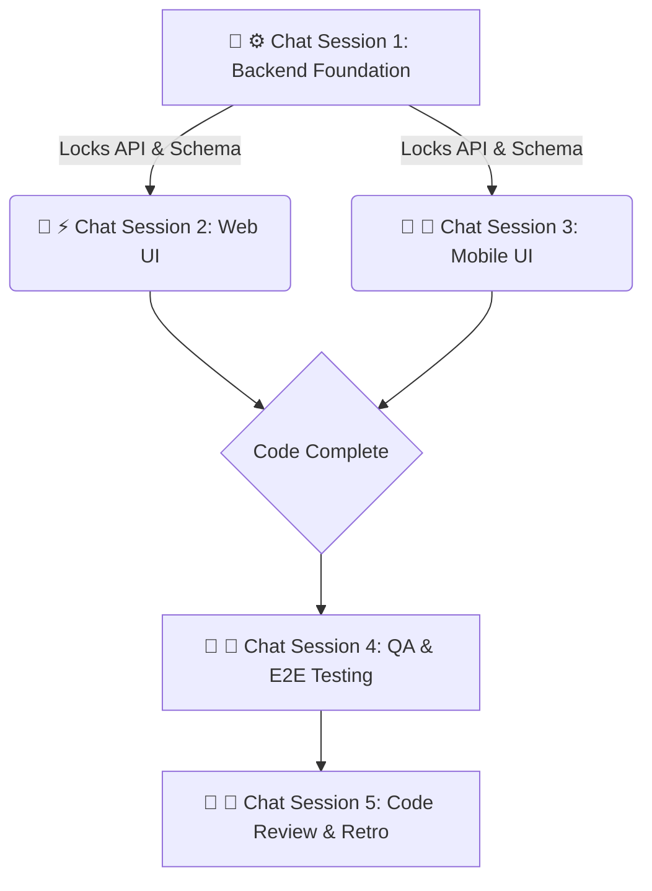

# Sprint [SPRINT_NUMBER] Playbook: [SPRINT_NAME]

## Sprint Summary

[Provide a 2-3 sentence summary of the sprint's goals, the primary features
being delivered, and the overarching product value.]



### 💬 ⚙️ Chat Session 1: Backend Foundation (Sequential)

_Execution Rule: These tasks must be run sequentially in a single chat window to
lock the data contracts and prevent schema conflicts._

- [ ] **[SPRINT_NUMBER].1.1 [Task Title - e.g., Database Schema Migrations]**

**Mode:** Planning **Model:** CLAUDE OPUS 4.6

```text
Sprint [SPRINT_NUMBER].1.1: Adopt the `[PERSONA]` persona from `.agents/personas/`.

**AGENT EXECUTION PROTOCOL (STRICT ADHERENCE REQUIRED):**
1. **Prerequisite Check**: Execute the `verify-sprint-prerequisites` workflow for sprint step `[SPRINT_NUMBER].1.1` and verify dependencies in `playbook.md`. If it fails, **STOP** and alert the user.
2. **Execution**: Perform the task instructions below.
3. **Finalization**: Execute the `finalize-sprint-task` workflow explicitly for sprint step `[SPRINT_NUMBER].1.1`.

[Insert detailed instructions here. Define exact table names, columns, relationships, and constraints. Tell the agent which files to modify.]
```

- [ ] **[SPRINT_NUMBER].1.2 [Task Title - e.g., Core API Controllers]**

**Mode:** Planning **Model:** CLAUDE SONNET 4.6

```text
Sprint [SPRINT_NUMBER].1.2: Adopt the `[PERSONA]` persona from `.agents/personas/`.

**AGENT EXECUTION PROTOCOL (STRICT ADHERENCE REQUIRED):**
1. **Prerequisite Check**: Execute the `verify-sprint-prerequisites` workflow for sprint step `[SPRINT_NUMBER].1.2` and verify dependencies in `playbook.md`. If it fails, **STOP** and alert the user.
2. **Execution**: Perform the task instructions below.
3. **Finalization**: Execute the `finalize-sprint-task` workflow explicitly for sprint step `[SPRINT_NUMBER].1.2`.

[Insert detailed instructions here. Define required Zod schemas, API route methods, expected payloads, and authorization middleware.]
```

### 💬 ⚡ Chat Session 2: Web UI (Concurrent)

_Execution Rule: Open a NEW chat window. This session operates exclusively
within `@repo/web`._

- [ ] **[SPRINT_NUMBER].2.1 [Task Title - e.g., Feature UI Components]**

**Mode:** Planning **Model:** GEMINI 3.1 HIGH

```text
Sprint [SPRINT_NUMBER].2.1: Adopt the `[PERSONA]` persona from `.agents/personas/`.

**AGENT EXECUTION PROTOCOL (STRICT ADHERENCE REQUIRED):**
1. **Prerequisite Check**: Execute the `verify-sprint-prerequisites` workflow for sprint step `[SPRINT_NUMBER].2.1` and verify dependencies in `playbook.md`. If it fails, **STOP** and alert the user.
2. **Execution**: Perform the task instructions below.
3. **Finalization**: Execute the `finalize-sprint-task` workflow explicitly for sprint step `[SPRINT_NUMBER].2.1`.

[Insert detailed instructions here. Specify Astro pages, React client components, Tailwind styling requirements, and the specific API endpoints to consume.]
```

### 💬 📱 Chat Session 3: Mobile UI (Concurrent)

_Execution Rule: Open a NEW chat window. This session operates exclusively
within `@repo/mobile`._

- [ ] **[SPRINT_NUMBER].3.1 [Task Title - e.g., Native Feature Screens]**

**Mode:** Planning **Model:** GEMINI 3.1 HIGH

```text
Sprint [SPRINT_NUMBER].3.1: Adopt the `[PERSONA]` persona from `.agents/personas/`.

**AGENT EXECUTION PROTOCOL (STRICT ADHERENCE REQUIRED):**
1. **Prerequisite Check**: Execute the `verify-sprint-prerequisites` workflow for sprint step `[SPRINT_NUMBER].3.1` and verify dependencies in `playbook.md`. If it fails, **STOP** and alert the user.
2. **Execution**: Perform the task instructions below.
3. **Finalization**: Execute the `finalize-sprint-task` workflow explicitly for sprint step `[SPRINT_NUMBER].3.1`.

[Insert detailed instructions here. Specify Expo Router screens, React Native components, mobile-first styling constraints, and API integrations.]
```

### 💬 🧪 Chat Session 4: QA & E2E Testing (Concurrent)

_Execution Rule: Open a NEW chat window after code complete._

- [ ] **[SPRINT_NUMBER].4.1 [Task Title - e.g., Playwright E2E Flows]**

**Mode:** Planning **Model:** CLAUDE OPUS 4.6

```text
Sprint [SPRINT_NUMBER].4.1: Adopt the `[PERSONA]` persona from `.agents/personas/`.

**AGENT EXECUTION PROTOCOL (STRICT ADHERENCE REQUIRED):**
1. **Prerequisite Check**: Execute the `verify-sprint-prerequisites` workflow for sprint step `[SPRINT_NUMBER].4.1` and verify dependencies in `playbook.md`. If it fails, **STOP** and alert the user.
2. **Execution**: Perform the task instructions below.
3. **Finalization**: Execute the `finalize-sprint-task` workflow explicitly for sprint step `[SPRINT_NUMBER].4.1`.

[For Chat Session 4, do NOT write custom task instructions for generating or executing tests. Instead, instruct the agent to execute the `plan-qa-testing` workflow for `[SPRINT_NUMBER]`.]
```

### 💬 🔄 Chat Session 5: Code Review & Retro (Sequential)

_Execution Rule: Run this in the primary PM planning chat once all PRs are
merged._

- [ ] **[SPRINT_NUMBER].5.1 Comprehensive Code Review**

**Mode:** Planning **Model:** GEMINI 3.1 HIGH

```text
Sprint [SPRINT_NUMBER].5.1: Adopt the `[PERSONA]` persona from `.agents/personas/`.

**AGENT EXECUTION PROTOCOL (STRICT ADHERENCE REQUIRED):**
1. **Prerequisite Check**: Execute the `verify-sprint-prerequisites` workflow for sprint step `[SPRINT_NUMBER].5.1` and verify dependencies in `playbook.md`. If it fails, **STOP** and alert the user.
2. **Execution**: Perform the task instructions below.
3. **Finalization**: Execute the `finalize-sprint-task` workflow explicitly for sprint step `[SPRINT_NUMBER].5.1`.

[Instruct the agent to execute the `sprint-code-review` workflow for `[SPRINT_NUMBER]`.]
```

- [ ] **[SPRINT_NUMBER].5.2 Sprint Retro & Roadmap Alignment**

**Mode:** Fast **Model:** GEMINI 3 FLASH

```text
Sprint [SPRINT_NUMBER].5.2: Adopt the `[PERSONA]` persona from `.agents/personas/`.

**AGENT EXECUTION PROTOCOL (STRICT ADHERENCE REQUIRED):**
1. **Prerequisite Check**: Execute the `verify-sprint-prerequisites` workflow for sprint step `[SPRINT_NUMBER].5.2` and verify dependencies in `playbook.md`. If it fails, **STOP** and alert the user.
2. **Execution**: Perform the task instructions below.
3. **Finalization**: Execute the `finalize-sprint-task` workflow explicitly for sprint step `[SPRINT_NUMBER].5.2`.

[Instruct the agent to execute the `sprint-retro` workflow for `[SPRINT_NUMBER]`.]
```
