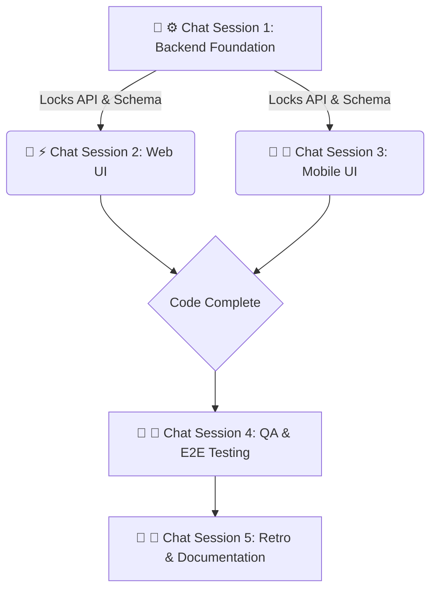

# Sprint [SPRINT_NUMBER] Playbook: [SPRINT_NAME]

## Sprint Summary

[Provide a 2-3 sentence summary of the sprint's goals, the primary features
being delivered, and the overarching product value.]



### 💬 ⚙️ Chat Session 1: Backend Foundation (Sequential)

_Execution Rule: These tasks must be run sequentially in a single chat window to
lock the data contracts and prevent schema conflicts._

- [ ] **[SPRINT_NUMBER].1 [Task Title - e.g., Database Schema Migrations]**

**Mode:** Planning **Model:** CLAUDE OPUS 4.6

```text
Sprint [SPRINT_NUMBER].1: Act as an ARCHITECT.
[Insert detailed instructions here. Define exact table names, columns, relationships, and constraints. Tell the agent which files to modify.]

AGENT INSTRUCTION: Ensure all validation and pre-commit hooks pass successfully. Upon completion, perform a git commit of your changes with the message "feat: [SPRINT_NUMBER].1 - [Task Title]". Finally, open the file docs/sprint-[SPRINT_NUMBER]/playbook.md, find the line starting with - [ ] **[SPRINT_NUMBER].1**, and mark it as complete by changing - [ ] to - [x].
```

- [ ] **[SPRINT_NUMBER].2 [Task Title - e.g., Core API Controllers]**

**Mode:** Planning **Model:** CLAUDE SONNET 4.6

```text
Sprint [SPRINT_NUMBER].2: Act as an ENGINEER.
[Insert detailed instructions here. Define required Zod schemas, API route methods, expected payloads, and authorization middleware.]

AGENT INSTRUCTION: Ensure all validation and pre-commit hooks pass successfully. Upon completion, perform a git commit of your changes with the message "feat: [SPRINT_NUMBER].2 - [Task Title]". Finally, open the file docs/sprint-[SPRINT_NUMBER]/playbook.md, find the line starting with - [ ] **[SPRINT_NUMBER].2**, and mark it as complete by changing - [ ] to - [x].
```

### 💬 ⚡ Chat Session 2: Web UI (Concurrent)

_Execution Rule: Open a NEW chat window. This session operates exclusively
within `@repo/web`._

- [ ] **[SPRINT_NUMBER].3.1 [Task Title - e.g., Feature UI Components]**

**Mode:** Planning **Model:** GEMINI 3.1 HIGH

```text
Sprint [SPRINT_NUMBER].3.1: Act as an ENGINEER.
[Insert detailed instructions here. Specify Astro pages, React client components, Tailwind styling requirements, and the specific API endpoints to consume.]

AGENT INSTRUCTION: Ensure all validation and pre-commit hooks pass successfully. Upon completion, perform a git commit of your changes with the message "feat: [SPRINT_NUMBER].3.1 - [Task Title]". Finally, open the file docs/sprint-[SPRINT_NUMBER]/playbook.md, find the line starting with - [ ] **[SPRINT_NUMBER].3.1**, and mark it as complete by changing - [ ] to - [x].
```

### 💬 📱 Chat Session 3: Mobile UI (Concurrent)

_Execution Rule: Open a NEW chat window. This session operates exclusively
within `@repo/mobile`._

- [ ] **[SPRINT_NUMBER].4.1 [Task Title - e.g., Native Feature Screens]**

**Mode:** Planning **Model:** GEMINI 3.1 HIGH

```text
Sprint [SPRINT_NUMBER].4.1: Act as an ENGINEER.
[Insert detailed instructions here. Specify Expo Router screens, React Native components, mobile-first styling constraints, and API integrations.]

AGENT INSTRUCTION: Ensure all validation and pre-commit hooks pass successfully. Upon completion, perform a git commit of your changes with the message "feat: [SPRINT_NUMBER].4.1 - [Task Title]". Finally, open the file docs/sprint-[SPRINT_NUMBER]/playbook.md, find the line starting with - [ ] **[SPRINT_NUMBER].4.1**, and mark it as complete by changing - [ ] to - [x].
```

### 💬 🧪 Chat Session 4: QA & E2E Testing (Concurrent)

_Execution Rule: Open a NEW chat window after code complete._

- [ ] **[SPRINT_NUMBER].5.1 [Task Title - e.g., Playwright E2E Flows]**

**Mode:** Planning **Model:** CLAUDE OPUS 4.6

```text
Sprint [SPRINT_NUMBER].5.1: Act as an SRE.
[Insert detailed instructions here. Specify the user flows to test, edge cases to cover, and which `apps/web/e2e/*.spec.ts` files to create or modify.]

AGENT INSTRUCTION: Ensure all validation and pre-commit hooks pass successfully. Upon completion, perform a git commit of your changes with the message "test: [SPRINT_NUMBER].5.1 - [Task Title]". Finally, open the file docs/sprint-[SPRINT_NUMBER]/playbook.md, find the line starting with - [ ] **[SPRINT_NUMBER].5.1**, and mark it as complete by changing - [ ] to - [x].
```

### 💬 🔄 Chat Session 5: Retro & Documentation (Sequential)

_Execution Rule: Run this in the primary PM planning chat once all PRs are
merged._

- [ ] **[SPRINT_NUMBER].6 Sprint Retro & Roadmap Alignment**

**Mode:** Fast **Model:** GEMINI 3 FLASH

```text
Sprint [SPRINT_NUMBER].6: Act as a PRODUCT MANAGER.
[Insert detailed instructions here. Instruct the agent to update `roadmap.md` to ✅ Implemented, update `architecture.md` if any core patterns changed, and finalize the sprint.]

AGENT INSTRUCTION: Ensure all validation and pre-commit hooks pass successfully. Upon completion, perform a git commit of your changes with the message "docs: [SPRINT_NUMBER].6 - [Task Title]". Finally, open the file docs/sprint-[SPRINT_NUMBER]/playbook.md, find the line starting with - [ ] **[SPRINT_NUMBER].6**, and mark it as complete by changing - [ ] to - [x].
```
