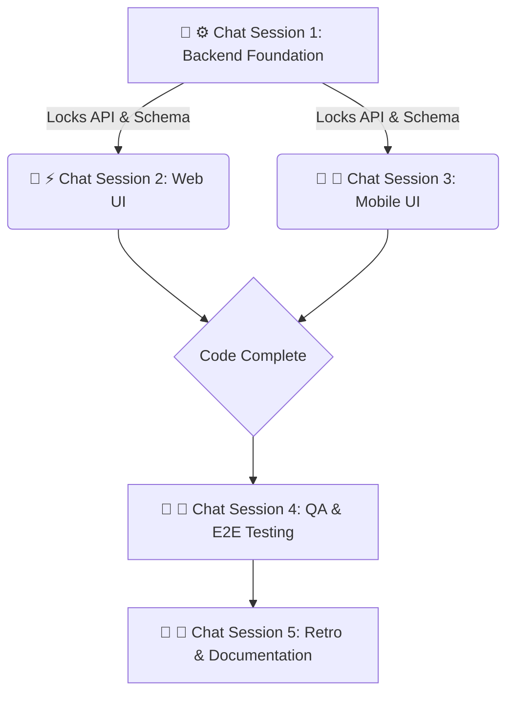

# Sprint [SPRINT_NUMBER] Playbook: [SPRINT_NAME]

## Sprint Summary

[Provide a 2-3 sentence summary of the sprint's goals, the primary features
being delivered, and the overarching product value.]



### 💬 ⚙️ Chat Session 1: Backend Foundation (Sequential)

_Execution Rule: These tasks must be run sequentially in a single chat window to
lock the data contracts and prevent schema conflicts._

- [ ] **[SPRINT_NUMBER].1 [Task Title - e.g., Database Schema Migrations]**

**Mode:** Planning **Model:** CLAUDE OPUS 4.6

```text
Sprint [SPRINT_NUMBER].1: Act as an ARCHITECT.

**AGENT EXECUTION PROTOCOL (STRICT ADHERENCE REQUIRED):**
1. **Prerequisite Check**: Open `playbook.md` and verify all tasks with lower `STEP` numbers in this chat AND all tasks in [MANDATORY_PREVIOUS_CHATS] are marked `[x]`. (Note: Refer to the Fan-Out Flow diagram for dependencies). If not, **STOP** and alert the user.
2. **Execution**: Perform the task instructions below.
3. **Validation**: Ensure all validation and pre-commit hooks pass (`npm run lint`, etc.).
4. **Commit**: `feat: [SPRINT_NUMBER].1 - [Task Title]`
5. **Completion**: Mark this task as complete (`- [x]`) in `playbook.md` BEFORE ending the session.

[Insert detailed instructions here. Define exact table names, columns, relationships, and constraints. Tell the agent which files to modify.]
```

- [ ] **[SPRINT_NUMBER].2 [Task Title - e.g., Core API Controllers]**

**Mode:** Planning **Model:** CLAUDE SONNET 4.6

```text
Sprint [SPRINT_NUMBER].2: Act as an ENGINEER.

**AGENT EXECUTION PROTOCOL (STRICT ADHERENCE REQUIRED):**
1. **Prerequisite Check**: Open `playbook.md` and verify all tasks with lower `STEP` numbers in this chat AND all tasks in [MANDATORY_PREVIOUS_CHATS] are marked `[x]`. (Note: Refer to the Fan-Out Flow diagram for dependencies). If not, **STOP** and alert the user.
2. **Execution**: Perform the task instructions below.
3. **Validation**: Ensure all validation and pre-commit hooks pass (`npm run lint`, etc.).
4. **Commit**: `feat: [SPRINT_NUMBER].2 - [Task Title]`
5. **Completion**: Mark this task as complete (`- [x]`) in `playbook.md` BEFORE ending the session.

[Insert detailed instructions here. Define required Zod schemas, API route methods, expected payloads, and authorization middleware.]
```

### 💬 ⚡ Chat Session 2: Web UI (Concurrent)

_Execution Rule: Open a NEW chat window. This session operates exclusively
within `@repo/web`._

- [ ] **[SPRINT_NUMBER].3.1 [Task Title - e.g., Feature UI Components]**

**Mode:** Planning **Model:** GEMINI 3.1 HIGH

```text
Sprint [SPRINT_NUMBER].3.1: Act as an ENGINEER.

**AGENT EXECUTION PROTOCOL (STRICT ADHERENCE REQUIRED):**
1. **Prerequisite Check**: Open `playbook.md` and verify all tasks with lower `STEP` numbers in this chat AND all tasks in [MANDATORY_PREVIOUS_CHATS] are marked `[x]`. (Note: Refer to the Fan-Out Flow diagram for dependencies). If not, **STOP** and alert the user.
2. **Execution**: Perform the task instructions below.
3. **Validation**: Ensure all validation and pre-commit hooks pass (`npm run lint`, etc.).
4. **Commit**: `feat: [SPRINT_NUMBER].3.1 - [Task Title]`
5. **Completion**: Mark this task as complete (`- [x]`) in `playbook.md` BEFORE ending the session.

[Insert detailed instructions here. Specify Astro pages, React client components, Tailwind styling requirements, and the specific API endpoints to consume.]
```

### 💬 📱 Chat Session 3: Mobile UI (Concurrent)

_Execution Rule: Open a NEW chat window. This session operates exclusively
within `@repo/mobile`._

- [ ] **[SPRINT_NUMBER].4.1 [Task Title - e.g., Native Feature Screens]**

**Mode:** Planning **Model:** GEMINI 3.1 HIGH

```text
Sprint [SPRINT_NUMBER].4.1: Act as an ENGINEER.

**AGENT EXECUTION PROTOCOL (STRICT ADHERENCE REQUIRED):**
1. **Prerequisite Check**: Open `playbook.md` and verify all tasks with lower `STEP` numbers in this chat AND all tasks in [MANDATORY_PREVIOUS_CHATS] are marked `[x]`. (Note: Refer to the Fan-Out Flow diagram for dependencies). If not, **STOP** and alert the user.
2. **Execution**: Perform the task instructions below.
3. **Validation**: Ensure all validation and pre-commit hooks pass (`npm run lint`, etc.).
4. **Commit**: `feat: [SPRINT_NUMBER].4.1 - [Task Title]`
5. **Completion**: Mark this task as complete (`- [x]`) in `playbook.md` BEFORE ending the session.

[Insert detailed instructions here. Specify Expo Router screens, React Native components, mobile-first styling constraints, and API integrations.]
```

### 💬 🧪 Chat Session 4: QA & E2E Testing (Concurrent)

_Execution Rule: Open a NEW chat window after code complete._

- [ ] **[SPRINT_NUMBER].5.1 [Task Title - e.g., Playwright E2E Flows]**

**Mode:** Planning **Model:** CLAUDE OPUS 4.6

```text
Sprint [SPRINT_NUMBER].5.1: Act as an SRE.

**AGENT EXECUTION PROTOCOL (STRICT ADHERENCE REQUIRED):**
1. **Prerequisite Check**: Open `playbook.md` and verify all tasks with lower `STEP` numbers in this chat AND all tasks in [MANDATORY_PREVIOUS_CHATS] are marked `[x]`. (Note: Refer to the Fan-Out Flow diagram for dependencies). If not, **STOP** and alert the user.
2. **Execution**: Perform the task instructions below.
3. **Validation**: Ensure all validation and pre-commit hooks pass (`npm run lint`, etc.).
4. **Commit**: `test: [SPRINT_NUMBER].5.1 - [Task Title]`
5. **Completion**: Mark this task as complete (`- [x]`) in `playbook.md` BEFORE ending the session.

[Insert detailed instructions here. Specify the user flows to test, edge cases to cover, and which `apps/web/e2e/*.spec.ts` files to create or modify. CRITICAL: Include a specific step to maintain/update fake/sample test data (seed files, mock API responses, storybook stories) to reflect sprint changes.]
```

### 💬 🔄 Chat Session 5: Retro & Documentation (Sequential)

_Execution Rule: Run this in the primary PM planning chat once all PRs are
merged._

- [ ] **[SPRINT_NUMBER].6 Sprint Retro & Roadmap Alignment**

**Mode:** Fast **Model:** GEMINI 3 FLASH

```text
Sprint [SPRINT_NUMBER].6: Act as a PRODUCT MANAGER.

**AGENT EXECUTION PROTOCOL (STRICT ADHERENCE REQUIRED):**
1. **Prerequisite Check**: Open `playbook.md` and verify all tasks with lower `STEP` numbers in this chat AND all tasks in [MANDATORY_PREVIOUS_CHATS] are marked `[x]`. (Note: Refer to the Fan-Out Flow diagram for dependencies). If not, **STOP** and alert the user.
2. **Execution**: Perform the task instructions below.
3. **Validation**: Ensure all validation and pre-commit hooks pass (`npm run lint`, etc.).
4. **Commit**: `docs: [SPRINT_NUMBER].6 - [Task Title]`
5. **Completion**: Mark this task as complete (`- [x]`) in `playbook.md` BEFORE ending the session.

[Insert detailed instructions here. Instruct the agent to:
1. Generate a `docs/sprints/sprint-[SPRINT_NUMBER]/retro.md` file using the `.agents/templates/sprint-retro-template.md` template.
2. Analyze the sprint execution logs, test results, and commits to accurately fill in the Sprint Scorecard, What Went Well, What Could Be Improved, and Architectural Debt sections.
3. Formulate Action Items for the next sprint.
4. Update `roadmap.md` to ✅ Implemented for completed items.
5. Update `architecture.md` if any core patterns changed.
6. Finalize the sprint documentation.]
```
