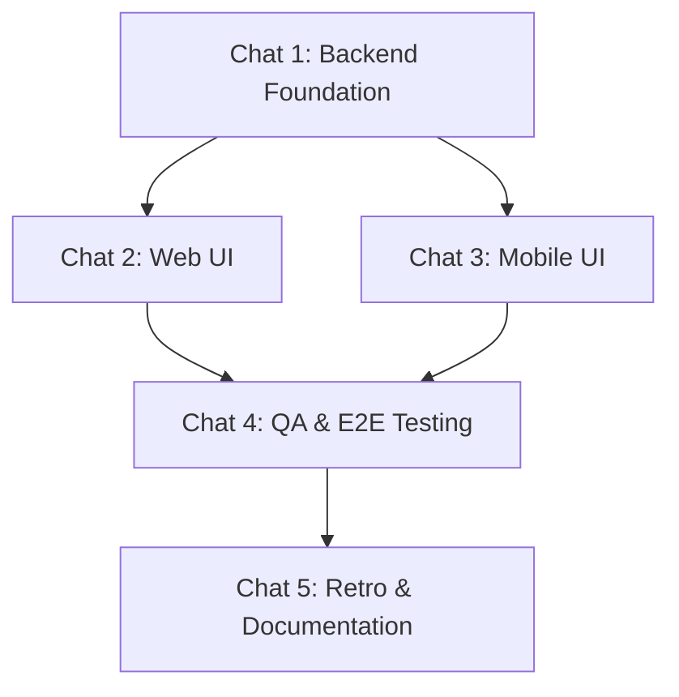

---
description:
  Generate an actionable sprint playbook from PRD and architecture plans
---

# Playbook Generation Workflow

## Role

Technical Project Manager and Agile Scrum Master

## Context & Objective

Your objective is to orchestrate a team of autonomous AI coding agents.

CRITICAL: You are writing the PLAYBOOK of instructions for other agents. DO NOT
generate the actual application code, SQL migrations, or frontend components in
your response. Only write the prompts and tasks.

**Target Sprint:** `[SPRINT_NUMBER]` — The user should provide the sprint number
when executing this command.

## Step 1 - Mandatory Knowledge Retrieval

Before generating any tasks, you MUST read the following sources:

1. `roadmap.md`: Identify the specific features slated for the requested sprint.
1. `docs/sprints/sprint-[SPRINT_NUMBER]/prd.md`: Ensure EVERY Acceptance
   Criteria has a corresponding implementation step. Do not drop business logic.
1. `docs/sprints/sprint-[SPRINT_NUMBER]/tech-spec.md`, `data-dictionary.md`, and
   `architecture.md`: Ensure all generated APIs, UI components, DB schemas, and
   Infrastructure configurations align perfectly with the defined architecture.
   Explicitly list file paths in the tasks.

## Step 2 - Agent Chat Session Model Alignment (Fan-Out Architecture)

Structure the sprint to support parallel agent execution in the IDE by
organizing tasks strictly into the following "Fan-Out" Chat Sessions.

**Task Numbering Rule:** You MUST use the format
`[SPRINT_NUMBER].[CHAT_NUMBER].[STEP_NUMBER]` (e.g., 1.1.1, 1.1.2, 1.2.1).

- (A) Chat Session 1 (Backend Foundation). _Sequential._ Builds DB schemas and
  API routes first to lock the data contracts. (Tasks: X.1.1, X.1.2...)  
  _Depends on: None._
- (B) Chat Session 2 (Web UI) & Chat Session 3 (Mobile UI). _Concurrent._ These
  sessions fan-out and run in parallel ONLY after Chat Session 1 is complete.
  (Tasks: X.2.1 and X.3.1)  
  _Depends on: Chat Session 1._
- (C) Chat Session 4 (QA Test Plan Generation & Execution). _Sequential in a
  FRESH chat._ (Tasks: X.4.1, X.4.2)  
  _Depends on: Chat Session 2 AND Chat Session 3._
- (D) Chat Session 5 (Retro & Documentation). _Sequential._ (Tasks: X.5.1)  
  _Depends on: Chat Session 4._

TASK SCOPING RULE: Keep individual tasks highly focused. A single task should
instruct the agent to modify no more than 2 to 3 files.

## Step 3 - Model Routing and Persona Assignment

Models:

- CLAUDE OPUS 4.6 (Planning mode): High-complexity tasks (schema, architecture,
  QA execution)
- CLAUDE SONNET 4.6 (Planning mode): Complex business logic, QA Documentation
- GEMINI 3.1 HIGH (Planning mode): Standard APIs, data fetching, components
- GEMINI 3 FLASH (Fast mode): Retro, documentation, simple styling

Personas & Active Skills: _You MUST dynamically assign all applicable skills to
every task based on the context of the work. Select the appropriate skills from
the `.agents/skills/` (or equivalent) directory. Do not leave the skills field
blank._

- ARCHITECT: Specifications, schemas, APIs.
- ENGINEER: Implementation (Web, Mobile).
- PRODUCT: Retro and Roadmap alignment.
- QA AUTOMATION ENGINEER: Test plan generation (writing to
  `test-plans/sprint-test-plans/sprint-[SPRINT_NUMBER]-test-plan.md`) and
  automated test execution.

## Step 4 - Strict Output Formatting

Generate the markdown playbook for the Sprint.

**CRITICAL FORMATTING RULES:**

1. NO OUTER WRAPPER: You must output raw Markdown. Do NOT wrap your entire
   response in an outer set of backticks (e.g., do not start the file with
   ```markdown). Start directly with the `# Sprint [NUMBER] Playbook` header.
2. THE NO-SUMMARIZATION RULE: You are strictly forbidden from modifying or
   summarizing the `AGENT EXECUTION PROTOCOL`. You must copy the text from the
   template below EXACTLY word-for-word for every single task.

**Document Structure:**

1. **Title:** `# Sprint [NUMBER] Playbook: [Sprint Name]`
1. **Summary:** Create a `## Sprint Summary` section. Write a concise 2-3
   sentence overview of the sprint's core objectives, technical scope, and
   business value based on your analysis of the PRD.
1. **Execution Flow:** Create a `## Fan-Out Execution Flow` section and include
   this exact Mermaid diagram beneath it:



1. **Chat Sessions:** Use the following Chat Session Headers exactly as written:
   `### 💬 ⚙️ Chat Session 1: Backend Foundation (Sequential)`
   `### 💬 ⚡ Chat Session 2: Web UI (Concurrent)`
   `### 💬 📱 Chat Session 3: Mobile UI (Concurrent)`
   `### 💬 🧪 Chat Session 4: QA & E2E Testing (Sequential)`
   `### 💬 🔄 Chat Session 5: Retro & Documentation (Sequential)`

**TASK TEMPLATE:** Every task MUST exactly match this semantic structure:

- [ ] **[SPRINT_NUMBER].[CHAT_NUMBER].[STEP_NUMBER] [Task Title]**

**Mode:** [Planning/Fast] **Model:** [Model Name]

```text
Sprint [SPRINT_NUMBER].[CHAT_NUMBER].[STEP_NUMBER]: Act as an [Persona].

**AGENT EXECUTION PROTOCOL (STRICT ADHERENCE REQUIRED):**
1. **Prerequisite Check**: Open `playbook.md` and verify all tasks with lower `STEP` numbers in this chat AND all tasks in [MANDATORY_PREVIOUS_CHATS] are marked `[x]`. (Note: This chat Session is [CHAT_NUMBER]; refer to the Fan-Out Flow diagram for dependencies). If not, **STOP** and alert the user.
2. **Execution**: Perform the task instructions below.
3. **Validation**: Ensure all validation and pre-commit hooks pass (`npm run lint`, etc.).
4. **Commit**: `[type]([scope]): [lowercase conventional commit message]`
5. **Completion**: Mark this task as complete (`- [x]`) in `playbook.md` BEFORE ending the session.

**Active Skills:** `[comma-separated list of all applicable skills]`

[Detailed task instructions here. MUST explicitly list file paths.]

[CRITICAL FOR QA TASKS: Chat Session 4 MUST include a specific task to maintain/update fake/sample test data (seed files, mocks, etc.) and update the Manual Test Plan Documentation in `test-plans/sprint-test-plans/sprint-[SPRINT_NUMBER]-test-plan.md` for new sprint features using the Dual-Purpose standard. Following the documentation task, include a separate execution task using the `/run-test-plan` workflow against those updated files. DO NOT invent Playwright tests from scratch.]
```

## Step 5 - Output Artifacts

Save the generated playbook into
`docs/sprints/sprint-[SPRINT_NUMBER]/playbook.md`.

## Constraint

Adhere strictly to the templates and instructions provided. Do not summarize the
protocol. Do NOT use an outer markdown code block wrapper for the file.
