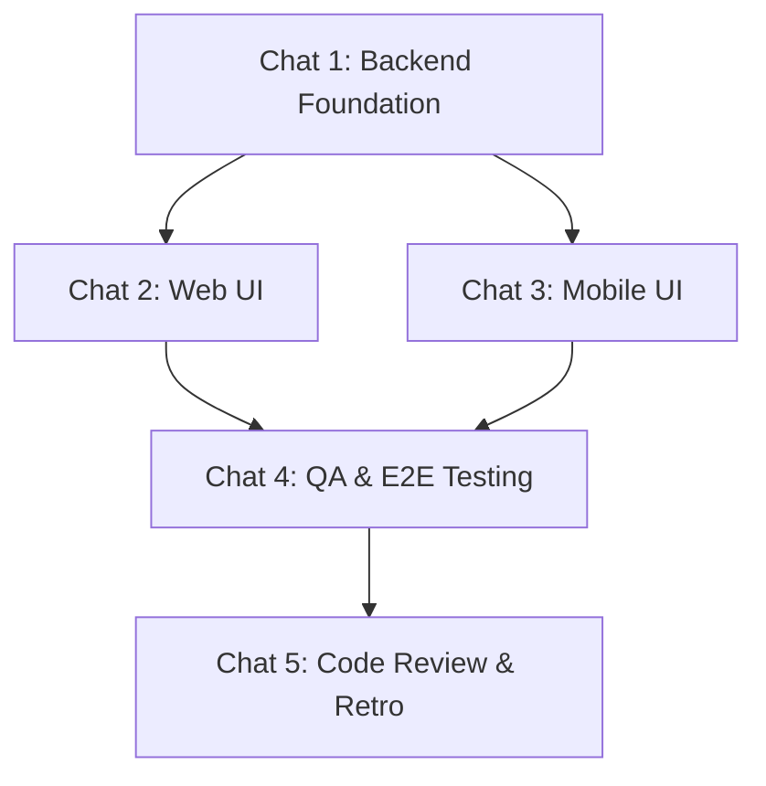

---
description:
  Generate an actionable sprint playbook from PRD and architecture plans
---

# Playbook Generation Workflow

## Role

Adopt the `project-manager` persona from `.agents/personas/`.

## Context & Objective

Your objective is to orchestrate a team of autonomous AI coding agents.

CRITICAL: You are writing the PLAYBOOK of instructions for other agents. DO NOT
generate the actual application code, SQL migrations, or frontend components in
your response. Only write the prompts and tasks.

**Target Sprint:** `[SPRINT_NUMBER]` — The user should provide the sprint number
when executing this command.

## Step 1 - Mandatory Knowledge Retrieval

Execute the `gather-sprint-context` workflow for `[SPRINT_NUMBER]` to retrieve
the roadmap, PRD, technical specifications, and architecture required to
generate your tasks.

## Step 2 - Agent Chat Session Model Alignment (Fan-Out Architecture)

Structure the sprint to support parallel agent execution in the IDE by
organizing tasks strictly into the following "Fan-Out" Chat Sessions.

**Task Numbering Rule:** You MUST use the format
`[SPRINT_NUMBER].[CHAT_NUMBER].[STEP_NUMBER]` (e.g., 1.1.1, 1.1.2, 1.2.1).

- (A) Chat Session 1 (Backend Foundation). _Sequential._ Builds DB schemas and
  API routes first to lock the data contracts. (Tasks: X.1.1, X.1.2...)  
  _Depends on: None._
- (B) Chat Session 2 (Web UI) & Chat Session 3 (Mobile UI). _Concurrent._ These
  sessions fan-out and run in parallel ONLY after Chat Session 1 is complete.
  (Tasks: X.2.1 and X.3.1)  
  _Depends on: Chat Session 1._
- (C) Chat Session 4 (QA Test Plan Generation & Execution). _Sequential in a
  FRESH chat._ (Tasks: X.4.1, X.4.2)  
  _Depends on: Chat Session 2 AND Chat Session 3._
- (D) Chat Session 5 (Code Review & Retro). _Sequential._ (Tasks: X.5.1,
  X.5.2)  
  _Depends on: Chat Session 4._

TASK SCOPING RULE: Keep individual tasks highly focused. A single task should
instruct the agent to modify no more than 2 to 3 files.

## Step 3 - Model Routing and Persona Assignment

### Model Selection Guidance

_You MUST dynamically assign the appropriate model for each task based on its
complexity, intelligence requirements, and speed constraints._ Read the strict
model selection rules and chaining configurations defined in the
`.agents/models.json` configuration file to determine which models should be
assigned to specific Personas and steps.

Personas & Active Skills: \_You MUST dynamically assign an appropriate persona
and applicable skills to every task based on the context of the work.

1. **Personas**: Dynamically select the exact Persona from the
   `.agents/personas/` directory that best fits the task (e.g., if it's a
   backend task, choose the appropriate backend persona file). **Do not invent
   or hardcode personas.**
2. **Skills**: Select the appropriate skills from the `.agents/skills/`
   directory. Do not leave the skills field blank.\_

## Step 4 - Strict Output Formatting

Generate the markdown playbook for the Sprint.

**CRITICAL FORMATTING RULES:**

1. NO OUTER WRAPPER: You must output raw Markdown. Do NOT wrap your entire
   response in an outer set of backticks (e.g., do not start the file with
   ```markdown). Start directly with the `# Sprint [NUMBER] Playbook` header.
2. THE NO-SUMMARIZATION RULE: You are strictly forbidden from modifying or
   summarizing the `AGENT EXECUTION PROTOCOL`. You must copy the text from the
   template below EXACTLY word-for-word for every single task.

**Document Structure:**

1. **Title:** `# Sprint [NUMBER] Playbook: [Sprint Name]`
1. **Summary:** Create a `## Sprint Summary` section. Write a concise 2-3
   sentence overview of the sprint's core objectives, technical scope, and
   business value based on your analysis of the PRD.
1. **Execution Flow:** Create a `## Fan-Out Execution Flow` section and include
   this exact Mermaid diagram beneath it:



1. **Chat Sessions:** Use the following Chat Session Headers exactly as written:
   `### 💬 ⚙️ Chat Session 1: Backend Foundation (Sequential)`
   `### 💬 ⚡ Chat Session 2: Web UI (Concurrent)`
   `### 💬 📱 Chat Session 3: Mobile UI (Concurrent)`
   `### 💬 🧪 Chat Session 4: QA & E2E Testing (Sequential)`
   `### 💬 🔄 Chat Session 5: Code Review & Retro (Sequential)`

**TASK TEMPLATE:** Every task MUST exactly match this semantic structure:

- [ ] **[SPRINT_NUMBER].[CHAT_NUMBER].[STEP_NUMBER] [Task Title]**

**Mode:** [Planning/Fast] **Model:** [Model Name]

```text
Sprint [SPRINT_NUMBER].[CHAT_NUMBER].[STEP_NUMBER]: Adopt the `[PERSONA]` persona from `.agents/personas/`.

**AGENT EXECUTION PROTOCOL (STRICT ADHERENCE REQUIRED):**
1. **Prerequisite Check**: Execute the `verify-sprint-prerequisites` workflow for sprint step `[SPRINT_NUMBER].[CHAT_NUMBER].[STEP_NUMBER]` and verify dependencies in `playbook.md`. If it fails, **STOP** and alert the user.
2. **Execution**: Perform the task instructions below.
3. **Finalization**: Execute the `finalize-sprint-task` workflow explicitly for sprint step `[SPRINT_NUMBER].[CHAT_NUMBER].[STEP_NUMBER]`.

**Active Skills:** `[comma-separated list of all applicable skills]`

[Detailed task instructions here. MUST explicitly list file paths.]

[CRITICAL FOR QA TASKS: For Chat Session 4, do NOT write custom task instructions for generating or executing tests. Instead, instruct the agent to execute the `plan-qa-testing` workflow for `[SPRINT_NUMBER]`.]

[CRITICAL FOR RETRO TASKS: For Chat Session 5, task X.5.1 should instruct the agent to execute the `sprint-code-review` workflow for `[SPRINT_NUMBER]`. Task X.5.2 should explicitly instruct the agent to execute the `sprint-retro` workflow for `[SPRINT_NUMBER]`.]
```

## Step 5 - Output Artifacts

Save the generated playbook into
`docs/sprints/sprint-[SPRINT_NUMBER]/playbook.md`.

## Constraint

Adhere strictly to the templates and instructions provided. Do not summarize the
protocol. Do NOT use an outer markdown code block wrapper for the file.
