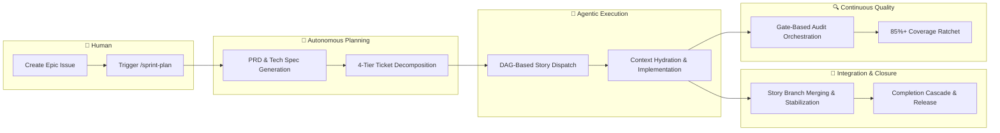

# Agent Protocols 🤖

A structured framework of instructions, personas, skills, and SDLC workflows
that govern AI coding assistants built on **Epic-Centric GitHub Orchestration**
— all planning, execution, and state management lives natively in GitHub Issues,
Labels, and Projects V2.

## Architecture Overview



- **GitHub as SSOT**: Issues, Labels, and Projects V2 are the single source of
  truth. No local playbooks or sprint files.
- **Provider Abstraction**: All ticketing operations flow through
  `ITicketingProvider`, an abstract interface with a shipped GitHub
  implementation using native `fetch()` (Node 20+).
- **Two-Command UX**: `/sprint-plan` generates PRDs, Tech Specs, and a full
  4-tier task hierarchy. `/sprint-execute` routes by `type::` label — pass a
  Story ID to drive a single Story to completion, or an Epic ID to run an entire
  Epic end-to-end (locally or via the GitHub `agent::dispatching` remote-trigger
  workflow). See [How to execute an Epic](#how-to-execute-an-epic).
- **Self-Contained**: Zero external SDK dependencies for core orchestration. No
  `@octokit/*`, no Axios — just raw HTTP and GraphQL.
- **Gate-Based Quality**: An automated audit orchestration pipeline selects and
  runs relevant audits at four sprint lifecycle gates, enforcing a
  maintainability ratchet that prevents code quality degradation. **Epic #596
  (v5.22.0)** adds a sibling per-method **CRAP gate** (complexity × coverage
  risk) wired into close-validation, CI, and pre-push, with a base-branch-
  enforced anti-gaming guardrail that blocks silent threshold relaxation. See
  the consumer-onboarding section in [`.agents/README.md`](.agents/README.md)
  for first-run behavior, opt-out, and `--json` output semantics.
- **Tunable concurrency caps**: **Epic #638 (v5.23.0)** turns the
  `concurrentMap` caps shipped in #553 into a configurable surface
  (`orchestration.concurrency.{waveGate, commitAssertion, progressReporter}`).
  Omitting the block preserves v5.21.0 behaviour exactly; operators tune from
  real `phase-timings` data via the new
  `.agents/scripts/aggregate-phase-timings.js` CLI. Same Epic ships a
  CHANGELOG style contract (`.agents/rules/changelog-style.md`), a
  compact-retro short-circuit for clean-manifest sprints, and the
  `/sprint-close --full-retro` override.

## Get Started

### 1. Install & Bootstrap

```powershell
# Add submodule (uses the dist branch)
git submodule add -b dist https://github.com/dsj1984/agent-protocols.git .agents

# Run idempotent bootstrap (creates labels, project fields)
node .agents/scripts/agents-bootstrap-github.js --install-workflows
```

### 2. Configure

Copy `.agents/default-agentrc.json` to your project root as `.agentrc.json` and
set your repository details:

```json
{
  "orchestration": {
    "provider": "github",
    "github": {
      "owner": "your-org",
      "repo": "your-repo",
      "operatorHandle": "@your-username"
    }
  }
}
```

Set `GITHUB_TOKEN` in your environment (or a `.env` file at the project root)
for background script authentication.

### 2b. MCP Activation (Optional but Recommended)

For the best agentic experience, add the orchestration server to your IDE or MCP
host:

```json
"agent-protocols": {
  "command": "node",
  "args": ["/absolute/path/to/your/project/.agents/scripts/mcp-orchestration.js"]
}
```

This enables agents to use native tools like `dispatch_wave` instead of raw
shell commands. See [.agents/MCP.md](.agents/MCP.md) for the full tool
reference (per-tool schemas, error modes, decision matrix, troubleshooting)
and [.agents/README.md](.agents/README.md) for the host-level configuration
details.

> **Hardening note (Epic #511, v5.19.0):** `tools/call` arguments are now
> AJV-validated against each tool's `inputSchema`, so malformed payloads
> return JSON-RPC `-32602 Invalid params` with a failing path rather than
> surfacing as downstream exceptions. `dispatch_wave` results also carry
> `manifestPersisted` / `manifestPersistError` so callers can detect a
> failed manifest write instead of reading a stale file. Full rundown in
> [docs/CHANGELOG.md](docs/CHANGELOG.md) under 5.19.0.

### 3. Plan Your First Epic

Create a GitHub Issue with the `type::epic` label, then run:

```text
/sprint-plan [EPIC_NUMBER]
```

See [SDLC.md](.agents/SDLC.md) for the full end-to-end workflow.

---

## How to execute an Epic

> **Full reference:** [`.agents/SDLC.md`](.agents/SDLC.md) is the canonical
> end-to-end workflow guide. The summary below is an orientation; see SDLC.md
> for the detailed happy path, HITL touchpoints, and the local-vs-remote
> decision matrix. For the slash-command reference index, see
> [`docs/workflows.md`](docs/workflows.md).

Two invocation paths share a single engine
(`.agents/scripts/lib/orchestration/epic-runner.js`):

### Path 1 — Local, operator-driven

```bash
# Plan the Epic first (generates PRD, Tech Spec, Stories, Tasks).
claude /sprint-plan <epicId>

# Drive it end-to-end from your workstation.
claude /sprint-execute <epicId>

# Or run individual Stories off the dispatch table.
claude /sprint-execute <storyId>
```

`/sprint-execute` (Epic Mode) flips the Epic to `agent::executing`, checkpoints
progress on the issue itself, fans out up to `concurrencyCap` Story executors
per wave, and lands at `agent::review`. If the Epic carries `epic::auto-close`,
the run continues autonomously through `/sprint-code-review` → `/sprint-retro` →
`/sprint-close`.

### Path 2 — Remote, GitHub-triggered

1. Configure repo secrets: `ANTHROPIC_API_KEY`, `ENV_FILE`, `MCP_JSON`.
2. On the Epic issue, add the `agent::dispatching` label (and optionally
   `epic::auto-close`).
3. `.github/workflows/epic-orchestrator.yml` fires, booting a Claude remote
   runner that runs `.agents/scripts/remote-bootstrap.js` and invokes
   `/sprint-execute` against a fresh clone.

The remote path has **one** pause point: `agent::blocked` on the Epic. Flip it
back to `agent::executing` to resume. All other labels (`risk::high`,
`epic::auto-close`, etc.) are informational during the run — mid-run changes are
ignored.

See [docs/remote-orchestrator.md](docs/remote-orchestrator.md) for the full
runner contract, failure/resumption model, and HITL touchpoints.

---

## Repository Structure

```text
agent-protocols/
├── .agents/                  # Distributed bundle (the "product")
│   ├── VERSION               # Current version (5.15.0)
│   ├── instructions.md       # Primary system prompt
│   ├── SDLC.md               # End-to-end workflow guide
│   ├── README.md             # Detailed consumer reference
│   ├── personas/             # Role-specific behavior (12 personas)
│   ├── rules/                # Domain-agnostic coding standards (9 rules)
│   ├── skills/               # Two-tier skill library
│   │   ├── core/             # Universal process skills (20 skills)
│   │   └── stack/            # Tech-stack-specific guardrails (22 skills)
│   ├── workflows/            # Slash-command automation (24 workflows)
│   ├── scripts/              # Orchestration engine
│   │   ├── lib/              # Core libraries (config, interfaces, factory)
│   │   │   ├── orchestration/  # SDK (dispatcher, hydrator, ticketing)
│   │   │   ├── presentation/   # Manifest rendering
│   │   │   └── mcp/            # MCP tool registry
│   │   ├── mcp/              # MCP tool implementations
│   │   └── providers/        # Ticketing provider implementations
│   ├── schemas/              # JSON Schemas for validation
│   └── templates/            # Context hydration templates
├── docs/                     # Changelog, plans, and legacy archive
├── tests/                    # Unit and integration tests
├── package.json              # Tooling: biome, markdownlint, husky
```

## Development

```powershell
npm run lint           # Check all markdown for lint errors
npm run format         # Auto-format all markdown files
npm test               # Run framework tests
npm run test:coverage  # Run tests with 85% coverage gate
```

## Documentation

| Document                                                      | Purpose                                             |
| ------------------------------------------------------------- | --------------------------------------------------- |
| [SDLC Workflow](.agents/SDLC.md)                              | **Canonical** end-to-end sprint lifecycle narrative |
| [Workflow Reference](docs/workflows.md)                       | Slash-command index grouped by lifecycle phase      |
| [Architecture](docs/architecture.md)                          | Module map, interfaces, and data flow               |
| [Remote Orchestrator](docs/remote-orchestrator.md)            | Runner contract, secrets, resumption semantics      |
| [Project Board](docs/project-board.md)                        | Projects V2 Status field, columns, and Views        |
| [Consumer Guide](.agents/README.md)                           | Setup, configuration, and APIs                      |
| [MCP Server Reference](.agents/MCP.md)                        | Per-tool reference for the orchestration MCP server |
| [Worktree Lifecycle](.agents/workflows/worktree-lifecycle.md) | Per-story `git worktree` isolation (v5.7.0+)        |
| [Changelog](docs/CHANGELOG.md)                                | Release history (v5.0.0+)                           |
| [Legacy Changelog](docs/archive/CHANGELOG-v4.md)              | v1.0.0 – v4.7.2 history                             |

### Parallel execution model (v5.7.0+)

When `orchestration.worktreeIsolation.enabled` is `true`, each dispatched story
runs inside its own `git worktree` at `.worktrees/story-<id>/`. The main
checkout stays quiet during a parallel sprint — branch swaps, staging, and
reflog activity are isolated per-story. Set it to `false` to preserve v5.5.1
single-tree behavior, backed by the `assert-branch.js` pre-commit guard and
focus-area wave serialization. See
[worktree-lifecycle.md](.agents/workflows/worktree-lifecycle.md) for the full
operator reference.

### Recent releases

- **v5.24.0 — Epic #668 (2026-04-24).** Parallel `/sprint-execute` on Claude
  Code web. The same command runs unchanged in claude.ai/code sessions,
  including N parallel sessions against one sprint wave. The committed
  `orchestration.worktreeIsolation.enabled` flag is now resolved per process
  via `AP_WORKTREE_ENABLED` (explicit operator override) and `CLAUDE_CODE_REMOTE`
  (web auto-detect), so one config serves both environments without git-
  history thrash. New claim-based pool mode: `/sprint-execute` with no story
  id picks the next eligible story off the Epic's dispatch manifest via an
  `in-progress-by:<sessionId>` label plus a `[claim]` structured comment, with
  read-back race detection. Launch-time dependency guard refuses stories with
  unmerged blockers. Story close wraps the epic-branch push in a bounded
  fetch-replay-push retry (`orchestration.closeRetry`) so concurrent closes
  from separate clones converge cleanly. Reclaimable stale claims (older than
  `orchestration.poolMode.staleClaimMinutes`, default 60) surface in pool-mode
  launch output for operator decision. New "Running sprint-execute on Claude
  Code web" runbook in `.agents/README.md`; worktree-off pattern and side-by-
  side execution-model diagram in [docs/patterns.md](docs/patterns.md) and
  [docs/architecture.md](docs/architecture.md). See
  [docs/CHANGELOG.md](docs/CHANGELOG.md) for the full entry.
- **v5.16.0 — Live runner progress + workflow-to-script migration (2026-04-22).**
  Two feature slices. (1) `ProgressReporter` now mirrors every per-wave
  snapshot to `<orchestration.epicRunner.logsDir>/epic-<epicId>-progress.log`
  so IDE-chat operators can tail Epic Mode runs via `Monitor` without
  tripping the Bash 10-minute ceiling. (2) Audit follow-on to the v5.15.4
  decomposer bug — broad sweep of `.agents/workflows/*.md` folded
  hand-authored bash/PowerShell logic into dedicated scripts so skills are
  launchers, not recipe books. New scripts: `sprint-execute-router.js`
  (type-label mode decision), `delete-epic-branches.js` (local + remote ref
  cleanup with `--dry-run`/`--json`), `git-pr-quality-gate.js` (lint +
  format + test gate, configurable via `.agentrc.json → qualityGate`),
  `git-rebase-and-resolve.js` (rebase orchestration with structured
  clean/conflict/error outcomes + `--continue`/`--abort`). New lib:
  `lib/plan-phase-cleanup.js` centralises the temp-file cleanup contract
  for the sprint-plan split flow; `Remove-Item` blocks gone from all three
  plan workflow `.md` files. `validate-docs-freshness.js` gains `--json`
  mode for programmatic failure enumeration. `/sprint-plan-decompose`
  Step 4 now invokes `sprint-plan-healthcheck.js` instead of asking the
  host LLM to walk the ticket graph by hand. `/git-merge-pr` Step 6
  conflict scan delegates to `detect-merges.js`; step numbers collapse
  from 8 to 7. +34 regression tests; full suite at 1010 passing.
- **v5.15.4 — Decomposer ticket-cap alignment (2026-04-22).** Patch-only fix
  to `/sprint-plan` Phase 2. The decomposer system prompt hardcoded a `25`
  ticket cap that overrode `.agentrc.json` `agentSettings.maxTickets` (default
  40) — the authoring LLM saw both values and picked the stricter one.
  `decomposer-prompts.js` now exports `renderDecomposerSystemPrompt({ maxTickets })`
  which interpolates the cap into the prompt's "Do NOT generate more than N
  tickets" warning. `buildDecompositionContext` reads `maxTickets` once and
  passes the same value to both the prompt and the returned context, so the
  two can no longer drift. Regression tests lock both the default (40) and a
  custom-config (60) value into the final `systemPrompt`.
- **v5.15.3 — Epic #441 (2026-04-22).** Patch-only resilience follow-ons for
  the retro action items from Epic #413. Fixes the `variableNotUsed: $issueId`
  GraphQL error that rendered every wave-poller progress row as `unknown` on
  Epic #413. Extends the MCP `post_structured_comment` `type` enum with
  `code-review`, `retro`, `retro-partial`, `epic-run-state`,
  `epic-run-progress`, `wave-N-start`/`wave-N-end`, `parked-follow-ons`, and
  `dispatch-manifest`. Sub-agents now auto-post `friction` structured comments
  for reap failures, wave-poller failures, and baseline refreshes
  (rate-limited per-Story). `/sprint-close` Phase 4 force-reaps worktrees
  whose Story branch is already merged into `epic/<id>` (with
  `--no-reap-discard-after-merge` override). `validateOrchestrationConfig` is
  wired into launcher `main()` for `epic-runner.js`, `plan-runner.js`,
  `sprint-plan-spec.js`, `sprint-plan-decompose.js`. `/sprint-execute` Epic
  Mode Phase 0.5 snapshots version-bump intent; `/sprint-execute` Story Mode
  close emits a docs-context-bridge friction comment when the Story touches
  configured `release.docs` paths. CI `test:coverage` gains stderr capture
  (`2>&1` + `set -o pipefail`) so silent-stderr failures no longer slip past
  the artifact. Post-wave `CommitAssertion` falls back to an epic-branch
  `resolves #<id>` grep when `origin/story-<id>` is already deleted by
  `sprint-story-close`.
- **v5.15.2 — Epic #413 (2026-04-22).** Patch-only resilience follow-ons
  for the retro action items from Epic #380. Spawner hardening (real
  `claude --version` integration test, pre-wave smoke-test, post-wave
  commit assertion). `sprint-story-close --resume / --restart` recovery
  paths. Biome v2 format gate restored at close time. `/sprint-close`
  Phase 3.2 tagging sanity check (`resolveTaggingPlan`). `detect-merges`
  skips its own test fixtures. `error-journal` parse-error fix +
  `validateOrchestrationConfig` wired into `resolveConfig()` +
  pending-cleanup drain at `/sprint-plan-spec` boot. `ProgressReporter`
  gains a stalled-worktree detector, a maintainability-drift detector,
  and a whole-epic table via `setPlan()` (every wave + story is
  rendered, not only the active wave). Configurable
  `orchestration.epicRunner.logsDir` (default `temp/epic-runner-logs/`).
  CI matrix added for Node 22 / 24.
- **v5.21.0 — Epic #553 (2026-04-24).** Epic-runner throughput and
  observability pass. New `lib/util/concurrent-map.js` underpins bounded-
  concurrency fanout in `sprint-wave-gate` (`getTicket` loops), wave-end
  commit-assertion (cap=4), and `ProgressReporter` (cap=8) — which now
  also caches per-ticket reads behind a 10-second TTL. Every
  `getTickets(epicId)` sweep primes the ticket cache so downstream
  `getTicket` calls issue zero HTTP. `gh auth token` is memoized across
  provider constructions. New `lib/util/phase-timer.js` threads through
  story-init / story-close and posts a `phase-timings` structured
  comment on close; the epic progress comment aggregates median / p95
  across closed stories. State-poller gains a bulk `issues?labels=…`
  path with per-ticket fallback. Windows worktree reap recovers from
  cwd-like failures and always `prune`s after remove. See
  [docs/CHANGELOG.md](docs/CHANGELOG.md) for the full entry.
- **Unreleased — Epic #470 (2026-04-23).** Clean-code & maintainability
  remediation: `providers/github.js` split into ticket-mapper, graphql-builder,
  cache-manager, and error-classifier modules under a thin façade; epic-runner
  coordinator decomposed into five phase modules; `sprint-story-init.js`
  broken into 6 injectable stages; `VerboseLogger` and `dispatch-logger.vlog`
  retired in favour of a level-aware `Logger`; `lib/runtime-context.js`
  injects `ctx` into legacy utilities. Also fixes two epic-runner bugs found
  while running the Epic itself: the idle-watchdog now re-reads the Story
  ticket before declaring `failed`, the Windows spawn uses `taskkill /T /F`
  to kill the shell's entire process tree, and resumed runs short-circuit
  already-done Stories. See [docs/CHANGELOG.md](docs/CHANGELOG.md) for the
  full entry.
- **v5.15.1 — Epic #380 (2026-04-22).** Patch-only internal hardening:
  two-stage Windows worktree reap (`fs.rm` retry + deferred sweep via
  `.worktrees/.pending-cleanup.json`); `/sprint-retro` routed through
  `provider.postComment` / MCP so retros never hit the Make.com webhook;
  `OrchestrationContext` / `EpicRunnerContext` / `PlanRunnerContext`
  replace opts bags across the epic-runner and plan-runner; new
  `ErrorJournal` writes structured JSONL to `temp/epic-<id>-errors.log`;
  shared `pollUntil` / `sleep` + label-transition helpers replace
  hand-rolled loops; `ProgressReporter` emits periodic wave snapshots on
  the Epic via an `epic-run-progress` structured comment. See
  [docs/CHANGELOG.md](docs/CHANGELOG.md) for the full entry.
- **v5.15.0 — Epic #349 (2026-04-22).** Self-serve GitHub-triggered
  planning pipeline; Kanban baseline; unified `/sprint-execute`. See the
  changelog for the full breakdown.

### Internal module layout (v5.13.0+)

The orchestration SDK's three largest modules — `lib/worktree-manager.js`,
`lib/orchestration/dispatch-engine.js`, and
`lib/presentation/manifest-renderer.js` — are now thin facades that compose
cohesive submodules under `lib/worktree/`, `lib/orchestration/`, and
`lib/presentation/`. Public imports are unchanged: every caller continues to
import `WorktreeManager`, `dispatch`, `renderManifestMarkdown`, etc. from the
same paths. Only the facade files are part of the stable public surface;
submodule paths are internal implementation detail. See
[architecture.md](docs/architecture.md) for the per-submodule responsibility
map.

## License

ISC
