# Agent Protocols 🤖

A structured framework of instructions, personas, skills, and SDLC workflows
that govern AI coding assistants. Version 5 is a **ground-up rewrite** built on
**Epic-Centric GitHub Orchestration** — all planning, execution, and state
management lives natively in GitHub Issues, Labels, and Projects V2.

## Architecture Overview

```mermaid
graph LR
    subgraph Human ["👤 Human"]
        A["Create Epic Issue"]
        B["Trigger /sprint-plan"]
    end

    subgraph Planning ["🤖 Autonomous Planning"]
        C["PRD & Tech Spec Generation"]
        D["4-Tier Ticket Decomposition"]
    end

    subgraph Execution ["🤖 Agentic Execution"]
        E["DAG-Based Task Dispatch"]
        F["Context Hydration & Implementation"]
    end

    subgraph Closure ["🤖 Integration & Closure"]
        G["Branch Integration & Stabilization"]
        H["Completion Cascade & Release"]
    end

    subgraph Refinement ["🔄 Autonomous Refinement"]
        I["Friction Analysis & Pattern Detection"]
        J["Protocol Suggestion & PR Generation"]
        K["Impact Tracking & Performance Reports"]
    end

    A --> B --> C --> D --> E --> F --> G --> H
    H --> I --> J --> K --> I
```



- **GitHub as SSOT**: Issues, Labels, and Projects V2 are the single source of
  truth. No local playbooks or sprint files.
- **Provider Abstraction**: All ticketing operations flow through
  `ITicketingProvider`, an abstract interface with a shipped GitHub
  implementation using native `fetch()` (Node 20+).
- **Two-Command UX**: `/sprint-plan` generates PRDs, Tech Specs, and a full
  4-tier task hierarchy. `/sprint-execute` dispatches work in Story-grouped
  waves, using shared context branches to minimize integration friction.
- **Self-Contained**: Zero external SDK dependencies for core orchestration. No
  `@octokit/*`, no Axios — just raw HTTP and GraphQL.
- **Autonomous Refinement**: A closed feedback loop that analyzes friction logs
  to suggest protocol improvements, identifies patterns, and tracks the impact of
  merged refinements on subsequent agent performance.
- **Real-time Monitoring**: Push-based health monitoring that updates a GitHub
  "Sprint Health" issue in real-time during execution.

## Get Started

### 1. Install & Bootstrap

```powershell
# Add submodule (uses the dist branch)
git submodule add -b dist https://github.com/dsj1984/agent-protocols.git .agents

# Run idempotent bootstrap (creates labels, project fields)
node .agents/scripts/bootstrap-agent-protocols.js --install-workflows
```

### 2. Configure

Copy `.agents/default-agentrc.json` to your project root as `.agentrc.json` and
set your repository details:

```json
{
  "orchestration": {
    "provider": "github",
    "github": {
      "owner": "your-org",
      "repo": "your-repo",
      "operatorHandle": "@your-username"
    }
  }
}
```

Set `GITHUB_TOKEN` in your environment (or a `.env` file at the project root)
for background script authentication.

### 2b. MCP Activation (Optional but Recommended)

For the best agentic experience, add the orchestration server to your IDE or MCP host:

```json
"agent-protocols": {
  "command": "node",
  "args": ["/absolute/path/to/your/project/.agents/scripts/mcp-orchestration.js"]
}
```

This enables agents to use native tools like `orchestrator_dispatch` instead of raw shell commands. See [.agents/README.md](.agents/README.md) for full configuration details.

### 3. Plan Your First Epic

Create a GitHub Issue with the `type::epic` label, then run:

```text
/sprint-plan [EPIC_NUMBER]
```

See [SDLC.md](.agents/SDLC.md) for the full end-to-end workflow.

---

## Repository Structure

```text
agent-protocols/
├── .agents/                  # Distributed bundle (the "product")
│   ├── VERSION               # Current version (5.0.0)
│   ├── instructions.md       # Primary system prompt
│   ├── SDLC.md               # End-to-end workflow guide
│   ├── README.md             # Detailed consumer reference
│   ├── personas/             # Role-specific behavior (12 personas)
│   ├── rules/                # Domain-agnostic coding standards (8 rules)
│   ├── skills/               # Two-tier skill library
│   │   ├── core/             # Universal process skills (20 skills)
│   │   └── stack/            # Tech-stack-specific guardrails (19 skills)
│   ├── workflows/            # Slash-command automation (25 workflows)
│   ├── scripts/              # Orchestration engine
│   │   ├── lib/              # Core libraries (config, interfaces, factory)
│   │   └── providers/        # Ticketing provider implementations
│   ├── schemas/              # JSON Schemas for validation
│   └── templates/            # Context hydration templates
├── docs/                     # Roadmap and legacy changelog archive
│   ├── ROADMAP.md            # Auto-generated project roadmap
├── tests/                    # Unit and integration tests
├── package.json              # Tooling: markdownlint, prettier, husky
```

## Development

```powershell
npm run lint           # Check all markdown for lint errors
npm run format         # Auto-format all markdown files
npm test              # Run framework tests
```

## Documentation

| Document                                         | Purpose                        |
| ------------------------------------------------ | ------------------------------ |
| [Consumer Guide](.agents/README.md)              | Setup, configuration, and APIs |
| [SDLC Workflow](.agents/SDLC.md)                 | End-to-end sprint lifecycle    |
| [Changelog](docs/CHANGELOG.md)                   | Release history (v5.0.0+)      |
| [Legacy Changelog](docs/archive/CHANGELOG-v4.md) | v1.0.0 – v4.7.2 history        |
| [Roadmap](docs/ROADMAP.md)                       | Auto-generated from Issues     |

## License

ISC
