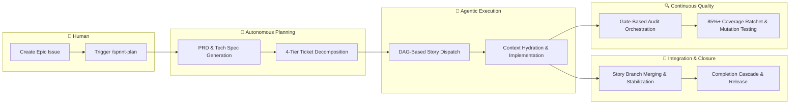

# Agent Protocols 🤖

A structured framework of instructions, personas, skills, and SDLC workflows
that govern AI coding assistants built on **Epic-Centric GitHub Orchestration**
— all planning, execution, and state management lives natively in GitHub Issues,
Labels, and Projects V2.

## Architecture Overview



- **GitHub as SSOT**: Issues, Labels, and Projects V2 are the single source of
  truth. No local playbooks or sprint files.
- **Provider Abstraction**: All ticketing operations flow through
  `ITicketingProvider`, an abstract interface with a shipped GitHub
  implementation using native `fetch()` (Node 20+).
- **Two-Command UX**: `/sprint-plan` generates PRDs, Tech Specs, and a full
  4-tier task hierarchy. `/sprint-execute` routes by `type::` label — pass a
  Story ID to drive a single Story to completion, or an Epic ID to run an
  entire Epic end-to-end (locally or via the GitHub `agent::dispatching`
  remote-trigger workflow). See [How to execute an Epic](#how-to-execute-an-epic).
- **Self-Contained**: Zero external SDK dependencies for core orchestration. No
  `@octokit/*`, no Axios — just raw HTTP and GraphQL.
- **Gate-Based Quality**: An automated audit orchestration pipeline selects and
  runs relevant audits at four sprint lifecycle gates, enforcing a
  maintainability ratchet that prevents code quality degradation.

## Get Started

### 1. Install & Bootstrap

```powershell
# Add submodule (uses the dist branch)
git submodule add -b dist https://github.com/dsj1984/agent-protocols.git .agents

# Run idempotent bootstrap (creates labels, project fields)
node .agents/scripts/bootstrap-agent-protocols.js --install-workflows
```

### 2. Configure

Copy `.agents/default-agentrc.json` to your project root as `.agentrc.json` and
set your repository details:

```json
{
  "orchestration": {
    "provider": "github",
    "github": {
      "owner": "your-org",
      "repo": "your-repo",
      "operatorHandle": "@your-username"
    }
  }
}
```

Set `GITHUB_TOKEN` in your environment (or a `.env` file at the project root)
for background script authentication.

### 2b. MCP Activation (Optional but Recommended)

For the best agentic experience, add the orchestration server to your IDE or MCP
host:

```json
"agent-protocols": {
  "command": "node",
  "args": ["/absolute/path/to/your/project/.agents/scripts/mcp-orchestration.js"]
}
```

This enables agents to use native tools like `dispatch_wave` instead of raw
shell commands. See [.agents/README.md](.agents/README.md) for full
configuration details.

### 3. Plan Your First Epic

Create a GitHub Issue with the `type::epic` label, then run:

```text
/sprint-plan [EPIC_NUMBER]
```

See [SDLC.md](.agents/SDLC.md) for the full end-to-end workflow.

---

## How to execute an Epic

Two invocation paths share a single engine
(`.agents/scripts/lib/orchestration/epic-runner.js`):

### Path 1 — Local, operator-driven

```bash
# Plan the Epic first (generates PRD, Tech Spec, Stories, Tasks).
claude /sprint-plan <epicId>

# Drive it end-to-end from your workstation.
claude /sprint-execute <epicId>

# Or run individual Stories off the dispatch table.
claude /sprint-execute <storyId>
```

`/sprint-execute` (Epic Mode) flips the Epic to `agent::executing`, checkpoints
progress on the issue itself, fans out up to `concurrencyCap` Story
executors per wave, and lands at `agent::review`. If the Epic carries
`epic::auto-close`, the run continues autonomously through
`/sprint-code-review` → `/sprint-retro` → `/sprint-close`.

### Path 2 — Remote, GitHub-triggered

1. Configure repo secrets: `ANTHROPIC_API_KEY`, `ENV_FILE`, `MCP_JSON`.
2. On the Epic issue, add the `agent::dispatching` label (and optionally
   `epic::auto-close`).
3. `.github/workflows/epic-dispatch.yml` fires, booting a Claude remote
   runner that runs `.agents/scripts/remote-bootstrap.js` and invokes
   `/sprint-execute` against a fresh clone.

The remote path has **one** pause point: `agent::blocked` on the Epic.
Flip it back to `agent::executing` to resume. All other labels
(`risk::high`, `epic::auto-close`, etc.) are informational during the
run — mid-run changes are ignored.

See [docs/remote-orchestrator.md](docs/remote-orchestrator.md) for the
full runner contract, failure/resumption model, and HITL touchpoints.

---

## Repository Structure

```text
agent-protocols/
├── .agents/                  # Distributed bundle (the "product")
│   ├── VERSION               # Current version (5.2.3)
│   ├── instructions.md       # Primary system prompt
│   ├── SDLC.md               # End-to-end workflow guide
│   ├── README.md             # Detailed consumer reference
│   ├── personas/             # Role-specific behavior (12 personas)
│   ├── rules/                # Domain-agnostic coding standards (9 rules)
│   ├── skills/               # Two-tier skill library
│   │   ├── core/             # Universal process skills (20 skills)
│   │   └── stack/            # Tech-stack-specific guardrails (22 skills)
│   ├── workflows/            # Slash-command automation (24 workflows)
│   ├── scripts/              # Orchestration engine
│   │   ├── lib/              # Core libraries (config, interfaces, factory)
│   │   │   ├── orchestration/  # SDK (dispatcher, hydrator, ticketing)
│   │   │   ├── presentation/   # Manifest rendering
│   │   │   └── mcp/            # MCP tool registry
│   │   ├── mcp/              # MCP tool implementations
│   │   └── providers/        # Ticketing provider implementations
│   ├── schemas/              # JSON Schemas for validation
│   └── templates/            # Context hydration templates
├── docs/                     # Changelog, plans, and legacy archive
├── tests/                    # Unit and integration tests
├── package.json              # Tooling: markdownlint, prettier, husky
```

## Development

```powershell
npm run lint           # Check all markdown for lint errors
npm run format         # Auto-format all markdown files
npm test               # Run framework tests
npm run test:coverage  # Run tests with 85% coverage gate
npm run mutate         # Run Stryker mutation testing
```

## Documentation

| Document                                                      | Purpose                                      |
| ------------------------------------------------------------- | -------------------------------------------- |
| [Consumer Guide](.agents/README.md)                           | Setup, configuration, and APIs               |
| [SDLC Workflow](.agents/SDLC.md)                              | End-to-end sprint lifecycle                  |
| [Worktree Lifecycle](.agents/workflows/worktree-lifecycle.md) | Per-story `git worktree` isolation (v5.7.0+) |
| [Changelog](docs/CHANGELOG.md)                                | Release history (v5.0.0+)                    |
| [Legacy Changelog](docs/archive/CHANGELOG-v4.md)              | v1.0.0 – v4.7.2 history                      |

### Parallel execution model (v5.7.0+)

When `orchestration.worktreeIsolation.enabled` is `true`, each dispatched story
runs inside its own `git worktree` at `.worktrees/story-<id>/`. The main
checkout stays quiet during a parallel sprint — branch swaps, staging, and
reflog activity are isolated per-story. Set it to `false` to preserve v5.5.1
single-tree behavior, backed by the `assert-branch.js` pre-commit guard and
focus-area wave serialization. See
[worktree-lifecycle.md](.agents/workflows/worktree-lifecycle.md) for the full
operator reference.

### Internal module layout (v5.13.0+)

The orchestration SDK's three largest modules — `lib/worktree-manager.js`,
`lib/orchestration/dispatch-engine.js`, and
`lib/presentation/manifest-renderer.js` — are now thin facades that compose
cohesive submodules under `lib/worktree/`, `lib/orchestration/`, and
`lib/presentation/`. Public imports are unchanged: every caller continues to
import `WorktreeManager`, `dispatch`, `renderManifestMarkdown`, etc. from the
same paths. Only the facade files are part of the stable public surface;
submodule paths are internal implementation detail. See
[architecture.md](docs/architecture.md) for the per-submodule responsibility
map.

## License

ISC
