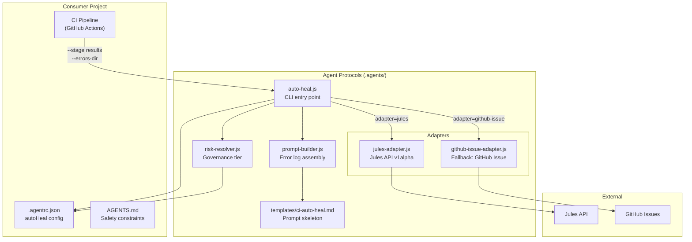

# Auto-Heal Workflow Design — Agent Protocols Extraction

## TL;DR

**Yes, this is a strong idea.** The auto-heal capability is currently tightly coupled to `athlete-portal`'s CI pipeline and Jules API specifics. Extracting it into agent-protocols as a **workflow + script + config schema** triad makes it reusable for any consuming project while keeping CI wiring as the consumer's responsibility.

## Current State (athlete-portal)

Today the self-heal lives in two project-specific locations:

| Component | Location | Concern |
|---|---|---|
| CI job definition | `.github/workflows/ci.yml` (lines 393–479) | Orchestrates artifact collection, conditional dispatch |
| Trigger script | `scripts/trigger-jules-session.sh` | Builds prompt, calls Jules API, handles rate limits |
| Auto-heal scope table | `AGENTS.md` | Documents governance tiers and allowed modifications |
| Config | Hardcoded in the bash script | No `.agentrc.json` integration |

### What's Project-Specific vs Reusable

| Aspect | Reusable (belongs in agent-protocols) | Project-Specific (stays in consumer) |
|---|---|---|
| Governance tiers (lint=🟢, typecheck=🟡, e2e=🔴) | ✅ | |
| Prompt construction with error context | ✅ | |
| Jules API client with retry/rate-limit handling | ✅ | |
| GitHub Issue-based fallback (Copilot Workspace) | ✅ | |
| CI stage names and artifact paths | | ✅ |
| CI job `needs:` DAG and `if:` conditions | | ✅ |
| Secret names and environment variables | | ✅ |
| Allowed modification scope per failure type | ✅ (configurable) | |

---

## Proposed Design

### 1. New `.agentrc.json` Configuration Section

Add a new top-level `autoHeal` section to the config schema:

```json
{
  "autoHeal": {
    "enabled": true,
    "adapter": "jules",
    "adapters": {
      "jules": {
        "apiKeyEnv": "JULES_API_KEY",
        "apiUrl": "https://jules.googleapis.com/v1alpha/sessions",
        "requirePlanApproval": true,
        "maxRetries": 3,
        "timeoutMs": 30000
      },
      "github-issue": {
        "labelPrefix": "auto-heal",
        "assignCopilot": false
      }
    },
    "stages": {
      "lint": {
        "riskTier": "green",
        "autoApprove": true,
        "logArtifact": "lint-output.log",
        "allowedModifications": ["Any file flagged by linter output"],
        "forbiddenModifications": []
      },
      "typecheck": {
        "riskTier": "yellow",
        "autoApprove": false,
        "logArtifact": "typecheck-output.log",
        "allowedModifications": ["Type annotations", "interface definitions", "import paths"],
        "forbiddenModifications": ["Auth middleware", "seed data"]
      },
      "unit": {
        "riskTier": "yellow",
        "autoApprove": false,
        "logArtifact": "unit-test-output.log",
        "allowedModifications": ["Test files (*.test.ts)", "mock setup", "source code bug fixes"],
        "forbiddenModifications": ["Seed data", "migration files"]
      },
      "e2e": {
        "riskTier": "red",
        "autoApprove": false,
        "logArtifact": "e2e-report/index.html",
        "allowedModifications": ["Playwright spec files", "page objects", "component test IDs"],
        "forbiddenModifications": ["Auth middleware", "API route signatures"]
      }
    },
    "promptTemplate": "ci-auto-heal",
    "maxLogSizeBytes": 4000,
    "branchFilter": ["main"],
    "consolidateSession": true
  }
}
```

> [!IMPORTANT]
> The `stages` block is **fully consumer-configurable**. A project using Jest instead of Vitest, or Cypress instead of Playwright, just adjusts stage names and artifact paths. The framework doesn't care what stages exist — it only cares about the risk tier mapping.

### 2. New Script: `.agents/scripts/auto-heal.js`

A Node.js replacement for the current Bash script with proper structure:

```
.agents/scripts/
├── auto-heal.js              # CLI entry point
└── lib/
    ├── auto-heal/
    │   ├── index.js           # Barrel export
    │   ├── prompt-builder.js  # Builds consolidated prompt from error logs
    │   ├── risk-resolver.js   # Determines governance tier from stage results
    │   └── adapters/
    │       ├── jules-adapter.js        # Jules API v1alpha client
    │       └── github-issue-adapter.js # Fallback: creates GitHub Issue
    └── ...existing libs
```

#### CLI Interface

```bash
node .agents/scripts/auto-heal.js \
  --stage lint=failure \
  --stage typecheck=success \
  --stage unit=failure \
  --errors-dir ./auto-heal-errors \
  --sha abc1234 \
  --pr 42 \
  --branch main
```

#### Key Design Decisions

1. **Node.js, not Bash** — Consistent with the rest of the agent-protocols scripts. Works on Windows (PowerShell) without WSL. Uses the existing `config-resolver.js` to read `.agentrc.json`.

2. **Adapter pattern** — Matches the existing `IExecutionAdapter` pattern. The Jules API adapter is the primary, GitHub Issue creation is the fallback (and also useful for teams without Jules API access yet).

3. **Prompt template** — Uses `.agents/templates/ci-auto-heal.md` for the prompt skeleton, with variables injected at runtime. Consumers can override this template.

### 3. New Template: `.agents/templates/ci-auto-heal.md`

```markdown
---
name: ci-auto-heal
description: Prompt template for CI auto-heal sessions
---

# CI Auto-Heal Request

## Context
- **Repository:** {{repo}}
- **Commit:** {{sha}}
- **PR:** #{{prNumber}}
- **Branch:** {{branch}}
- **Failed Stages:** {{failedStages}}
- **Risk Tier:** {{riskTier}} ({{riskEmoji}})
- **Auto-Approve:** {{autoApprove}}

## Constraints

Refer to AGENTS.md in the repository root for project conventions and safety constraints.

### Allowed Modifications
{{#each stages}}
{{#if failed}}
**{{name}}:**
{{#each allowedModifications}}- ✅ {{this}}
{{/each}}
{{#each forbiddenModifications}}- 🚫 {{this}}
{{/each}}
{{/if}}
{{/each}}

## Error Logs
{{errorSections}}

## Instructions

Analyze ALL errors above and generate a SINGLE consolidated fix.
You may modify source code, type definitions, test files, and configuration
as permitted by the constraints above. Do NOT modify forbidden files.
```

### 4. New Workflow: `.agents/workflows/ci-auto-heal.md`

This is the **agent-facing documentation** — not CI automation. It tells a local agent how to manually execute the auto-heal process:

```markdown
---
description: >-
  Triage and remediate CI failures using governance-tiered auto-healing.
  Dispatches to the configured adapter (Jules API or GitHub Issue).
---

# /ci-auto-heal

## When to Run
- Manually after a CI failure on `main` when auto-heal didn't trigger
- As a diagnostic tool to understand failure scope and risk tier

## Step 0 — Gather Failure Context
1. Identify failed CI stages from the workflow run
2. Download error artifacts to a local directory

## Step 1 — Dispatch Auto-Heal
```powershell
node .agents/scripts/auto-heal.js \
  --stage lint=<result> \
  --stage typecheck=<result> \
  --stage unit=<result> \
  --stage e2e=<result> \
  --errors-dir ./auto-heal-errors \
  --sha <commit-sha> \
  --pr <pr-number>
```

## Step 2 — Monitor Session
...
```

### 5. Consumer CI Integration (Template)

Add a **reference CI template** in `.agents/templates/ci-auto-heal-job.yml` that consumers copy-paste into their own CI:

```yaml
# .agents/templates/ci-auto-heal-job.yml
# Copy this into your CI workflow and customize stage names/artifact names.
#
# Prerequisites:
#   - JULES_API_KEY secret configured
#   - Error log artifacts uploaded by prior CI stages

auto-heal:
  name: Auto-Heal
  runs-on: ubuntu-latest
  needs: [lint, typecheck, test, build-and-e2e]  # ← customize
  if: >-
    always() &&
    github.ref == 'refs/heads/main' &&
    contains(needs.*.result, 'failure')
  permissions:
    contents: write
    pull-requests: write
    issues: write
  steps:
    - uses: actions/checkout@v4

    - name: Setup Node.js
      uses: actions/setup-node@v4
      with:
        node-version: '22'

    # Download error artifacts (customize names to match your CI)
    - name: Download lint errors
      if: needs.lint.result == 'failure'
      uses: actions/download-artifact@v4
      with:
        name: lint-error-log
        path: auto-heal-errors/lint
      continue-on-error: true

    # ... repeat for each stage ...

    - name: Dispatch Auto-Heal
      run: |
        node .agents/scripts/auto-heal.js \
          --stage "lint=${{ needs.lint.result }}" \
          --stage "typecheck=${{ needs.typecheck.result }}" \
          --stage "test=${{ needs.test.result }}" \
          --stage "e2e=${{ needs.build-and-e2e.result }}" \
          --errors-dir auto-heal-errors \
          --sha "${{ github.sha }}" \
          --pr "${{ github.event.pull_request.number || '0' }}"
      env:
        JULES_API_KEY: ${{ secrets.JULES_API_KEY }}
        GITHUB_TOKEN: ${{ secrets.GITHUB_TOKEN }}
```

---

## Architecture Diagram



---

## MCP Tool Extension

Optionally expose an `auto_heal` tool via the MCP server so agents can trigger it programmatically:

| Tool | Purpose |
|---|---|
| `trigger_auto_heal` | Dispatches an auto-heal session from within an agent conversation |

This would register in `mcp-orchestration.js` alongside the existing tools. Useful for scenarios where an agent is running `/sprint-execute`, encounters a CI failure, and wants to self-remediate without human intervention.

---

## Migration Path for athlete-portal

1. **Phase 1** — Implement the new script + config in agent-protocols submodule
2. **Phase 2** — Add `autoHeal` config to athlete-portal's `.agentrc.json`
3. **Phase 3** — Replace `scripts/trigger-jules-session.sh` with `node .agents/scripts/auto-heal.js` in `ci.yml`
4. **Phase 4** — Delete `scripts/trigger-jules-session.sh`

---

## Open Questions

> [!IMPORTANT]
> **Adapter extensibility** — Should we design for additional adapters beyond Jules and GitHub Issues? (e.g., Devin API, Codex API, generic webhook). If so, the adapter interface should be formalized like `IExecutionAdapter`.

> [!WARNING]
> **Jules API stability** — The current API is `v1alpha`. The adapter should be designed so that API changes only require updating `jules-adapter.js`, not consumer configs.

> [!NOTE]
> **Stage names** — Should the framework ship with a default set of stage names (lint, typecheck, unit, e2e, build) that consumers extend, or should it be fully blank-slate? A default set with override capability feels right — it establishes conventions without being prescriptive.
