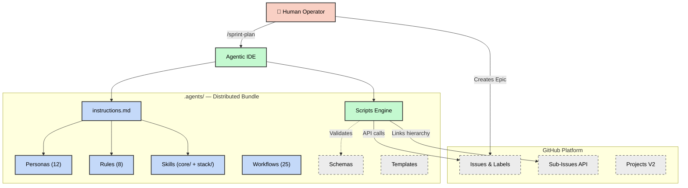
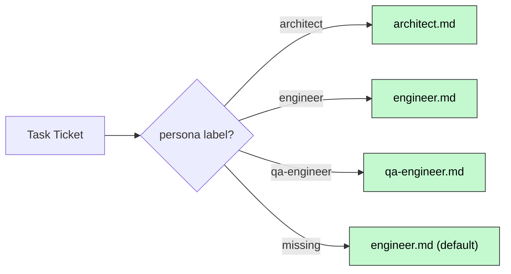
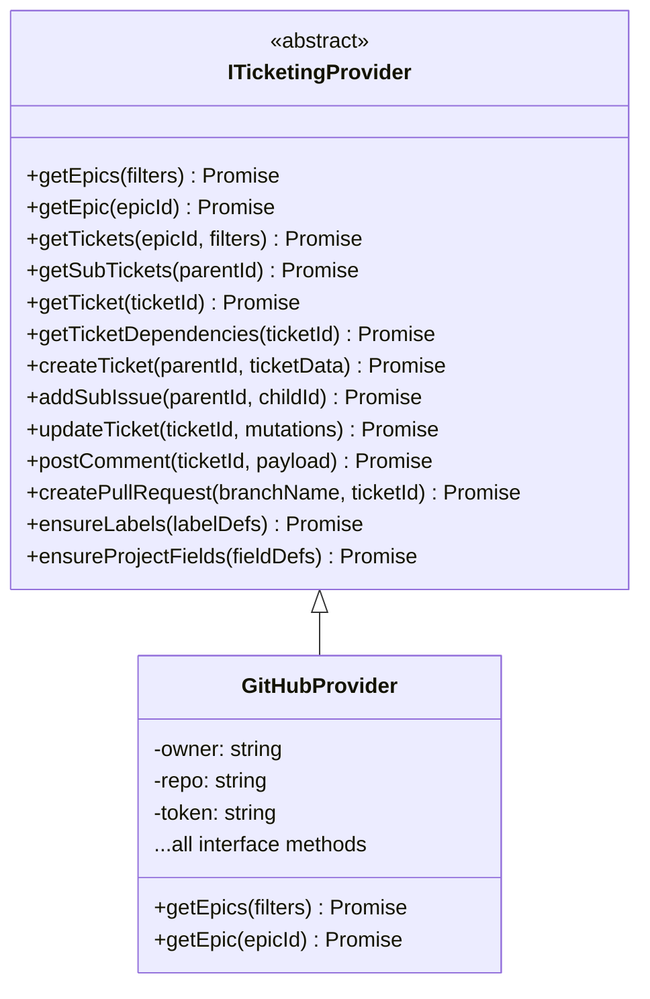
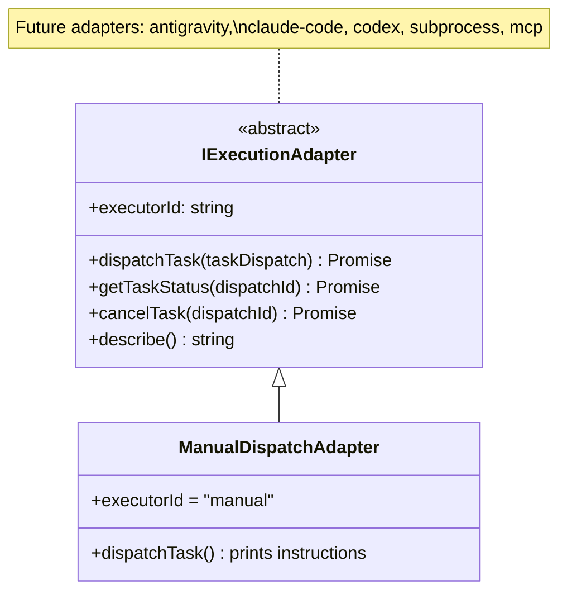
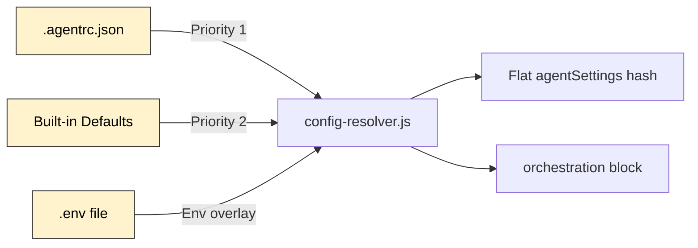
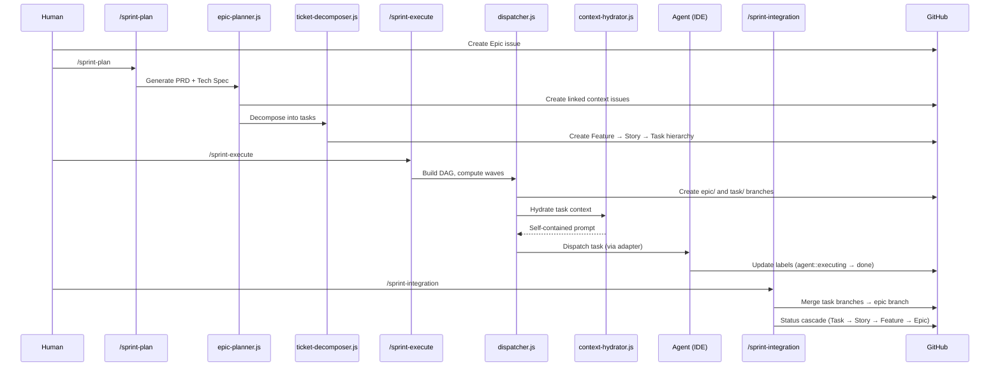
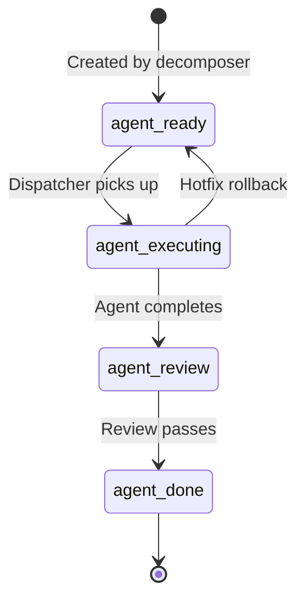

# Architecture

> **Version:** 5.0.0 · **Updated:** 2026-04-06

This document describes the internal architecture of Agent Protocols — a
framework of instructions, personas, skills, and SDLC workflows that govern AI
coding assistants. It is the authoritative reference for how the system is
structured, how components interact, and where to find each subsystem.

---

## High-Level Overview

Agent Protocols follows an **Epic-Centric GitHub Orchestration** model where
GitHub Issues, Labels, and Projects V2 serve as the Single Source of Truth
(SSOT). The framework decomposes product initiatives (Epics) into executable
agent tasks, dispatches them across parallel waves, and integrates the results —
all without local state files.



---

## Repository Layout

The repository has a clear separation between the **distributed product**
(`.agents/`) and **development tooling** (root-level files).

```text
agent-protocols/
├── .agents/                  ← Distributed bundle (the "product")
│   ├── instructions.md       ← Primary system prompt (all agent rules)
│   ├── VERSION               ← Semantic version (currently 5.0.0)
│   ├── SDLC.md               ← Sprint pipeline user guide
│   ├── README.md             ← Consumer documentation
│   ├── default-agentrc.json  ← Default config template
│   │
│   ├── personas/             ← 12 role-specific behavior files
│   ├── rules/                ← 8 domain-agnostic coding standards
│   ├── skills/               ← Two-tier skill library
│   │   ├── core/             ←   20 universal process skills
│   │   └── stack/            ←   5 tech-stack categories
│   ├── workflows/            ← 25 SDLC slash-command workflows
│   ├── scripts/              ← Deterministic JavaScript tooling
│   │   ├── lib/              ←   Shared modules & interfaces
│   │   ├── providers/        ←   Ticketing provider implementations
│   │   └── adapters/         ←   Execution adapter implementations
│   ├── schemas/              ← JSON Schema for structured output
│   └── templates/            ← Prompt and planning templates
│
├── .agentrc.json             ← Runtime configuration (dogfooding)
├── .github/workflows/        ← CI/CD pipeline (ci.yml)
├── docs/                     ← Project documentation
├── tests/                    ← Framework test suite
│   └── lib/                  ←   Library-specific unit tests
├── temp/                     ← Ephemeral runtime artifacts (git-ignored)
├── biome.json                ← Biome linter/formatter config
├── package.json              ← npm tooling + dev dependencies
└── AGENTS.md                 ← Repository-level onboarding
```

---

## Core Subsystems

### 1. Instruction Layer

The instruction layer defines **what agents are** and **how they must behave**.

| Component     | Path                           | Purpose                                                                                                                                         |
| ------------- | ------------------------------ | ----------------------------------------------------------------------------------------------------------------------------------------------- |
| System Prompt | `.agents/instructions.md`      | Master behavioral contract — 10 sections covering guardrails, FinOps, shell protocol, philosophy, quality discipline, Git conventions, and more |
| Personas      | `.agents/personas/*.md`        | 12 role-specific constraint files (architect, engineer, qa-engineer, etc.) that override default behavior when activated                        |
| Rules         | `.agents/rules/*.md`           | 8 domain-agnostic coding standards (API conventions, git conventions, security baseline, testing, etc.)                                         |
| Skills        | `.agents/skills/{core,stack}/` | Two-tier library of callable capabilities                                                                                                       |

#### Persona Routing



#### Skill Architecture

Skills use a **two-tier layout**:

- **`core/`** — 20 universal, process-driven skills (debugging, TDD, security,
  code review, context engineering, etc.)
- **`stack/`** — Technology-specific skills organized by category:
  - `architecture/` — Monorepo strategies, system design
  - `backend/` — Server frameworks, API patterns
  - `frontend/` — UI frameworks, CSS systems
  - `qa/` — Testing frameworks (Playwright, Vitest)
  - `security/` — Hardening patterns

Each skill contains a `SKILL.md` file with constraints and an optional
`examples/` directory.

---

### 2. Orchestration Engine

The orchestration engine is the **runtime brain** — a set of JavaScript ESM
scripts that automate the entire SDLC from planning through integration.

#### Component Diagram

```mermaid
graph TB
    classDef script fill:#e8d5f5,stroke:#333,color:#000
    classDef lib fill:#d5e8f5,stroke:#333,color:#000
    classDef iface fill:#f5e8d5,stroke:#333,color:#000

    subgraph Scripts ["Orchestration Scripts"]
        EP["epic-planner.js"]:::script
        TD["ticket-decomposer.js"]:::script
        DI["dispatcher.js"]:::script
        CH["context-hydrator.js"]:::script
        SI["sprint-integrate.js"]:::script
        NO["notify.js"]:::script
        UTS["update-ticket-state.js"]:::script
        VP["verify-prereqs.js"]:::script
        GR["generate-roadmap.js"]:::script
    end

    subgraph Lib ["Shared Library (lib/)"]
        CR["config-resolver.js"]:::lib
        PF["provider-factory.js"]:::lib
        AF["adapter-factory.js"]:::lib
        GH["Graph.js (DAG)"]:::lib
        DP["dependency-parser.js"]:::lib
        LC["llm-client.js"]:::lib
        GMO["git-merge-orchestrator.js"]:::lib
        GU["git-utils.js"]:::lib
        VL["VerboseLogger.js"]:::lib
        IV["integration-verifier.js"]:::lib
    end

    subgraph Interfaces ["Abstract Interfaces"]
        ITP["ITicketingProvider"]:::iface
        IEA["IExecutionAdapter"]:::iface
    end

    subgraph Implementations ["Concrete Implementations"]
        GHP["providers/github.js"]:::script
        MA["adapters/manual.js"]:::script
    end

    DI --> CR & PF & AF & GH & DP & CH
    SI --> CR & PF & GMO & IV & VL
    EP --> CR & PF & LC
    TD --> CR & PF & LC & DP

    PF --> ITP
    AF --> IEA
    ITP -.->|"implements"| GHP
    IEA -.->|"implements"| MA
```



#### Key Scripts

| Script                   | Responsibility                                                                    |
| ------------------------ | --------------------------------------------------------------------------------- |
| `epic-planner.js`        | Synthesizes Epic body → generates PRD and Tech Spec tickets via LLM               |
| `ticket-decomposer.js`   | Recursively decomposes specs into Feature → Story → Task hierarchy                |
| `dispatcher.js`          | Builds dependency DAG, computes execution waves, dispatches tasks                 |
| `context-hydrator.js`    | Assembles self-contained prompts (protocol + persona + skills + hierarchy + task) |
| `sprint-integrate.js`    | Merges task branches into Epic base branch via candidate branches                 |
| `update-ticket-state.js` | Syncs task status via GitHub labels (`agent::ready` → `agent::done`)              |
| `verify-prereqs.js`      | Validates dependency satisfaction before task execution                           |
| `notify.js`              | Dispatches notifications via @mention and webhook channels                        |
| `generate-roadmap.js`    | Auto-generates `docs/ROADMAP.md` from open Epics                                  |

---

### 3. Provider Abstraction Layer

All ticketing interactions are mediated through the **`ITicketingProvider`**
abstract interface, enabling future portability beyond GitHub.



**Resolution**: The `provider-factory.js` reads `orchestration.provider` from
`.agentrc.json` and instantiates the matching concrete class.

---

### 4. Execution Adapter Layer

The **`IExecutionAdapter`** interface separates _what to run_ (Dispatcher) from
_how to run it_ (Adapter), enabling pluggable agentic runtimes.



**Resolution**: The `adapter-factory.js` reads `orchestration.executor` from
`.agentrc.json` (default: `"manual"`).

---

### 5. Configuration System

Configuration follows a **layered resolution** pattern:



#### Key Configuration Sections

| Section         | Purpose                                                                    |
| --------------- | -------------------------------------------------------------------------- |
| `agentSettings` | Operational limits, paths, commands, thresholds                            |
| `orchestration` | Provider config, executor, LLM settings, notifications                     |
| `models`        | Cost-tiered model selection guidance (Architects → Workhorses → Sprinters) |
| `techStack`     | Project-specific technology choices                                        |

**Security**: The config resolver blocks shell metacharacter injection
(`; & | \`` `` $()`) in all string values that flow into subprocesses.

---

### 6. Dependency Graph Engine

The `Graph.js` module provides the mathematical foundation for task scheduling:

| Function                  | Algorithm                                  | Complexity |
| ------------------------- | ------------------------------------------ | ---------- |
| `buildGraph()`            | Adjacency list construction                | O(N)       |
| `detectCycle()`           | DFS 3-color cycle detection                | O(V+E)     |
| `assignLayers()`          | Memoized layer assignment                  | O(V+E)     |
| `computeWaves()`          | Layer-grouped wave partitioning            | O(V+E)     |
| `topologicalSort()`       | Kahn's algorithm (deterministic tie-break) | O(V+E)     |
| `transitiveReduction()`   | DFS-based edge pruning                     | O(V·(V+E)) |
| `autoSerializeOverlaps()` | Focus-area conflict serialization          | O(N²+V·E)  |
| `computeReachability()`   | Memoized DFS transitive closure            | O(V·(V+E)) |

The auto-serialization pass prevents file-level merge conflicts by injecting
synthetic dependency edges between tasks with overlapping `focusAreas`.

---

## Data Flow: Epic Lifecycle



---

## Ticket Hierarchy

The framework uses a 4-tier GitHub Issue hierarchy with label-based typing and
`blocked by #NNN` dependency wiring:

```text
Epic (type::epic)
├── PRD (context::prd)
├── Tech Spec (context::tech-spec)
├── Feature (type::feature)
│   ├── Story (type::story)
│   │   ├── Task (type::task)     ← Atomic agent work unit
│   │   │   ├── - [ ] subtask 1
│   │   │   └── - [ ] subtask 2
│   │   └── Task (type::task)
│   └── Story (type::story)
└── Feature (type::feature)
```

### State Machine

Each Task progresses through a label-driven state machine:



---

## Workflow System

The 25 slash-command workflows fall into four categories:

### Sprint Lifecycle

| Workflow                            | Phase     | Description                                                |
| ----------------------------------- | --------- | ---------------------------------------------------------- |
| `/sprint-plan`                      | Planning  | End-to-end PRD → Tech Spec → Task decomposition            |
| `/sprint-execute`                   | Execution | Dispatch manifest (Epic) or hydrated implementation (Task) |
| `/sprint-finalize-task`             | Execution | Validate, commit, state sync for a completed task          |
| `/sprint-verify-task-prerequisites` | Execution | Dependency satisfaction check                              |
| `/sprint-integration`               | Closure   | Merge task branches via candidate branch pattern           |
| `/sprint-code-review`               | Closure   | Comprehensive code review                                  |
| `/sprint-hotfix`                    | Closure   | Rapid remediation of integration failures                  |
| `/sprint-retro`                     | Closure   | Retrospective from ticket graph data                       |
| `/sprint-close-out`                 | Closure   | Merge to main, tag release, close Epic                     |

### Audit Suite

12 specialized audit workflows covering accessibility, architecture, clean code,
dependencies, DevOps, performance, privacy, quality, security, SEO, SRE, and
UX/UI. Each audit activates the corresponding persona and skill set.

### Git Operations

| Workflow                     | Description                                     |
| ---------------------------- | ----------------------------------------------- |
| `/git-commit-all`            | Stage and commit all changes                    |
| `/delete-epic`               | Hard reset: delete all Epic branches and issues |
| `/bootstrap-agent-protocols` | Initialize repo with v5 label taxonomy          |

### Security

| Workflow        | Description                  |
| --------------- | ---------------------------- |
| `/run-red-team` | Adversarial security testing |

---

## Security Architecture

### Input Validation

- **Shell injection protection**: `config-resolver.js` scans all config string
  values against a metacharacter regex (`/([;&|`]|\$\()/`) before they reach
  subprocess calls.
- **Branch name validation**: `dependency-parser.js` enforces safe branch
  component characters (alphanumeric, hyphens, underscores, dots, slashes).
- **Schema validation**: `orchestration` config is validated against an embedded
  JSON Schema via `ajv`.

### HITL Risk Gates

Tasks labeled `risk::high` are held at dispatch for explicit human approval.
Risk heuristics are defined in `.agentrc.json` under `riskGates.heuristics` and
cover destructive mutations, infrastructure changes, and global refactors.

### Anti-Thrashing Protocol

The framework enforces two circuit breakers to prevent runaway cost:

- **Error Threshold** (`consecutiveErrorCount`, default 3): Stop after N
  consecutive tool errors.
- **Stagnation Threshold** (`stagnationStepCount`, default 5): Stop after N
  steps without file modifications.

---

## Observability

### Friction Telemetry

Operational difficulties are logged directly to GitHub Task tickets via
`diagnose-friction.js`. This captures tool failures, command errors, and
automation candidates as structured comments.

### Verbose Logging

When `agentSettings.verboseLogging.enabled` is `true`, the `VerboseLogger`
writes structured JSONL files to `temp/verbose-logs/` capturing:

- Agent action dispatches and environment observations
- Workflow phase transitions
- Integration events
- Configuration resolution details

### Notification System

| Event               | Severity | Channel            |
| ------------------- | -------- | ------------------ |
| `task-complete`     | INFO     | GitHub @mention    |
| `feature-complete`  | INFO     | GitHub @mention    |
| `epic-complete`     | INFO     | @mention + webhook |
| `review-needed`     | ACTION   | @mention + webhook |
| `approval-required` | ACTION   | Webhook            |
| `blocked`           | ACTION   | Webhook            |

---

## Testing

The test suite uses the **Node.js native test runner** (`node --test`) with no
external test framework dependencies:

```text
tests/
├── bootstrap.test.js            ← Bootstrap script tests
├── config-orchestration.test.js ← Orchestration config validation
├── context-hydrator.test.js     ← Context assembly tests
├── diagnose-friction.test.js    ← Friction telemetry tests
├── dispatcher.test.js           ← Dispatch engine tests
├── epic-planner.test.js         ← Planning pipeline tests
├── execution-adapter.test.js    ← Adapter interface tests
├── notify.test.js               ← Notification system tests
├── provider-factory.test.js     ← Provider resolution tests
├── providers-github.test.js     ← GitHub provider tests
├── structure.test.js            ← File structure validation
├── ticket-decomposer.test.js   ← Decomposition pipeline tests
├── ticketing-provider.test.js   ← Provider interface tests
├── update-ticket-state.test.js  ← State sync tests
├── verify-prereqs.test.js       ← Prerequisite verification tests
└── lib/
    ├── config-resolver.test.js  ← Config resolver tests
    └── task-utils.test.js       ← Task utility tests
```

**Run**: `npm test` (invokes `node --test tests/*.test.js tests/lib/*.test.js`)

---

## CI/CD Pipeline

A single GitHub Actions workflow (`ci.yml`) runs on every push and PR:

1. **Lint** — Biome (JavaScript) + markdownlint (Markdown)
2. **Format Check** — Biome format verification
3. **Test** — Full test suite via `npm test`
4. **Dist Sync** — On merge to `main`, syncs `.agents/` to the `dist` branch for
   consumer submodule distribution

### Local Hooks

- **Husky** + **lint-staged**: Auto-lint and format staged `.md` files on commit

---

## FinOps Model

The framework implements an economic guardrail system for LLM cost management:

### Model Tiers

| Tier           | Models                                  | Use Case                             | Budget Allocation            |
| -------------- | --------------------------------------- | ------------------------------------ | ---------------------------- |
| **Architects** | Claude Opus 4.6, Gemini 3.1 Pro (High)  | Complex design, deep debugging       | 5-10% of tasks               |
| **Workhorses** | Claude Sonnet 4.6, Gemini 3.1 Pro (Low) | Standard features, API integration   | 20-30% of tasks              |
| **Sprinters**  | Gemini 3 Flash                          | Boilerplate, formatting, quick fixes | 60-80% of tasks, <10% budget |

### Budget Protocol

- **Soft Warning** at 80% of `maxTokenBudget` → user notification + webhook
- **Hard Stop** at 100% → execution halt, requires human override

---

## Distribution Model

Agent Protocols is distributed as a **Git submodule** via the `dist` branch:

```text
Consumer Project/
├── .agents/          ← Git submodule pointing to dist branch
│   ├── instructions.md
│   ├── personas/
│   ├── rules/
│   ├── skills/
│   ├── workflows/
│   ├── scripts/
│   └── ...
├── .agentrc.json     ← Project-specific configuration
└── ...
```

Consumers add the submodule, copy `default-agentrc.json` to their project root
as `.agentrc.json`, and configure their `techStack` and `orchestration` blocks.
