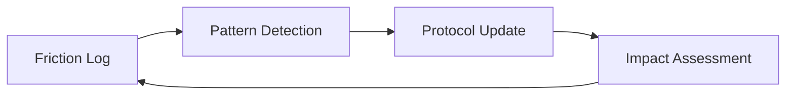

# Design Patterns

## Self-Healing Protocol

### Problem
Static instructions (system prompts and skills) become outdated as the tech stack evolves or as agents encounter recurring edge cases.

### Solution
Implement a **Self-Healing Protocol** pattern:
1.  **Logging Phase:** Agents record "friction events" whenever a tool fails or a goal is blocked.
2.  **Synthesis Phase:** An analyzer clusters these events into patterns.
3.  **Healing Phase:** A refiner agent modifies the protocol (skills/rules) to prevent the recurring issue.
4.  **Verification Phase:** An impact tracker validates that the change actually reduced friction in subsequent tasks.

### Structure

---

## Story-Level Branching

### Problem
Epic branches become massive, long-lived, and prone to merge conflicts across dozens of tasks.

### Solution
The **Story-Level Branching** pattern restricts the integration scope:
1.  **Base Branch:** `epic/NNN`
2.  **Shared Story Branch:** `story/EPIC-ID/STORY-NAME`
3.  **Task Branches:** `task/EPIC-ID/TASK-NAME` (branch from story branch)
4.  **Integration:** Task merges into Story branch → Story merges into Epic branch.

### Benefits
*   Reduced integration surface area.
*   Parallel development of independent stories without conflict.
*   Easier cherry-picking and rollback.
