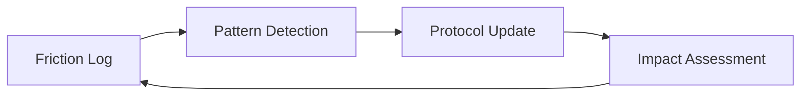

# Design Patterns

## Self-Healing Protocol

### Problem
Static instructions (system prompts and skills) become outdated as the tech stack evolves or as agents encounter recurring edge cases.

### Solution
Implement a **Self-Healing Protocol** pattern:
1.  **Logging Phase:** Agents record "friction events" whenever a tool fails or a goal is blocked.
2.  **Synthesis Phase:** An analyzer clusters these events into patterns.
3.  **Healing Phase:** A refiner agent modifies the protocol (skills/rules) to prevent the recurring issue.
4.  **Verification Phase:** An impact tracker validates that the change actually reduced friction in subsequent tasks.

### Structure


---

## Story-Level Branching

### Problem
Epic branches become massive, long-lived, and prone to merge conflicts across dozens of tasks.

### Solution
The **Story-Level Branching** pattern restricts the integration scope:
1.  **Base Branch:** `epic/NNN`
2.  **Shared Story Branch:** `story/EPIC-ID/STORY-NAME`
3.  **Task Branches:** `task/EPIC-ID/TASK-NAME` (branch from story branch)
4.  **Integration:** Task merges into Story branch → Story merges into Epic branch.

### Benefits
*   Reduced integration surface area.
*   Parallel development of independent stories without conflict.
*   Easier cherry-picking and rollback.

---

## Worktree-per-Story Isolation (v5.7.0+)

### Problem
Under parallel sprint execution, multiple story agents share the same working
tree. Rapid `git checkout` swaps cause one agent's `git add -A` to sweep WIP
from a different agent's story into the wrong commit. The v5.5.1 guards
prevent the specific observed failure modes but not the underlying class of
bug: multiple agents mutating one working tree at the same time.

### Solution
Each dispatched story runs in its own `git worktree`:
1.  **Worktree root:** `.worktrees/story-<id>/` (path traversal guarded).
2.  **Single authority:** `WorktreeManager` owns `ensure`, `reap`, `list`,
    `isSafeToRemove`, `gc`. No other code calls `git worktree` directly.
3.  **Dispatcher integration:** `dispatch()` ensures the worktree before
    dispatching and threads its path as `cwd` through the adapter;
    `sprint-story-close` reaps after a successful merge.
4.  **Fallback:** `orchestration.worktreeIsolation.enabled: false`
    restores single-tree behavior; v5.5.1 guards remain the primary
    defense in that mode.

### Benefits
*   Main-checkout HEAD never moves during a parallel sprint.
*   Each story's staging, reflog, and checkout operations are isolated.
*   Defense-in-depth preserved: pre-commit branch guard runs inside each worktree.
*   Fallback mode is a first-class supported configuration.

### Trade-offs
*   Disk usage multiplies with the `per-worktree` `node_modules` strategy;
    `symlink` and `pnpm-store` mitigate at the cost of platform fragility.
*   Concurrent `git fetch` can collide on `.git/packed-refs.lock` — handled
    by bounded retry (`gitFetchWithRetry`) rather than a global mutex.
*   Windows path limits require a pre-flight warning when estimated depth
    exceeds the configured threshold.

## Rule-as-SSOT, Skill-as-Guidance (v5.11.0+)

### Problem

When a framework ships both enforcement rules (`rules/*.md`) and authoring
guidance (`skills/**/SKILL.md`) covering the same domain, the skill tends to
drift — restating the rule's grammar in slightly different words, or inventing
parallel vocabularies when no constraint forces coherence. Over time the two
diverge, the reviewer has two documents to consult, and the rule's authority
erodes.

### Solution

Adopt a strict layering:

1. **Rule (`rules/<domain>.md`)** — the single SSOT for taxonomy, grammar,
   and forbidden patterns in its domain. Defines *what* is allowed.
2. **Skill (`skills/**/SKILL.md`)** — describes *how* and *when* authors
   apply the rule. Cross-links to the rule for the *what*; never restates
   the taxonomy or forbidden list.
3. **Workflow (`workflows/*.md`)** — describes *who triggers* the work and
   what artifact flows through the sprint. Defers to rule and skill for
   authoring specifics.

Enforced by a cross-reference audit (see Story #282 / Task #294): grep each
skill for redefinition of rule content and rewrite any violations.

### Benefits

*   Reviewers have exactly one place to verify tag or pattern validity.
*   Additions to the taxonomy require a rule PR — a deliberate, visible
    act rather than a silent divergence in a skill.
*   Skills stay short and focused on applied craft, not vocabulary.

### Trade-offs

*   Higher friction to add a new tag or forbidden pattern (rule PR + review).
*   Mitigated by designing extensible dimensions into the rule itself — e.g.
    `@domain-<slug>` lets consumers add project-specific domains without
    touching the rule.

### Example (this Epic)

`.agents/rules/gherkin-standards.md` owns the tag taxonomy and forbidden
patterns. `gherkin-authoring` teaches PRD AC → Scenario translation and the
step-reuse protocol by *pointing at* the rule. `playwright-bdd` configures the
runtime but *references* the rule's tag set instead of picking its own.

---

## Facade + Responsibility-Bounded Submodules

### Motivation

When an orchestration module grows past the point where a single file
usefully describes a single responsibility, we decompose it into cohesive
submodules behind a **thin facade**. The facade preserves every public
export at the existing import path; submodules are internal
implementation detail.

Introduced by Epic #297 (v5.13.0) to split `lib/worktree-manager.js`
(1,234 LOC), `lib/orchestration/dispatch-engine.js` (874 LOC), and
`lib/presentation/manifest-renderer.js` (600 LOC).

### Pattern

1. Create a sibling directory (`lib/worktree/`, `lib/orchestration/`,
   etc.) and extract cohesive submodules — each owning one
   responsibility, ≤350 LOC, with its own per-submodule test file.
2. Reduce the original file to a **facade** (typically ≤200 LOC) that
   imports the submodules, composes them, and re-exports the exact set
   of public symbols external callers currently consume.
3. For class-based modules (like `WorktreeManager`), the facade's class
   delegates each method body to a submodule helper that takes a
   lightweight `ctx` bag. State (e.g. caches) lives on the facade
   instance.
4. Preserve every test in the existing suite without edits. Where
   pre-existing tests probe internal helpers, add short
   backwards-compat delegate methods on the facade rather than
   rewriting the test.

### Benefits

*   Downstream consumers keep their import paths verbatim — no caller
    edits outside the three target areas.
*   Each submodule is individually unit-testable without mocking the
    entire class hierarchy.
*   Future behaviour changes land in the submodule that owns the
    concern, not a 1,000-LOC grab-bag.
*   The split merges are bisectable one-by-one because every
    intermediate state still preserves the public contract.

### Trade-offs

*   Backwards-compat delegates on the facade are technical debt —
    they exist solely to keep monkey-patch-heavy tests green. They
    must be actively retired as tests migrate.
*   Two-level indirection (facade → submodule helper) is a small
    readability tax on follow-up contributors; ADR and
    `architecture.md` must explicitly note which paths are the stable
    public surface.

### Example (this Epic)

```text
.agents/scripts/lib/worktree-manager.js       ← 223-LOC facade (public surface)
.agents/scripts/lib/worktree/
  lifecycle-manager.js                        ← git worktree ops
  node-modules-strategy.js                    ← per-worktree / symlink / pnpm-store
  bootstrapper.js                             ← .env, .mcp.json, .agents copy
  inspector.js                                ← porcelain + path helpers
```

External callers continue to import `WorktreeManager` and
`parseWorktreePorcelain` from the facade path verbatim; the four
submodule paths are free to rename without a major version bump.

---

## Marker-keyed structured comment upsert (v5.14.0)

Long-running orchestrator state lives on the Epic issue itself rather
than in a local file or side database. The pattern relies on
`upsertStructuredComment(provider, ticketId, type, body)` (in
`lib/orchestration/ticketing.js`), which:

1. Derives a unique HTML marker of the form
   `<!-- ap:structured-comment type="<type>" -->` from the `type`.
2. Searches the ticket's comments for the marker.
3. If a match exists, deletes it first.
4. Posts the new body with the marker prepended.

The result is **idempotent by marker**: re-running the upsert replaces
the prior comment, so checkpoints and wave-boundary reports never
accumulate as clutter.

**Consumers in the epic runner:**

| Type                 | Writer                      | Purpose                                                     |
| -------------------- | --------------------------- | ----------------------------------------------------------- |
| `epic-run-state`     | `Checkpointer`              | JSON checkpoint (`currentWave`, `autoClose`, wave history). |
| `wave-<N>-start`     | `WaveObserver.waveStart`    | Per-wave start manifest + timestamp.                        |
| `wave-<N>-end`       | `WaveObserver.waveEnd`      | Per-wave outcomes + duration.                               |
| `dispatch-manifest`  | `sprint-plan` / dispatcher  | Frozen Story manifest for the wave-gate.                    |
| `parked-follow-ons`  | dispatcher                  | Out-of-manifest Stories surfaced at sprint-close gate.      |
| `retro`              | `/sprint-retro`             | Final retrospective body with `retro-complete` marker.      |
| `code-review`        | (planned, Epic #349)        | Findings report from `/sprint-code-review`.                 |

**When to reach for this pattern:** orchestrator state that must
survive restarts, be human-readable on the issue, and be
machine-parseable by downstream tooling (wave-gate, retro aggregator).
Prefer a local file only when the state is ephemeral and recoverable
(e.g. `temp/dispatch-manifest-<id>.{md,json}` is a view, not an SSOT).

**When NOT to use it:** high-frequency state updates (sub-second or
sub-minute) — the delete-then-post cycle has rate-limit cost. For those
cases, compute a running total and upsert at wave boundaries instead.

---

## Error Handling Convention (Fatal vs. Throw)

### Problem

Scripts under `.agents/scripts/` mix two ways of signalling failure —
`throw new Error(...)` and `Logger.fatal(...)` (which calls
`process.exit(1)`). Without a rule, library modules sometimes call
`process.exit()` directly, which makes them untestable and impossible to
compose. Conversely, CLI entry points sometimes let unhandled rejections
escape, losing the framework's prefixed error line.

### Rule

| Layer                                                   | How failure is signalled                                                            |
| ------------------------------------------------------- | ----------------------------------------------------------------------------------- |
| **Library code** (`lib/**`, imported by multiple CLIs)  | `throw` an `Error`. **Never** call `Logger.fatal()` or `process.exit()`.            |
| **CLI entry point** (`main()` in a top-level script)    | Let `throw`n errors bubble out of `main()`.                                         |
| **CLI wrapper** (the `runAsCli(import.meta.url, main)` line) | Funnels the rejection through `cli-utils.js` → prefixed stderr + `process.exit(1)`. |
| **Logger primitive** (`Logger.fatal` in `lib/Logger.js`) | The one sanctioned caller of `process.exit(1)` — used only by CLIs that cannot rely on the `runAsCli` handler (e.g. multi-phase orchestrators that print their own summary before exiting). |

**Equivalently:** recoverable errors (or errors whose caller might want
to retry, catch, or convert to a friction comment) are **thrown**. Fatal
errors — the process must not continue and no caller up-stack can
recover — are either thrown from `main()` so `runAsCli` handles them, or
surfaced via `Logger.fatal()` at the CLI boundary.

### Why it matters

1.  **Library code stays pure.** `lib/orchestration/**` and
    `lib/worktree/**` are imported by the MCP server, the epic runner,
    and multiple CLI scripts. If any of them called `process.exit()`,
    they would kill the MCP server process on a recoverable error. The
    only way library code ends a process is by throwing and letting the
    top-level `runAsCli` handler convert that to an exit.
2.  **`runAsCli` gives uniform error output.** Every CLI that wraps its
    `main()` in `runAsCli(import.meta.url, main, { source: '<name>' })`
    prints `[<name>] Fatal error: <stack>` before exiting 1. Scripts
    that bypass the wrapper and `process.exit()` themselves lose that
    uniformity.
3.  **Testability.** A library that `throw`s can be asserted against in
    a unit test; a library that `process.exit()`s cannot.

### Accepted exceptions

*   **`lib/Logger.js`** — defines `Logger.fatal`, the one sanctioned
    call site of `process.exit(1)`.
*   **`lib/cli-utils.js`** — `runAsCli` is the default CLI error
    handler; its `process.exit(exitCode)` implements the contract for
    all entry-point scripts.
*   **Orchestrator CLIs that print their own summary** (e.g.
    `sprint-story-close.js`, `epic-runner.js`) may call
    `Logger.fatal()` explicitly when the error has already been logged
    in a structured form and a raw stack trace would add noise.

### Quick sweep

```bash
# Sites that should exist only in lib/Logger.js + lib/cli-utils.js:
grep -rn "process\.exit" .agents/scripts/lib | grep -v Logger.js | grep -v cli-utils.js

# Sites that should exist only at CLI boundaries:
grep -rn "Logger\.fatal" .agents/scripts/lib
```

Both queries should return no results when the convention holds.

---

## OrchestrationContext Dependency Injection (v5.15.1)

### Problem

The epic-runner and plan-runner submodules previously took a loosely-shaped
`opts` bag as their first argument. Over the Epic #321 and Epic #349 cycles
this object grew to hold `provider`, `logger`, `settings`, ad-hoc
feature flags, injected `execImpl` for tests, and several siblings. Each
new submodule picked a slightly different subset. Adding a new cross-cutting
concern — for Epic #380 this was the `ErrorJournal` — meant editing every
call site and hoping no path silently dropped the new field.

### Pattern

`lib/orchestration/context.js` exports three typed context constructors:

- `OrchestrationContext` — the shared base. Holds `provider`, `settings`,
  `logger`, and `errorJournal`.
- `EpicRunnerContext extends OrchestrationContext` — adds epic-runner
  specifics (`epicId`, `concurrencyCap`, `runSkill` adapter, …).
- `PlanRunnerContext extends OrchestrationContext` — adds plan-runner
  specifics (`phase`, `decomposerAdapter`, …).

Every orchestration submodule takes `ctx` as its first argument:

```js
export async function dispatchWave(ctx, waveNumber) {
  const { provider, logger, errorJournal } = ctx;
  // …
}
```

Tests construct a minimal `ctx` with stub injectables rather than
reaching into a shared module state. Composition (epic-runner calling
into dispatch-engine) passes `ctx` through unchanged — submodules never
reconstruct a new context from an opts bag.

### The `errorJournal?.record(...)` idiom

Alongside the ctx refactor, every silent-catch site in the orchestration
layer now records to the journal:

```js
try {
  await doRiskyThing();
} catch (err) {
  logger.warn(`[epic-runner] ${err.message}`);
  errorJournal?.record({
    phase: 'blocker-handler',
    error: err,
    context: { storyId, label },
  });
}
```

The optional chaining (`errorJournal?.record`) is deliberate: older test
fixtures may construct a bare ctx without a journal, and that must
remain valid. In production the journal is always wired by the runner
entry points. The resulting `temp/epic-<id>-errors.log` is a JSONL
stream consumable by the retro aggregator (and, planned, by the
sprint-health dashboard).

### Benefits

*   Adding a new cross-cutting concern is a **one-line ctx extension** plus
    grep-safe call-site updates. Epic #380 added `errorJournal` this way.
*   Every submodule's first argument is typed and discoverable — no
    more "what's in `opts`?" guessing.
*   Tests no longer need to guess which `opts` keys a submodule peeks
    at; they build a stub ctx that matches the constructor shape.

### Trade-offs

*   Converting the initial call sites is a one-time grind — Epic #380
    Story #389 touched every `epic-runner/*` file.
*   The ctx constructor is the boundary where validation lives; don't
    sprinkle `if (!ctx.provider) …` checks across submodules.

---

## `pollUntil` / `sleep` instead of hand-rolled poll loops (v5.15.1)

### Problem

`state-poller.js` and `blocker-handler.js` each carried their own
`while (true) { await new Promise(r => setTimeout(r, ms)); … }` loops
with slightly different jitter, timeout, and abort handling. Adding a
timeout budget to one did not automatically apply to the other, and
the "is this done yet" check was inlined inside the loop body —
untestable without mocking `setTimeout`.

### Pattern

Epic #380 Story #392 / #407 extracted `lib/util/poll-loop.js`:

```js
import { pollUntil, sleep } from '../util/poll-loop.js';

const label = await pollUntil(
  () => provider.getLabel(ticketId),
  (labelValue) => labelValue === 'agent::review',
  { intervalMs: 30_000, timeoutMs: 15 * 60_000 },
);
```

`pollUntil(fn, predicate, opts)` runs `fn`, tests `predicate(result)`,
and sleeps `intervalMs` between attempts until either the predicate
passes or `timeoutMs` elapses. `sleep(ms)` is the trivial awaitable
`setTimeout` wrapper used elsewhere.

### When to reach for it

*   Waiting for an external label / state transition driven by another
    agent or a human operator.
*   Waiting for a file or structured comment to materialise on a ticket.

### When NOT to use it

*   Tight sub-second polling — `pollUntil` is designed for the tens-of-
    seconds to minutes regime typical of orchestrator pauses. For
    sub-second work use an event or a direct await.
*   Anything where the callee can tell you when it's done (a Promise, an
    emitter) — don't poll around it.

### Benefits

*   Timeout + interval behaviour is consistent across every orchestrator
    pause site.
*   One module to audit for jitter / abort / rate-limit behaviour.
*   Test fixtures can inject a fake clock against one module instead of
    three.
