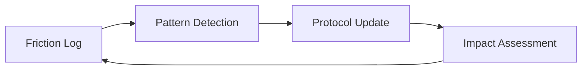

# Design Patterns

## Self-Healing Protocol

### Problem
Static instructions (system prompts and skills) become outdated as the tech stack evolves or as agents encounter recurring edge cases.

### Solution
Implement a **Self-Healing Protocol** pattern:
1.  **Logging Phase:** Agents record "friction events" whenever a tool fails or a goal is blocked.
2.  **Synthesis Phase:** An analyzer clusters these events into patterns.
3.  **Healing Phase:** A refiner agent modifies the protocol (skills/rules) to prevent the recurring issue.
4.  **Verification Phase:** An impact tracker validates that the change actually reduced friction in subsequent tasks.

### Structure

---

## Story-Level Branching

### Problem
Epic branches become massive, long-lived, and prone to merge conflicts across dozens of tasks.

### Solution
The **Story-Level Branching** pattern restricts the integration scope:
1.  **Base Branch:** `epic/NNN`
2.  **Shared Story Branch:** `story/EPIC-ID/STORY-NAME`
3.  **Task Branches:** `task/EPIC-ID/TASK-NAME` (branch from story branch)
4.  **Integration:** Task merges into Story branch → Story merges into Epic branch.

### Benefits
*   Reduced integration surface area.
*   Parallel development of independent stories without conflict.
*   Easier cherry-picking and rollback.

---

## Worktree-per-Story Isolation (v5.7.0+)

### Problem
Under parallel sprint execution, multiple story agents share the same working
tree. Rapid `git checkout` swaps cause one agent's `git add -A` to sweep WIP
from a different agent's story into the wrong commit. The v5.5.1 guards
prevent the specific observed failure modes but not the underlying class of
bug: multiple agents mutating one working tree at the same time.

### Solution
Each dispatched story runs in its own `git worktree`:
1.  **Worktree root:** `.worktrees/story-<id>/` (path traversal guarded).
2.  **Single authority:** `WorktreeManager` owns `ensure`, `reap`, `list`,
    `isSafeToRemove`, `gc`. No other code calls `git worktree` directly.
3.  **Dispatcher integration:** `dispatch()` ensures the worktree before
    dispatching and threads its path as `cwd` through the adapter;
    `sprint-story-close` reaps after a successful merge.
4.  **Fallback:** `orchestration.worktreeIsolation.enabled: false`
    restores single-tree behavior; v5.5.1 guards remain the primary
    defense in that mode.

### Benefits
*   Main-checkout HEAD never moves during a parallel sprint.
*   Each story's staging, reflog, and checkout operations are isolated.
*   Defense-in-depth preserved: pre-commit branch guard runs inside each worktree.
*   Fallback mode is a first-class supported configuration.

### Trade-offs
*   Disk usage multiplies with the `per-worktree` `node_modules` strategy;
    `symlink` and `pnpm-store` mitigate at the cost of platform fragility.
*   Concurrent `git fetch` can collide on `.git/packed-refs.lock` — handled
    by bounded retry (`gitFetchWithRetry`) rather than a global mutex.
*   Windows path limits require a pre-flight warning when estimated depth
    exceeds the configured threshold.
