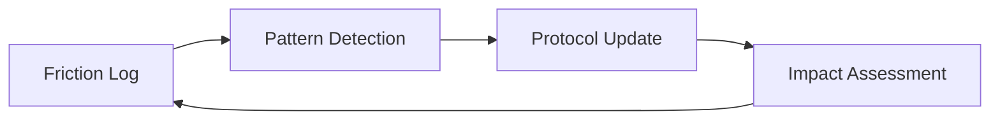

# Design Patterns

## Self-Healing Protocol

### Problem
Static instructions (system prompts and skills) become outdated as the tech stack evolves or as agents encounter recurring edge cases.

### Solution
Implement a **Self-Healing Protocol** pattern:
1.  **Logging Phase:** Agents record "friction events" whenever a tool fails or a goal is blocked.
2.  **Synthesis Phase:** An analyzer clusters these events into patterns.
3.  **Healing Phase:** A refiner agent modifies the protocol (skills/rules) to prevent the recurring issue.
4.  **Verification Phase:** An impact tracker validates that the change actually reduced friction in subsequent tasks.

### Structure

---

## Story-Level Branching

### Problem
Epic branches become massive, long-lived, and prone to merge conflicts across dozens of tasks.

### Solution
The **Story-Level Branching** pattern restricts the integration scope:
1.  **Base Branch:** `epic/NNN`
2.  **Shared Story Branch:** `story/EPIC-ID/STORY-NAME`
3.  **Task Branches:** `task/EPIC-ID/TASK-NAME` (branch from story branch)
4.  **Integration:** Task merges into Story branch → Story merges into Epic branch.

### Benefits
*   Reduced integration surface area.
*   Parallel development of independent stories without conflict.
*   Easier cherry-picking and rollback.

---

## Worktree-per-Story Isolation (v5.7.0+)

### Problem
Under parallel sprint execution, multiple story agents share the same working
tree. Rapid `git checkout` swaps cause one agent's `git add -A` to sweep WIP
from a different agent's story into the wrong commit. The v5.5.1 guards
prevent the specific observed failure modes but not the underlying class of
bug: multiple agents mutating one working tree at the same time.

### Solution
Each dispatched story runs in its own `git worktree`:
1.  **Worktree root:** `.worktrees/story-<id>/` (path traversal guarded).
2.  **Single authority:** `WorktreeManager` owns `ensure`, `reap`, `list`,
    `isSafeToRemove`, `gc`. No other code calls `git worktree` directly.
3.  **Dispatcher integration:** `dispatch()` ensures the worktree before
    dispatching and threads its path as `cwd` through the adapter;
    `sprint-story-close` reaps after a successful merge.
4.  **Fallback:** `orchestration.worktreeIsolation.enabled: false`
    restores single-tree behavior; v5.5.1 guards remain the primary
    defense in that mode.

### Benefits
*   Main-checkout HEAD never moves during a parallel sprint.
*   Each story's staging, reflog, and checkout operations are isolated.
*   Defense-in-depth preserved: pre-commit branch guard runs inside each worktree.
*   Fallback mode is a first-class supported configuration.

### Trade-offs
*   Disk usage multiplies with the `per-worktree` `node_modules` strategy;
    `symlink` and `pnpm-store` mitigate at the cost of platform fragility.
*   Concurrent `git fetch` can collide on `.git/packed-refs.lock` — handled
    by bounded retry (`gitFetchWithRetry`) rather than a global mutex.
*   Windows path limits require a pre-flight warning when estimated depth
    exceeds the configured threshold.

## Rule-as-SSOT, Skill-as-Guidance (v5.11.0+)

### Problem

When a framework ships both enforcement rules (`rules/*.md`) and authoring
guidance (`skills/**/SKILL.md`) covering the same domain, the skill tends to
drift — restating the rule's grammar in slightly different words, or inventing
parallel vocabularies when no constraint forces coherence. Over time the two
diverge, the reviewer has two documents to consult, and the rule's authority
erodes.

### Solution

Adopt a strict layering:

1. **Rule (`rules/<domain>.md`)** — the single SSOT for taxonomy, grammar,
   and forbidden patterns in its domain. Defines *what* is allowed.
2. **Skill (`skills/**/SKILL.md`)** — describes *how* and *when* authors
   apply the rule. Cross-links to the rule for the *what*; never restates
   the taxonomy or forbidden list.
3. **Workflow (`workflows/*.md`)** — describes *who triggers* the work and
   what artifact flows through the sprint. Defers to rule and skill for
   authoring specifics.

Enforced by a cross-reference audit (see Story #282 / Task #294): grep each
skill for redefinition of rule content and rewrite any violations.

### Benefits

*   Reviewers have exactly one place to verify tag or pattern validity.
*   Additions to the taxonomy require a rule PR — a deliberate, visible
    act rather than a silent divergence in a skill.
*   Skills stay short and focused on applied craft, not vocabulary.

### Trade-offs

*   Higher friction to add a new tag or forbidden pattern (rule PR + review).
*   Mitigated by designing extensible dimensions into the rule itself — e.g.
    `@domain-<slug>` lets consumers add project-specific domains without
    touching the rule.

### Example (this Epic)

`.agents/rules/gherkin-standards.md` owns the tag taxonomy and forbidden
patterns. `gherkin-authoring` teaches PRD AC → Scenario translation and the
step-reuse protocol by *pointing at* the rule. `playwright-bdd` configures the
runtime but *references* the rule's tag set instead of picking its own.
