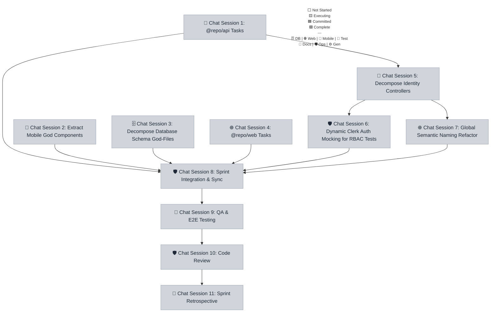

# Sprint 040 Playbook: Clean Code & Architecture Remediation

> **Playbook Path**: `docs/sprints/sprint-040/playbook.md`

## Sprint Summary

A zero-feature, debt-only sprint dedicated to paying down structural debt
identified in the Sprint 39 audits. Decomposes God Files across the database
schema, API controllers, frontend components, and test suites. Introduces a
Services layer for business logic, refactors naming patterns, and hardens the
test architecture with dynamic auth mocking, E2E hydration guards, and telemetry
isolation.

## Fan-Out Execution Flow



### 📱 Chat Session 1: @repo/api Tasks (Concurrent)

_Execution Rule: Open a NEW chat window. This session runs concurrently with
other sessions at the same level. This session operates exclusively within
`@repo/api`._

- [ ] **040.1.1 Modularize Monolithic API Test Suite**

**Mode:** Planning | **Model (First Choice):** Claude Sonnet 4.6 (Thinking) |
**Model (Second Choice):** Gemini 3.1 Pro (Low)

```text
Sprint 040.1.1: Adopt the `qa-engineer` persona from `.agents/personas/`.

**AGENT EXECUTION PROTOCOL (STRICT ADHERENCE REQUIRED):**
1. **Environment Reset**: Ensure you are on the sprint base branch: `git checkout sprint-040 ; git pull`. Verify with `git branch --show-current`. If the result is `main` or `master`, **STOP** and alert the user.
2. **Mark Executing**: Update the playbook — change your task checkbox to `- [~]` and set the Mermaid class for node `C1` to `executing` (if not already). Commit and push the state change.
3. **Execution**: Perform the task instructions below.
4. **Finalization**: Execute the `finalize-sprint-task` workflow explicitly for sprint step `040.1.1`.

**Active Skills:** `qa/vitest, qa/resilient-qa-automation, architecture/monorepo-path-strategist`

Decompose the 22KB `apps/api/src/routes/v1/v1.test.ts` into domain-specific test files.\n- Analyze the existing test file and identify all `describe` blocks by domain (clubs, teams, social, identity, media, etc.).\n- Create domain-specific test files colocated with their controllers (e.g., `teams/clubs.test.ts`, `social/connections.test.ts`). Merge with any existing minimal test stubs.\n- Each file must be fully self-contained with its own imports, `describe` block, and setup/teardown logic.\n- Extract shared test fixtures (if any) into a shared `__test-utils__/` module.\n- Reduce `v1.test.ts` to only cover the root health-check endpoint (`GET /api/v1`).\n- Run `pnpm --filter @repo/api test` to verify zero assertion regressions.
```

- [ ] **040.1.2 Introduce Backend Services Layer**

**Mode:** Planning | **Model (First Choice):** Claude Opus 4.6 (Thinking) |
**Model (Second Choice):** Gemini 3.1 Pro (Low)

```text
Sprint 040.1.2: Adopt the `engineer` persona from `.agents/personas/`.

**AGENT EXECUTION PROTOCOL (STRICT ADHERENCE REQUIRED):**
1. **Environment Reset**: Ensure you are on the sprint base branch: `git checkout sprint-040 ; git pull`. Verify with `git branch --show-current`. If the result is `main` or `master`, **STOP** and alert the user.
2. **Mark Executing**: Update the playbook — change your task checkbox to `- [~]` and set the Mermaid class for node `C1` to `executing` (if not already). Commit and push the state change.
3. **Execution**: Perform the task instructions below.
4. **Finalization**: Execute the `finalize-sprint-task` workflow explicitly for sprint step `040.1.2`.

**Active Skills:** `backend/cloudflare-hono-architect, backend/cloudflare-workers, architecture/monorepo-path-strategist`

Create a new Services layer at `apps/api/src/services/` to decouple business logic from Hono controllers.\n- Create `services/DmService.ts` — extract thread creation, parental CC injection, participant resolution, and message dispatch logic from `social/dms.ts` (24KB).\n- Create `services/UserService.ts` — extract profile resolution, slug validation, onboarding checks, and push token management from `identity/users.ts` (23KB).\n- Service functions must accept typed inputs and return typed outputs. No Hono context (`c`) objects inside services.\n- Refactor `dms.ts` and `users.ts` controllers to be lean: (1) validate with Zod, (2) call service, (3) return response.\n- Run `pnpm --filter @repo/api test` to verify all existing tests pass without modification.\n- Run `pnpm typecheck` to verify type safety.
```

- [ ] **040.1.3 Decompose Media Controllers**

**Mode:** Planning | **Model (First Choice):** Claude Sonnet 4.6 (Thinking) |
**Model (Second Choice):** Gemini 3.1 Pro (Low)

```text
Sprint 040.1.3: Adopt the `engineer` persona from `.agents/personas/`.

**AGENT EXECUTION PROTOCOL (STRICT ADHERENCE REQUIRED):**
1. **Environment Reset**: Ensure you are on the sprint base branch: `git checkout sprint-040 ; git pull`. Verify with `git branch --show-current`. If the result is `main` or `master`, **STOP** and alert the user.
2. **Mark Executing**: Update the playbook — change your task checkbox to `- [~]` and set the Mermaid class for node `C1` to `executing` (if not already). Commit and push the state change.
3. **Execution**: Perform the task instructions below.
4. **Finalization**: Execute the `finalize-sprint-task` workflow explicitly for sprint step `040.1.3`.

**Active Skills:** `backend/cloudflare-hono-architect, backend/cloudflare-workers`

Decompose the `apps/api/src/routes/v1/media/videos.ts` (23KB) monolithic controller into domain-aligned sub-route files.\n- Create or verify `media/upload.ts` — consolidate all upload logic (Direct Upload URL generation).\n- Create `media/analysis.ts` — extract `POST /videos/:id/analyze` and AI tagging queue dispatch.\n- Create `media/studio.ts` — extract smart crop, telestrator, and filter endpoints.\n- Create `media/metadata.ts` — extract `GET /videos`, video listing, status queries, and caption updates.\n- Update `media/index.ts` to compose sub-routers. All API paths must remain identical.\n- Verify with `pnpm --filter @repo/api test` and `pnpm typecheck`.
```

- [ ] **040.1.4 Unified API Error Reporting**

**Mode:** Fast | **Model (First Choice):** Claude Sonnet 4.6 (Thinking) |
**Model (Second Choice):** Gemini 3 Flash

```text
Sprint 040.1.4: Adopt the `engineer` persona from `.agents/personas/`.

**AGENT EXECUTION PROTOCOL (STRICT ADHERENCE REQUIRED):**
1. **Environment Reset**: Ensure you are on the sprint base branch: `git checkout sprint-040 ; git pull`. Verify with `git branch --show-current`. If the result is `main` or `master`, **STOP** and alert the user.
2. **Mark Executing**: Update the playbook — change your task checkbox to `- [~]` and set the Mermaid class for node `C1` to `executing` (if not already). Commit and push the state change.
3. **Execution**: Perform the task instructions below.
4. **Finalization**: Execute the `finalize-sprint-task` workflow explicitly for sprint step `040.1.4`.

**Active Skills:** `backend/cloudflare-workers, security/secure-telemetry-logger`

Consolidate error reporting in the API by replacing all native `console.error` calls with the structured `@repo/shared` logger.\n- Verify that a structured logger exists at `packages/shared/src/utils/logger.ts`. If not, create a minimal JSON-structured logger compatible with Cloudflare Workers.\n- Find all `console.error` usages in `apps/api/src/` using grep.\n- Replace each with `logger.error(message, context)` where context includes `route`, `userId` (when available), and the error object.\n- Ensure all previously logged data is preserved in the structured format.\n- Run `pnpm --filter @repo/api test` and `pnpm typecheck`.
```

### 📱 Chat Session 2: Extract Mobile God Components (Concurrent)

_Execution Rule: Open a NEW chat window. This session runs concurrently with
other sessions at the same level. This session operates exclusively within
`@repo/mobile`._

- [ ] **040.2.1 Extract Mobile God Components**

**Mode:** Planning | **Model (First Choice):** Claude Sonnet 4.6 (Thinking) |
**Model (Second Choice):** Gemini 3.1 Pro (Low)

```text
Sprint 040.2.1: Adopt the `engineer-mobile` persona from `.agents/personas/`.

**AGENT EXECUTION PROTOCOL (STRICT ADHERENCE REQUIRED):**
1. **Environment Reset**: Ensure you are on the sprint base branch: `git checkout sprint-040 ; git pull`. Verify with `git branch --show-current`. If the result is `main` or `master`, **STOP** and alert the user.
2. **Mark Executing**: Update the playbook — change your task checkbox to `- [~]` and set the Mermaid class for node `C2` to `executing` (if not already). Commit and push the state change.
3. **Execution**: Perform the task instructions below.
4. **Finalization**: Execute the `finalize-sprint-task` workflow explicitly for sprint step `040.2.1`.

**Active Skills:** `frontend/expo-react-native-developer`

Extract inline modals, bottom sheets, and complex state logic from mobile screen god-components.\n- `LockerRoomScreen.tsx` (18KB): Extract `MediaPickerModal.tsx`, `UploadProgressSheet.tsx`, and `HighlightCard.tsx` into `src/components/locker-room/`. Create `hooks/useLockerRoom.ts`.\n- `ComposePostScreen.tsx` (18KB): Extract `PostMediaAttacher.tsx`, `MentionSuggestions.tsx`, and `PostPreview.tsx` into `src/components/compose-post/`. Create `hooks/useComposePost.ts`.\n- Screen files should be reduced by at least 30% in line count.\n- Ensure no DOM elements (div, span, etc.) are used — React Native components only.\n- Run `pnpm --filter @repo/mobile typecheck` to verify.
```

### 🗄️ Chat Session 3: Decompose Database Schema God-Files (Concurrent)

_Execution Rule: Open a NEW chat window. This session runs concurrently with
other sessions at the same level. This session operates exclusively within
`@repo/shared`._

- [ ] **040.3.1 Decompose Database Schema God-Files**

**Mode:** Planning | **Model (First Choice):** Claude Sonnet 4.6 (Thinking) |
**Model (Second Choice):** Gemini 3.1 Pro (Low)

```text
Sprint 040.3.1: Adopt the `engineer` persona from `.agents/personas/`.

**AGENT EXECUTION PROTOCOL (STRICT ADHERENCE REQUIRED):**
1. **Environment Reset**: Ensure you are on the sprint base branch: `git checkout sprint-040 ; git pull`. Verify with `git branch --show-current`. If the result is `main` or `master`, **STOP** and alert the user.
2. **Mark Executing**: Update the playbook — change your task checkbox to `- [~]` and set the Mermaid class for node `C3` to `executing` (if not already). Commit and push the state change.
3. **Execution**: Perform the task instructions below.
4. **Finalization**: Execute the `finalize-sprint-task` workflow explicitly for sprint step `040.3.1`.

**Active Skills:** `backend/sqlite-drizzle-expert, backend/turso-sqlite, architecture/monorepo-path-strategist`

Decompose the 32KB `packages/shared/src/db/schema/performance.ts` god-file into domain-aligned modules.\n- Create `schema/scouting.ts` — extract `savedSearches`, `scoutTags`, `scoutNotes` tables and their relations.\n- Create `schema/fitness.ts` — extract `workoutPrograms`, `workoutLogs`, `nutritionPlans`, `nutritionLogs` and their relations.\n- Create `schema/gamification.ts` — extract `userBadges`, `trophies`, `leaderboardConfigs`, `h2hChallenges`, `h2hVotes`, `kudos` and their relations.\n- Create `schema/evaluations.ts` — extract `evaluations`, `challenges`, `challengeEntries`, `accolades` and coaching-related relations.\n- Create `schema/instructional.ts` — extract `instructionalVideos`, `videoBookmarks` and their relations.\n- Update `schema/index.ts` barrel to re-export all new modules for backward compatibility.\n- Run `pnpm --filter @repo/shared build` to verify the build.\n- Run `pnpm typecheck` to verify all downstream workspaces compile correctly.
```

### 🌐 Chat Session 4: @repo/web Tasks (Concurrent)

_Execution Rule: Open a NEW chat window. This session runs concurrently with
other sessions at the same level. This session operates exclusively within
`@repo/web`._

- [ ] **040.4.1 Extract Web Component Logic into Hooks**

**Mode:** Planning | **Model (First Choice):** Claude Sonnet 4.6 (Thinking) |
**Model (Second Choice):** Gemini 3.1 Pro (Low)

```text
Sprint 040.4.1: Adopt the `engineer-web` persona from `.agents/personas/`.

**AGENT EXECUTION PROTOCOL (STRICT ADHERENCE REQUIRED):**
1. **Environment Reset**: Ensure you are on the sprint base branch: `git checkout sprint-040 ; git pull`. Verify with `git branch --show-current`. If the result is `main` or `master`, **STOP** and alert the user.
2. **Mark Executing**: Update the playbook — change your task checkbox to `- [~]` and set the Mermaid class for node `C4` to `executing` (if not already). Commit and push the state change.
3. **Execution**: Perform the task instructions below.
4. **Finalization**: Execute the `finalize-sprint-task` workflow explicitly for sprint step `040.4.1`.

**Active Skills:** `frontend/astro-react-island-strategist, frontend/astro`

Extract business logic from large web React components into dedicated custom hooks.\n- `FamilyCenter.tsx` (20KB): Extract fetch operations and permission logic into `hooks/useFamilyPermissions.ts` and `hooks/useFamilyMembers.ts`. Extract `FamilyMemberCard.tsx` and `PermissionRequestModal.tsx` sub-components.\n- `GlobalSearch.tsx` (19KB): Extract search logic into `hooks/useGlobalSearch.ts`. Extract `SearchResultGroup.tsx` and `SearchSuggestions.tsx`.\n- `PrivacyDashboard.tsx` (18KB): Extract privacy settings into `hooks/usePrivacySettings.ts`. Extract `PrivacyFieldRow.tsx` and `DataVisibilityCard.tsx`.\n- `EvaluationsHub.tsx` (18KB): Extract evaluation data into `hooks/useEvaluations.ts`. Extract `EvaluationCard.tsx` and `EvaluationDetailModal.tsx`.\n- Hooks follow `use[Domain]` naming convention. Colocate in a `hooks/` directory adjacent to the component.\n- Run `pnpm --filter @repo/web build` and `pnpm typecheck` to verify no regressions.
```

- [ ] **040.4.2 E2E Hydration & Race-Condition Hardening**

**Mode:** Planning | **Model (First Choice):** Claude Sonnet 4.6 (Thinking) |
**Model (Second Choice):** Gemini 3.1 Pro (Low)

```text
Sprint 040.4.2: Adopt the `qa-engineer` persona from `.agents/personas/`.

**AGENT EXECUTION PROTOCOL (STRICT ADHERENCE REQUIRED):**
1. **Environment Reset**: Ensure you are on the sprint base branch: `git checkout sprint-040 ; git pull`. Verify with `git branch --show-current`. If the result is `main` or `master`, **STOP** and alert the user.
2. **Mark Executing**: Update the playbook — change your task checkbox to `- [~]` and set the Mermaid class for node `C4` to `executing` (if not already). Commit and push the state change.
3. **Execution**: Perform the task instructions below.
4. **Finalization**: Execute the `finalize-sprint-task` workflow explicitly for sprint step `040.4.2`.

**Active Skills:** `qa/playwright, qa/resilient-qa-automation`

Audit and harden all Playwright E2E specs to eliminate flaky behavior caused by hydration races.\n- Search for all `waitForTimeout` calls in `apps/web/e2e/` and replace with explicit guards: `page.waitForLoadState('networkidle')`, `page.waitForSelector('[data-testid="..."]', { state: 'visible' })`, or `page.waitForSelector('[data-hydrated]')`.\n- For tests that depend on API responses, add network intercepts using `page.route()` to mock or wait for specific endpoints.\n- For React island interactions, ensure tests wait for the `data-hydrated` attribute before clicking or asserting.\n- Run the full E2E suite locally (`pnpm --filter @repo/web test:e2e`) to verify stability.\n- Document the hydration guard pattern in a short README or code comment for future test authors.
```

- [ ] **040.4.3 Telemetry Isolation & Mocking Utility**

**Mode:** Fast | **Model (First Choice):** Gemini 3 Flash | **Model (Second
Choice):** Claude Sonnet 4.6 (Thinking)

```text
Sprint 040.4.3: Adopt the `qa-engineer` persona from `.agents/personas/`.

**AGENT EXECUTION PROTOCOL (STRICT ADHERENCE REQUIRED):**
1. **Environment Reset**: Ensure you are on the sprint base branch: `git checkout sprint-040 ; git pull`. Verify with `git branch --show-current`. If the result is `main` or `master`, **STOP** and alert the user.
2. **Mark Executing**: Update the playbook — change your task checkbox to `- [~]` and set the Mermaid class for node `C4` to `executing` (if not already). Commit and push the state change.
3. **Execution**: Perform the task instructions below.
4. **Finalization**: Execute the `finalize-sprint-task` workflow explicitly for sprint step `040.4.3`.

**Active Skills:** `qa/playwright, qa/resilient-qa-automation`

Create a centralized telemetry mocking utility to achieve 100% network isolation in E2E tests.\n- Create `apps/web/e2e/utils/telemetry-mock.ts` with a `blockTelemetry(page)` function.\n- The function must intercept and abort all outbound requests matching PostHog, Sentry, and internal analytics domains.\n- Integrate the blocker into the Playwright global setup or `beforeEach` fixture so it applies to all specs automatically.\n- Verify that no telemetry requests escape to external services during test runs.\n- Run `pnpm --filter @repo/web test:e2e` to verify zero regressions.
```

### 🧪 Chat Session 5: Decompose Identity Controllers (Sequential)

_Execution Rule: These tasks must be run sequentially in a single chat window.
This session operates exclusively within `@repo/api`._

- [ ] **040.5.1 Decompose Identity Controllers**

**Mode:** Planning | **Model (First Choice):** Claude Sonnet 4.6 (Thinking) |
**Model (Second Choice):** Gemini 3.1 Pro (Low)

```text
Sprint 040.5.1: Adopt the `engineer` persona from `.agents/personas/`.

**AGENT EXECUTION PROTOCOL (STRICT ADHERENCE REQUIRED):**
1. **Environment Reset**: Ensure you are on the sprint base branch: `git checkout sprint-040 ; git pull`. Verify with `git branch --show-current`. If the result is `main` or `master`, **STOP** and alert the user.
2. **Mark Executing**: Update the playbook — change your task checkbox to `- [~]` and set the Mermaid class for node `C5` to `executing` (if not already). Commit and push the state change.
3. **Prerequisite Check**: Execute the `verify-sprint-prerequisites` workflow for sprint step `040.5.1`.
   - **Dependencies**: `040.1.2`
4. **Execution**: Perform the task instructions below.
5. **Finalization**: Execute the `finalize-sprint-task` workflow explicitly for sprint step `040.5.1`.

**Active Skills:** `backend/cloudflare-hono-architect, backend/cloudflare-workers`

Decompose the `apps/api/src/routes/v1/identity/users.ts` (23KB) monolithic controller into domain-aligned sub-route files.\n- Create `identity/profile-management.ts` — extract `PATCH /users/me`, `PATCH /users/me/slug`, and avatar update logic.\n- Create `identity/push-tokens.ts` — extract `PUT /users/push-token`.\n- Create `identity/relationships.ts` — extract `POST /users/link` and parent-athlete relationship management.\n- Create `identity/onboarding.ts` — extract onboarding interception and profile completion checks.\n- Update `identity/index.ts` to compose sub-routers using `app.route()`. All API paths and response shapes must remain identical.\n- Verify with `pnpm --filter @repo/api test` and `pnpm typecheck`.
```

### 🛡️ Chat Session 6: Dynamic Clerk Auth Mocking for RBAC Tests (Concurrent)

_Execution Rule: Open a NEW chat window. This session runs concurrently with
other sessions at the same level. This session operates exclusively within
`@repo/api`._

- [ ] **040.6.1 Dynamic Clerk Auth Mocking for RBAC Tests**

**Mode:** Planning | **Model (First Choice):** Claude Sonnet 4.6 (Thinking) |
**Model (Second Choice):** Gemini 3.1 Pro (Low)

```text
Sprint 040.6.1: Adopt the `qa-engineer` persona from `.agents/personas/`.

**AGENT EXECUTION PROTOCOL (STRICT ADHERENCE REQUIRED):**
1. **Environment Reset**: Ensure you are on the sprint base branch: `git checkout sprint-040 ; git pull`. Verify with `git branch --show-current`. If the result is `main` or `master`, **STOP** and alert the user.
2. **Mark Executing**: Update the playbook — change your task checkbox to `- [~]` and set the Mermaid class for node `C6` to `executing` (if not already). Commit and push the state change.
3. **Prerequisite Check**: Execute the `verify-sprint-prerequisites` workflow for sprint step `040.6.1`.
   - **Dependencies**: `040.1.1`, `040.5.1`
4. **Execution**: Perform the task instructions below.
5. **Finalization**: Execute the `finalize-sprint-task` workflow explicitly for sprint step `040.6.1`.

**Active Skills:** `qa/vitest, qa/resilient-qa-automation, backend/clerk-auth`

Refactor the API Vitest setup to support dynamic JWT payload injection for RBAC testing at scale.\n- Create `apps/api/src/__test-utils__/mockAuth.ts` with a `createMockAuth(payload)` utility that accepts dynamic claims (userId, clerkId, role, teamIds, clubIds, subscriptionTier).\n- The utility must generate a mock auth context that can be injected into Hono's `c.set()` without requiring real Clerk JWT tokens.\n- Retain the existing `MOCK_TOKEN_MAP` as convenience presets that delegate to `createMockAuth()`.\n- Migrate at least 5 existing RBAC boundary tests to use the new dynamic pattern.\n- Run `pnpm --filter @repo/api test` to verify zero regressions.
```

### 🌐 Chat Session 7: Global Semantic Naming Refactor (Concurrent)

_Execution Rule: Open a NEW chat window. This session runs concurrently with
other sessions at the same level._

- [ ] **040.7.1 Global Semantic Naming Refactor**

**Mode:** Fast | **Model (First Choice):** Gemini 3 Flash | **Model (Second
Choice):** Claude Sonnet 4.6 (Thinking)

```text
Sprint 040.7.1: Adopt the `engineer` persona from `.agents/personas/`.

**AGENT EXECUTION PROTOCOL (STRICT ADHERENCE REQUIRED):**
1. **Environment Reset**: Ensure you are on the sprint base branch: `git checkout sprint-040 ; git pull`. Verify with `git branch --show-current`. If the result is `main` or `master`, **STOP** and alert the user.
2. **Mark Executing**: Update the playbook — change your task checkbox to `- [~]` and set the Mermaid class for node `C7` to `executing` (if not already). Commit and push the state change.
3. **Prerequisite Check**: Execute the `verify-sprint-prerequisites` workflow for sprint step `040.7.1`.
   - **Dependencies**: `040.1.3`, `040.5.1`
4. **Execution**: Perform the task instructions below.
5. **Finalization**: Execute the `finalize-sprint-task` workflow explicitly for sprint step `040.7.1`.

**Active Skills:** `architecture/autonomous-coding-standards`

Execute a monorepo-wide refactor of generic variable names to semantic, domain-relevant names.\n- Search for all `const data = await res.json()` patterns in `apps/api/src/` and replace with domain-specific names (e.g., `clubDetails`, `rosterEntries`, `highlightMeta`).\n- Search for `const data = await` patterns in `apps/web/src/` hooks and components and apply the same treatment.\n- Ensure iteration variables are descriptive (e.g., `for (const connection of connectionList)` not `for (const item of data)`).\n- Run `pnpm test` and `pnpm typecheck` to verify zero regressions.
```

### 🛡️ Chat Session 8: Sprint Integration & Sync (Sequential)

_Execution Rule: Open a NEW chat window after code complete._

- [ ] **040.8.1 Sprint 40 Integration**

**Mode:** Fast | **Model (First Choice):** Claude Sonnet 4.6 (Thinking) |
**Model (Second Choice):** Gemini 3 Flash

```text
Sprint 040.8.1: Adopt the `engineer` persona from `.agents/personas/`.

**AGENT EXECUTION PROTOCOL (STRICT ADHERENCE REQUIRED):**
1. **Environment Reset**: Ensure you are on the sprint base branch: `git checkout sprint-040 ; git pull`. Verify with `git branch --show-current`. If the result is `main` or `master`, **STOP** and alert the user.
2. **Mark Executing**: Update the playbook — change your task checkbox to `- [~]` and set the Mermaid class for node `C8` to `executing` (if not already). Commit and push the state change.
3. **Prerequisite Check**: Execute the `verify-sprint-prerequisites` workflow for sprint step `040.8.1`.
   - **Dependencies**: `040.1.4`, `040.2.1`, `040.3.1`, `040.4.1`, `040.4.2`, `040.4.3`, `040.6.1`, `040.7.1`
4. **Execution**: Perform the task instructions below.
5. **Finalization**: Execute the `finalize-sprint-task` workflow explicitly for sprint step `040.8.1`.

**Active Skills:** `architecture/monorepo-path-strategist, devops/git-flow-specialist`

Execute the `sprint-integration` workflow for `40`.
```

### 🧪 Chat Session 9: QA & E2E Testing (Sequential)

_Execution Rule: Open a NEW chat window after code complete._

- [ ] **040.9.1 Sprint 40 QA**

**Mode:** Planning | **Model (First Choice):** Claude Sonnet 4.6 (Thinking) |
**Model (Second Choice):** Gemini 3.1 Pro (Low)

```text
Sprint 040.9.1: Adopt the `qa-engineer` persona from `.agents/personas/`.

**AGENT EXECUTION PROTOCOL (STRICT ADHERENCE REQUIRED):**
1. **Environment Reset**: Ensure you are on the sprint base branch: `git checkout sprint-040 ; git pull`. Verify with `git branch --show-current`. If the result is `main` or `master`, **STOP** and alert the user.
2. **Mark Executing**: Update the playbook — change your task checkbox to `- [~]` and set the Mermaid class for node `C9` to `executing` (if not already). Commit and push the state change.
3. **Prerequisite Check**: Execute the `verify-sprint-prerequisites` workflow for sprint step `040.9.1`.
   - **Dependencies**: `040.8.1`
4. **Execution**: Perform the task instructions below.
5. **Finalization**: Execute the `finalize-sprint-task` workflow explicitly for sprint step `040.9.1`.

**Active Skills:** `qa/vitest, qa/playwright, qa/resilient-qa-automation`

Execute the `plan-qa-testing` workflow for `40`.
```

### 🛡️ Chat Session 10: Code Review (Sequential)

_Execution Rule: Run this in the primary PM planning chat once all PRs are
merged._

- [ ] **040.10.1 Sprint 40 Code Review**

**Mode:** Planning | **Model (First Choice):** Claude Opus 4.6 (Thinking) |
**Model (Second Choice):** Gemini 3.1 Pro (Low)

```text
Sprint 040.10.1: Adopt the `architect` persona from `.agents/personas/`.

**AGENT EXECUTION PROTOCOL (STRICT ADHERENCE REQUIRED):**
1. **Environment Reset**: Ensure you are on the sprint base branch: `git checkout sprint-040 ; git pull`. Verify with `git branch --show-current`. If the result is `main` or `master`, **STOP** and alert the user.
2. **Mark Executing**: Update the playbook — change your task checkbox to `- [~]` and set the Mermaid class for node `C10` to `executing` (if not already). Commit and push the state change.
3. **Prerequisite Check**: Execute the `verify-sprint-prerequisites` workflow for sprint step `040.10.1`.
   - **Dependencies**: `040.9.1`
4. **Execution**: Perform the task instructions below.
5. **Finalization**: Execute the `finalize-sprint-task` workflow explicitly for sprint step `040.10.1`.

**Active Skills:** `architecture/autonomous-coding-standards, devops/git-flow-specialist`

Execute the `sprint-code-review` workflow for `40`.
```

### 📝 Chat Session 11: Sprint Retrospective (Sequential)

_Execution Rule: Run this in the primary PM planning chat once all PRs are
merged._

- [ ] **040.11.1 Sprint 40 Retrospective**

**Mode:** Fast | **Model (First Choice):** Claude Sonnet 4.6 (Thinking) |
**Model (Second Choice):** Gemini 3 Flash

```text
Sprint 040.11.1: Adopt the `product` persona from `.agents/personas/`.

**AGENT EXECUTION PROTOCOL (STRICT ADHERENCE REQUIRED):**
1. **Environment Reset**: Ensure you are on the sprint base branch: `git checkout sprint-040 ; git pull`. Verify with `git branch --show-current`. If the result is `main` or `master`, **STOP** and alert the user.
2. **Mark Executing**: Update the playbook — change your task checkbox to `- [~]` and set the Mermaid class for node `C11` to `executing` (if not already). Commit and push the state change.
3. **Prerequisite Check**: Execute the `verify-sprint-prerequisites` workflow for sprint step `040.11.1`.
   - **Dependencies**: `040.10.1`
4. **Execution**: Perform the task instructions below.
5. **Finalization**: Execute the `finalize-sprint-task` workflow explicitly for sprint step `040.11.1`.

**Active Skills:** `architecture/markdown`

Execute the `sprint-retro` workflow for `40`.
```
