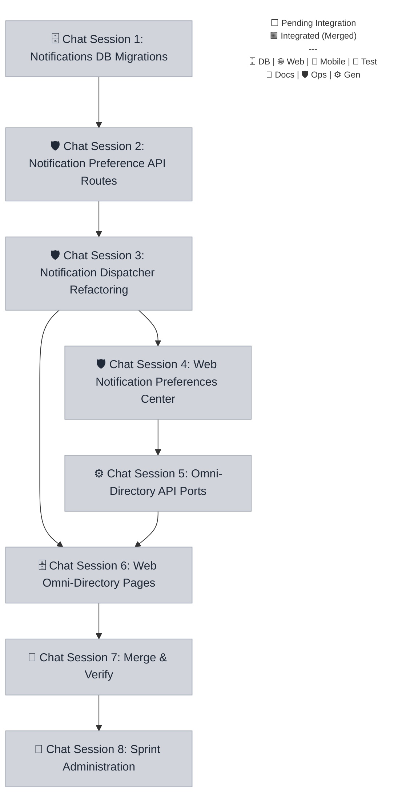

# Sprint 045 Playbook: Notification Customization & Global Discovery

> **Playbook Path:** docs/sprints/sprint-045/playbook.md
>
> **Protocol Version:** v4.1.0
>
> **Objective:** Implement granular notification preferences via a new users
> table attribute and expose it in the UI. Develop high-fidelity omni-directory
> lookup portals for Athletes, Clubs, and Teams.

## Sprint Summary

Implement granular notification preferences via a new users table attribute and
expose it in the UI. Develop high-fidelity omni-directory lookup portals for
Athletes, Clubs, and Teams.

## Fan-Out Execution Flow



## 📋 Execution Plan

### 🗄️ Chat Session 1: Notifications DB Migrations

[ ] **045.1.1** Notifications DB Migrations

- **Mode**: Planning
- **Model**: Claude Opus 4.6 (Thinking) || Gemini 3.1 Pro (High)
- **Scope**: `@repo/shared`
- **Dependencies**: None

```markdown
=== SYSTEM PROTOCOL & CAPABILITIES ===

**AGENT EXECUTION PROTOCOL:** Before beginning work, you MUST run the pre-flight
verification script to ensure all dependencies are committed. Read and strictly
follow the steps defined in
`.agents/workflows/sprint-verify-task-prerequisites.md` or run the manual
verification script for your specific task. If the script fails, STOP
immediately and ask the user to complete the blocking tasks.

**Branching:** All task work MUST occur on the branch specified in your
instructions. If this task depends on previous tasks, ensure you have fetched
the latest remote state (`git fetch origin`) and merged or checked out their
respective feature branches before beginning work.

**Close-out:**

1. **Complete & Finalize**: All code must be committed and pushed via the
   standard workflow. Read and strictly follow the steps defined in
   `.agents/workflows/sprint-finalize-task.md` to track state and notify the
   team.
2. **Error Recovery**: If you encounter an unresolvable error, execute:
   `node .agents/scripts/update-task-state.js 045.1.1 blocked` and alert the
   user immediately.

=== VOLATILE TASK CONTEXT ===

**Persona**: engineer **Loaded Skills**: `backend/sqlite-drizzle-expert`,
`backend/turso-sqlite` **Sprint / Session**: Sprint 045 | Chat Session 1

**Pre-flight Task Validation (Run this first):**
`node .agents/scripts/verify-prereqs.js docs/sprints/sprint-045/playbook.md 045.1.1 temp/task-state`

**Context Sync (Mandatory — run before writing any code):** Read the PRD and
Tech Spec to understand exact schema fields, UI categories, filter parameters,
and privacy rules. Do not hallucinate values defined in these documents:

- `docs/sprints/sprint-045/prd.md`
- `docs/sprints/sprint-045/tech-spec.md`

**Perception-Action Event Stream Protocol:** All environmental interactions MUST
be streamed. Start the loop via:
`node .agents/scripts/run-agent-loop.js 045.1.1 --branch task/sprint-045/db-migrations-notifications --pattern default`
Feed Atomic Action JSON payloads into its stdin. Reference
`.agents/schemas/atomic-action-schema.json` for the format. Do not use random
bash execution.

**Instructions:**

1. **Task db-migrations-notifications:**
   - **Mark Executing**:
     `node .agents/scripts/update-task-state.js 045.1.1 executing`
   - Locate `packages/shared/src/db/schema.ts`.
   - Add the `notification_preferences` column as a lightweight JSON field to
     the `users` table with the default values specified in the Tech Spec.
   - Generate the Drizzle migrations by running
     `pnpm --filter @repo/shared db:generate` to verify schema generation works.
   - Update any globally shared Zod types.
```

### 🛡️ Chat Session 2: Notification Preference API Routes

> **⚠️ PREREQUISITE:** Do not start this session until the tasks in **Chat(s)
> 1** are finished (this is verified automatically by your pre-flight script).

[ ] **045.2.1** Notification Preference API Routes

- **Mode**: Planning
- **Model**: Claude Opus 4.6 (Thinking) || Gemini 3.1 Pro (High)
- **Scope**: `@repo/api`
- **Dependencies**: `045.1.1`

```markdown
=== SYSTEM PROTOCOL & CAPABILITIES ===

**AGENT EXECUTION PROTOCOL:** Before beginning work, you MUST run the pre-flight
verification script to ensure all dependencies are committed. Read and strictly
follow the steps defined in
`.agents/workflows/sprint-verify-task-prerequisites.md` or run the manual
verification script for your specific task. If the script fails, STOP
immediately and ask the user to complete the blocking tasks.

**Branching:** All task work MUST occur on the branch specified in your
instructions. If this task depends on previous tasks, ensure you have fetched
the latest remote state (`git fetch origin`) and merged or checked out their
respective feature branches before beginning work. **Required Merges (run after
checkout):**

- `git merge origin/task/sprint-045/db-migrations-notifications`

**Close-out:**

1. **Complete & Finalize**: All code must be committed and pushed via the
   standard workflow. Read and strictly follow the steps defined in
   `.agents/workflows/sprint-finalize-task.md` to track state and notify the
   team.
2. **Error Recovery**: If you encounter an unresolvable error, execute:
   `node .agents/scripts/update-task-state.js 045.2.1 blocked` and alert the
   user immediately.

=== VOLATILE TASK CONTEXT ===

**Persona**: engineer **Loaded Skills**: `backend/cloudflare-hono-architect`
**Sprint / Session**: Sprint 045 | Chat Session 2

**Pre-flight Task Validation (Run this first):**
`node .agents/scripts/verify-prereqs.js docs/sprints/sprint-045/playbook.md 045.2.1 temp/task-state`

**Context Sync (Mandatory — run before writing any code):** Read the PRD and
Tech Spec to understand exact schema fields, UI categories, filter parameters,
and privacy rules. Do not hallucinate values defined in these documents:

- `docs/sprints/sprint-045/prd.md`
- `docs/sprints/sprint-045/tech-spec.md`

**Perception-Action Event Stream Protocol:** All environmental interactions MUST
be streamed. Start the loop via:
`node .agents/scripts/run-agent-loop.js 045.2.1 --branch task/sprint-045/api-notifications --pattern default`
Feed Atomic Action JSON payloads into its stdin. Reference
`.agents/schemas/atomic-action-schema.json` for the format. Do not use random
bash execution.

**Instructions:**

1. **Task api-notifications:**
   - **Mark Executing**:
     `node .agents/scripts/update-task-state.js 045.2.1 executing`
   - In `apps/api/src/routes/v1/users.ts` (or equivalently within the users API
     namespace):
   - Implement `GET /v1/users/me/notifications` to fetch the
     `notification_preferences` object.
   - Implement `PATCH /v1/users/me/notifications` to update preferences,
     validating with Zod schemas.
   - Enforce the guardrail that `security` email channels cannot be disabled.
```

### 🛡️ Chat Session 3: Notification Dispatcher Refactoring

> **⚠️ PREREQUISITE:** Do not start this session until the tasks in **Chat(s)
> 2** are finished (this is verified automatically by your pre-flight script).

[ ] **045.3.1** Notification Dispatcher Refactoring

- **Mode**: Planning
- **Model**: Claude Opus 4.6 (Thinking) || Gemini 3.1 Pro (High)
- **Scope**: `@repo/api`
- **Dependencies**: `045.2.1`

```markdown
=== SYSTEM PROTOCOL & CAPABILITIES ===

**AGENT EXECUTION PROTOCOL:** Before beginning work, you MUST run the pre-flight
verification script to ensure all dependencies are committed. Read and strictly
follow the steps defined in
`.agents/workflows/sprint-verify-task-prerequisites.md` or run the manual
verification script for your specific task. If the script fails, STOP
immediately and ask the user to complete the blocking tasks.

**Branching:** All task work MUST occur on the branch specified in your
instructions. If this task depends on previous tasks, ensure you have fetched
the latest remote state (`git fetch origin`) and merged or checked out their
respective feature branches before beginning work. **Required Merges (run after
checkout):**

- `git merge origin/task/sprint-045/api-notifications`

**Close-out:**

1. **Complete & Finalize**: All code must be committed and pushed via the
   standard workflow. Read and strictly follow the steps defined in
   `.agents/workflows/sprint-finalize-task.md` to track state and notify the
   team.
2. **Error Recovery**: If you encounter an unresolvable error, execute:
   `node .agents/scripts/update-task-state.js 045.3.1 blocked` and alert the
   user immediately.

=== VOLATILE TASK CONTEXT ===

**Persona**: engineer **Loaded Skills**: `backend/cloudflare-hono-architect`,
`backend/cloudflare-workers` **Sprint / Session**: Sprint 045 | Chat Session 3

**Pre-flight Task Validation (Run this first):**
`node .agents/scripts/verify-prereqs.js docs/sprints/sprint-045/playbook.md 045.3.1 temp/task-state`

**Context Sync (Mandatory — run before writing any code):** Read the PRD and
Tech Spec to understand exact schema fields, UI categories, filter parameters,
and privacy rules. Do not hallucinate values defined in these documents:

- `docs/sprints/sprint-045/prd.md`
- `docs/sprints/sprint-045/tech-spec.md`

**Perception-Action Event Stream Protocol:** All environmental interactions MUST
be streamed. Start the loop via:
`node .agents/scripts/run-agent-loop.js 045.3.1 --branch task/sprint-045/refactor-dispatcher --pattern default`
Feed Atomic Action JSON payloads into its stdin. Reference
`.agents/schemas/atomic-action-schema.json` for the format. Do not use random
bash execution.

**Instructions:**

1. **Task refactor-dispatcher:**
   - **Mark Executing**:
     `node .agents/scripts/update-task-state.js 045.3.1 executing`
   - Refactor core notification dispatchers (e.g. `sendPushNotification`,
     `sendEmail`).
   - Have the dispatchers parse or retrieve `users.notification_preferences`
     conditionally to suppress dispatch if opted out.
   - Override opt-outs unconditionally for security-critical actions (e.g.,
     password resets) as mandated.
```

### 🛡️ Chat Session 4: Web Notification Preferences Center

> **⚠️ PREREQUISITE:** Do not start this session until the tasks in **Chat(s)
> 3** are finished (this is verified automatically by your pre-flight script).

[ ] **045.4.1** Web Notification Preferences Center

- **Mode**: Planning
- **Model**: Claude Opus 4.6 (Thinking) || Gemini 3.1 Pro (High)
- **Scope**: `root`
- **Dependencies**: `045.3.1`

```markdown
=== SYSTEM PROTOCOL & CAPABILITIES ===

**AGENT EXECUTION PROTOCOL:** Before beginning work, you MUST run the pre-flight
verification script to ensure all dependencies are committed. Read and strictly
follow the steps defined in
`.agents/workflows/sprint-verify-task-prerequisites.md` or run the manual
verification script for your specific task. If the script fails, STOP
immediately and ask the user to complete the blocking tasks.

**Branching:** All task work MUST occur on the branch specified in your
instructions. If this task depends on previous tasks, ensure you have fetched
the latest remote state (`git fetch origin`) and merged or checked out their
respective feature branches before beginning work. **Required Merges (run after
checkout):**

- `git merge origin/task/sprint-045/refactor-dispatcher`

**Close-out:**

1. **Complete & Finalize**: All code must be committed and pushed via the
   standard workflow. Read and strictly follow the steps defined in
   `.agents/workflows/sprint-finalize-task.md` to track state and notify the
   team.
2. **Error Recovery**: If you encounter an unresolvable error, execute:
   `node .agents/scripts/update-task-state.js 045.4.1 blocked` and alert the
   user immediately.

=== VOLATILE TASK CONTEXT ===

**Persona**: engineer-web **Loaded Skills**: `frontend/astro`,
`frontend/tailwind-v4`, `frontend/astro-react-island-strategist` **Sprint /
Session**: Sprint 045 | Chat Session 4

**Pre-flight Task Validation (Run this first):**
`node .agents/scripts/verify-prereqs.js docs/sprints/sprint-045/playbook.md 045.4.1 temp/task-state`

**Context Sync (Mandatory — run before writing any code):** Read the PRD and
Tech Spec to understand exact schema fields, UI categories, filter parameters,
and privacy rules. Do not hallucinate values defined in these documents:

- `docs/sprints/sprint-045/prd.md`
- `docs/sprints/sprint-045/tech-spec.md`

**Perception-Action Event Stream Protocol:** All environmental interactions MUST
be streamed. Start the loop via:
`node .agents/scripts/run-agent-loop.js 045.4.1 --branch task/sprint-045/web-notifications-ui --pattern default`
Feed Atomic Action JSON payloads into its stdin. Reference
`.agents/schemas/atomic-action-schema.json` for the format. Do not use random
bash execution.

**Instructions:**

1. **Task web-notifications-ui:**
   - **Mark Executing**:
     `node .agents/scripts/update-task-state.js 045.4.1 executing`
   - In `apps/web/src/pages/settings/notifications.astro` (or the React
     component it renders):
   - Create a responsive grid layout of toggle switches for each class of
     preference (Events, Social, Security, Marketing).
   - Hydrate state via `GET /v1/users/me/notifications` and dispatch saves via
     `PATCH`.
   - Support subtle animations per Tailwind v4 guidelines.
```

### ⚙️ Chat Session 5: Omni-Directory API Ports

> **⚠️ PREREQUISITE:** Do not start this session until the tasks in **Chat(s)
> 4** are finished (this is verified automatically by your pre-flight script).

[ ] **045.5.1** Omni-Directory API Ports

- **Mode**: Planning
- **Model**: Claude Opus 4.6 (Thinking) || Gemini 3.1 Pro (High)
- **Scope**: `@repo/api`
- **Dependencies**: `045.4.1`

```markdown
=== SYSTEM PROTOCOL & CAPABILITIES ===

**AGENT EXECUTION PROTOCOL:** Before beginning work, you MUST run the pre-flight
verification script to ensure all dependencies are committed. Read and strictly
follow the steps defined in
`.agents/workflows/sprint-verify-task-prerequisites.md` or run the manual
verification script for your specific task. If the script fails, STOP
immediately and ask the user to complete the blocking tasks.

**Branching:** All task work MUST occur on the branch specified in your
instructions. If this task depends on previous tasks, ensure you have fetched
the latest remote state (`git fetch origin`) and merged or checked out their
respective feature branches before beginning work. **Required Merges (run after
checkout):**

- `git merge origin/task/sprint-045/web-notifications-ui`

**Close-out:**

1. **Complete & Finalize**: All code must be committed and pushed via the
   standard workflow. Read and strictly follow the steps defined in
   `.agents/workflows/sprint-finalize-task.md` to track state and notify the
   team.
2. **Error Recovery**: If you encounter an unresolvable error, execute:
   `node .agents/scripts/update-task-state.js 045.5.1 blocked` and alert the
   user immediately.

=== VOLATILE TASK CONTEXT ===

**Persona**: engineer **Loaded Skills**: `backend/cloudflare-hono-architect`,
`backend/sqlite-drizzle-expert` **Sprint / Session**: Sprint 045 | Chat Session
5

**Pre-flight Task Validation (Run this first):**
`node .agents/scripts/verify-prereqs.js docs/sprints/sprint-045/playbook.md 045.5.1 temp/task-state`

**Context Sync (Mandatory — run before writing any code):** Read the PRD and
Tech Spec to understand exact schema fields, UI categories, filter parameters,
and privacy rules. Do not hallucinate values defined in these documents:

- `docs/sprints/sprint-045/prd.md`
- `docs/sprints/sprint-045/tech-spec.md`

**Perception-Action Event Stream Protocol:** All environmental interactions MUST
be streamed. Start the loop via:
`node .agents/scripts/run-agent-loop.js 045.5.1 --branch task/sprint-045/api-directories --pattern default`
Feed Atomic Action JSON payloads into its stdin. Reference
`.agents/schemas/atomic-action-schema.json` for the format. Do not use random
bash execution.

**Instructions:**

1. **Task api-directories:**
   - **Mark Executing**:
     `node .agents/scripts/update-task-state.js 045.5.1 executing`
   - In `apps/api/src/routes/v1/directory.ts`:
   - Update `GET /v1/directory/athletes` combining GPA and graduation year
     facets via `academic_profiles` and enfore data privacy rules via RBAC.
   - Implement `GET /v1/directory/clubs` supporting regional geographic
     filtering and indicating WaaS badging.
   - Implement `GET /v1/directory/teams` faceted globally by sport, gender, age.
```

### 🗄️ Chat Session 6: Web Omni-Directory Pages

> **⚠️ PREREQUISITE:** Do not start this session until the tasks in **Chat(s) 3,
> 5** are finished (this is verified automatically by your pre-flight script).

[ ] **045.6.1** Web Omni-Directory Pages

- **Mode**: Planning
- **Model**: Claude Opus 4.6 (Thinking) || Gemini 3.1 Pro (High)
- **Scope**: `root`
- **Dependencies**: `045.5.1`, `045.3.1`

```markdown
=== SYSTEM PROTOCOL & CAPABILITIES ===

**AGENT EXECUTION PROTOCOL:** Before beginning work, you MUST run the pre-flight
verification script to ensure all dependencies are committed. Read and strictly
follow the steps defined in
`.agents/workflows/sprint-verify-task-prerequisites.md` or run the manual
verification script for your specific task. If the script fails, STOP
immediately and ask the user to complete the blocking tasks.

**Branching:** All task work MUST occur on the branch specified in your
instructions. If this task depends on previous tasks, ensure you have fetched
the latest remote state (`git fetch origin`) and merged or checked out their
respective feature branches before beginning work. **Required Merges (run after
checkout):**

- `git merge origin/task/sprint-045/api-directories`
- `git merge origin/task/sprint-045/refactor-dispatcher`

**Close-out:**

1. **Complete & Finalize**: All code must be committed and pushed via the
   standard workflow. Read and strictly follow the steps defined in
   `.agents/workflows/sprint-finalize-task.md` to track state and notify the
   team.
2. **Error Recovery**: If you encounter an unresolvable error, execute:
   `node .agents/scripts/update-task-state.js 045.6.1 blocked` and alert the
   user immediately.

=== VOLATILE TASK CONTEXT ===

**Persona**: engineer-web **Loaded Skills**: `frontend/astro`,
`frontend/tailwind-v4`, `frontend/astro-react-island-strategist` **Sprint /
Session**: Sprint 045 | Chat Session 6

**Pre-flight Task Validation (Run this first):**
`node .agents/scripts/verify-prereqs.js docs/sprints/sprint-045/playbook.md 045.6.1 temp/task-state`

**Context Sync (Mandatory — run before writing any code):** Read the PRD and
Tech Spec to understand exact schema fields, UI categories, filter parameters,
and privacy rules. Do not hallucinate values defined in these documents:

- `docs/sprints/sprint-045/prd.md`
- `docs/sprints/sprint-045/tech-spec.md`

**Perception-Action Event Stream Protocol:** All environmental interactions MUST
be streamed. Start the loop via:
`node .agents/scripts/run-agent-loop.js 045.6.1 --branch task/sprint-045/web-directories-ui --pattern default`
Feed Atomic Action JSON payloads into its stdin. Reference
`.agents/schemas/atomic-action-schema.json` for the format. Do not use random
bash execution.

**Instructions:**

1. **Task web-directories-ui:**
   - **Mark Executing**:
     `node .agents/scripts/update-task-state.js 045.6.1 executing`
   - Create or update Astro faceted search pages under
     `apps/web/src/pages/directory/`.
   - Bind dynamic React islands for filter sidebars matching the new Query
     Parameter schema from `@repo/shared/schemas`.
   - Update data table and display visualizations representing attributes
     properly.
```

### 🧪 Chat Session 7: Merge & Verify

> **⚠️ PREREQUISITE:** Do not start this session until the tasks in **Chat(s)
> 6** are finished (this is verified automatically by your pre-flight script).

[ ] **045.7.1** Sprint Integration

- **Mode**: Fast
- **Model**: Claude Opus 4.6 (Thinking) || Gemini 3.1 Pro (High)
- **HITL Check**: ⚠️ Requires explicit user approval before execution.
- **Dependencies**: `045.6.1`

```markdown
=== SYSTEM PROTOCOL & CAPABILITIES ===

**AGENT EXECUTION PROTOCOL:** Before beginning work, you MUST run the pre-flight
verification script to ensure all dependencies are committed. Read and strictly
follow the steps defined in
`.agents/workflows/sprint-verify-task-prerequisites.md` or run the manual
verification script for your specific task. If the script fails, STOP
immediately and ask the user to complete the blocking tasks.

**Branching:** All task work MUST occur on the branch specified in your
instructions. If this task depends on previous tasks, ensure you have fetched
the latest remote state (`git fetch origin`) and merged or checked out their
respective feature branches before beginning work.

**Close-out:**

1. **Complete & Finalize**: All code must be committed and pushed via the
   standard workflow. Read and strictly follow the steps defined in
   `.agents/workflows/sprint-finalize-task.md` to track state and notify the
   team.
2. **Error Recovery**: If you encounter an unresolvable error, execute:
   `node .agents/scripts/update-task-state.js 045.7.1 blocked` and alert the
   user immediately.

=== VOLATILE TASK CONTEXT ===

**Persona**: engineer **Loaded Skills**:
`architecture/monorepo-path-strategist`, `devops/git-flow-specialist` **Sprint /
Session**: Sprint 045 | Chat Session 7

> **🚨 HITL REQUIRED:** STOP and explicitly ask the user for approval via chat
> before proceeding with execution or commits.

**Pre-flight Task Validation (Run this first):**
`node .agents/scripts/verify-prereqs.js docs/sprints/sprint-045/playbook.md 045.7.1 temp/task-state`

**Perception-Action Event Stream Protocol:** All environmental interactions MUST
be streamed. Start the loop via:
`node .agents/scripts/run-agent-loop.js 045.7.1 --branch sprint-045 --pattern default`
Feed Atomic Action JSON payloads into its stdin. Reference
`.agents/schemas/atomic-action-schema.json` for the format. Do not use random
bash execution.

**Instructions:**

1. **Task integration:**
   - **Mark Executing**:
     `node .agents/scripts/update-task-state.js 045.7.1 executing`
   - Execute the `sprint-integration` workflow for `045`.
```

[ ] **045.7.2** Sprint Code Review

- **Mode**: Planning
- **Model**: Claude Sonnet 4.6 (Think) OR Gemini 3.1 Pro (High) || Gemini 3
  Flash
- **Dependencies**: `045.7.1`

````markdown
=== SYSTEM PROTOCOL & CAPABILITIES ===

**AGENT EXECUTION PROTOCOL:** Before beginning work, you MUST run the pre-flight
verification script to ensure all dependencies are committed. Read and strictly
follow the steps defined in
`.agents/workflows/sprint-verify-task-prerequisites.md` or run the manual
verification script for your specific task. If the script fails, STOP
immediately and ask the user to complete the blocking tasks.

**Branching:** All task work MUST occur on the branch specified in your
instructions. If this task depends on previous tasks, ensure you have fetched
the latest remote state (`git fetch origin`) and merged or checked out their
respective feature branches before beginning work.

**Close-out:**

1. **Complete & Finalize**: All code must be committed and pushed via the
   standard workflow. Read and strictly follow the steps defined in
   `.agents/workflows/sprint-finalize-task.md` to track state and notify the
   team.
2. **Error Recovery**: If you encounter an unresolvable error, execute:
   `node .agents/scripts/update-task-state.js 045.7.2 blocked` and alert the
   user immediately.

=== VOLATILE TASK CONTEXT ===

**Persona**: architect **Loaded Skills**:
`architecture/autonomous-coding-standards`, `devops/git-flow-specialist`
**Sprint / Session**: Sprint 045 | Chat Session 7

**Pre-flight Task Validation (Run this first):**
`node .agents/scripts/verify-prereqs.js docs/sprints/sprint-045/playbook.md 045.7.2 temp/task-state`

**Perception-Action Event Stream Protocol:** All environmental interactions MUST
be streamed. Start the loop via:
`node .agents/scripts/run-agent-loop.js 045.7.2 --branch sprint-045 --pattern default`
Feed Atomic Action JSON payloads into its stdin. Reference
`.agents/schemas/atomic-action-schema.json` for the format. Do not use random
bash execution.

**Instructions:**

1. **Task code-review:**
   - **Mark Executing**:
     `node .agents/scripts/update-task-state.js 045.7.2 executing`
   - Execute the `sprint-code-review` workflow for `045`.

**Manual Fix Finalization (FOR HUMAN OPERATOR — run in a separate terminal):**
If manual fixes were implemented during this review, the human operator MUST run
the following commands in a separate terminal to synchronize before proceeding
to QA:

```bash
# 1. Commit Review Fixes
git add . && (git diff --staged --quiet || git commit -m "fix(review): implement architectural code review feedback")
# 2. Push to integration branch
git push origin HEAD
# 3. Mark code review as passed
node .agents/scripts/update-task-state.js 045.7.2 passed
```
````

[ ] **045.7.3** Sprint QA & Testing

- **Mode**: Planning
- **Model**: Claude Sonnet 4.6 (Think) OR Gemini 3.1 Pro (High) || Gemini 3
  Flash
- **Dependencies**: `045.7.2`

```markdown
=== SYSTEM PROTOCOL & CAPABILITIES ===

**AGENT EXECUTION PROTOCOL:** Before beginning work, you MUST run the pre-flight
verification script to ensure all dependencies are committed. Read and strictly
follow the steps defined in
`.agents/workflows/sprint-verify-task-prerequisites.md` or run the manual
verification script for your specific task. If the script fails, STOP
immediately and ask the user to complete the blocking tasks.

**Branching:** All task work MUST occur on the branch specified in your
instructions. If this task depends on previous tasks, ensure you have fetched
the latest remote state (`git fetch origin`) and merged or checked out their
respective feature branches before beginning work.

**Close-out:**

1. **Complete & Finalize**: All code must be committed and pushed via the
   standard workflow. Read and strictly follow the steps defined in
   `.agents/workflows/sprint-finalize-task.md` to track state and notify the
   team.
2. **Error Recovery**: If you encounter an unresolvable error, execute:
   `node .agents/scripts/update-task-state.js 045.7.3 blocked` and alert the
   user immediately.

=== VOLATILE TASK CONTEXT ===

**Persona**: qa-engineer **Loaded Skills**: `qa/resilient-qa-automation`
**Sprint / Session**: Sprint 045 | Chat Session 7

**Pre-flight Task Validation (Run this first):**
`node .agents/scripts/verify-prereqs.js docs/sprints/sprint-045/playbook.md 045.7.3 temp/task-state`

**Perception-Action Event Stream Protocol:** All environmental interactions MUST
be streamed. Start the loop via:
`node .agents/scripts/run-agent-loop.js 045.7.3 --branch sprint-045 --pattern default`
Feed Atomic Action JSON payloads into its stdin. Reference
`.agents/schemas/atomic-action-schema.json` for the format. Do not use random
bash execution.

**Instructions:**

1. **Task qa:**
   - **Mark Executing**:
     `node .agents/scripts/update-task-state.js 045.7.3 executing`
   - Execute the `sprint-testing` workflow for `045`.
```

### 📝 Chat Session 8: Sprint Administration

> **⚠️ PREREQUISITE:** Do not start this session until the tasks in **Chat(s)
> 7** are finished (this is verified automatically by your pre-flight script).

[ ] **045.8.1** Sprint Retrospective

- **Mode**: Fast
- **Model**: Claude Sonnet 4.6 (Think) OR Gemini 3.1 Pro (High) || Gemini 3.1
  Pro (High)
- **Dependencies**: `045.7.3`

```markdown
=== SYSTEM PROTOCOL & CAPABILITIES ===

**AGENT EXECUTION PROTOCOL:** Before beginning work, you MUST run the pre-flight
verification script to ensure all dependencies are committed. Read and strictly
follow the steps defined in
`.agents/workflows/sprint-verify-task-prerequisites.md` or run the manual
verification script for your specific task. If the script fails, STOP
immediately and ask the user to complete the blocking tasks.

**Branching:** All task work MUST occur on the branch specified in your
instructions. If this task depends on previous tasks, ensure you have fetched
the latest remote state (`git fetch origin`) and merged or checked out their
respective feature branches before beginning work.

**Close-out:**

1. **Complete & Finalize**: All code must be committed and pushed via the
   standard workflow. Read and strictly follow the steps defined in
   `.agents/workflows/sprint-finalize-task.md` to track state and notify the
   team.
2. **Error Recovery**: If you encounter an unresolvable error, execute:
   `node .agents/scripts/update-task-state.js 045.8.1 blocked` and alert the
   user immediately.

=== VOLATILE TASK CONTEXT ===

**Persona**: product **Loaded Skills**: `architecture/markdown` **Sprint /
Session**: Sprint 045 | Chat Session 8

**Pre-flight Task Validation (Run this first):**
`node .agents/scripts/verify-prereqs.js docs/sprints/sprint-045/playbook.md 045.8.1 temp/task-state`

**Perception-Action Event Stream Protocol:** All environmental interactions MUST
be streamed. Start the loop via:
`node .agents/scripts/run-agent-loop.js 045.8.1 --branch sprint-045 --pattern default`
Feed Atomic Action JSON payloads into its stdin. Reference
`.agents/schemas/atomic-action-schema.json` for the format. Do not use random
bash execution.

**Instructions:**

1. **Task retro:**
   - **Mark Executing**:
     `node .agents/scripts/update-task-state.js 045.8.1 executing`
   - Execute the `sprint-retro` workflow for `045`.
```

[ ] **045.8.2** Sprint Close & Merge

- **Mode**: Fast
- **Model**: Claude Opus 4.6 (Thinking) || Gemini 3.1 Pro (High)
- **HITL Check**: ⚠️ Requires explicit user approval before execution.
- **Dependencies**: `045.8.1`

```markdown
=== SYSTEM PROTOCOL & CAPABILITIES ===

**AGENT EXECUTION PROTOCOL:** Before beginning work, you MUST run the pre-flight
verification script to ensure all dependencies are committed. Read and strictly
follow the steps defined in
`.agents/workflows/sprint-verify-task-prerequisites.md` or run the manual
verification script for your specific task. If the script fails, STOP
immediately and ask the user to complete the blocking tasks.

**Branching:** All task work MUST occur on the branch specified in your
instructions. If this task depends on previous tasks, ensure you have fetched
the latest remote state (`git fetch origin`) and merged or checked out their
respective feature branches before beginning work.

**Close-out:**

1. **Complete & Finalize**: All code must be committed and pushed via the
   standard workflow. Read and strictly follow the steps defined in
   `.agents/workflows/sprint-finalize-task.md` to track state and notify the
   team.
2. **Error Recovery**: If you encounter an unresolvable error, execute:
   `node .agents/scripts/update-task-state.js 045.8.2 blocked` and alert the
   user immediately.

=== VOLATILE TASK CONTEXT ===

**Persona**: devops-engineer **Loaded Skills**: `devops/git-flow-specialist`
**Sprint / Session**: Sprint 045 | Chat Session 8

> **🚨 HITL REQUIRED:** STOP and explicitly ask the user for approval via chat
> before proceeding with execution or commits.

**Pre-flight Task Validation (Run this first):**
`node .agents/scripts/verify-prereqs.js docs/sprints/sprint-045/playbook.md 045.8.2 temp/task-state`

**Perception-Action Event Stream Protocol:** All environmental interactions MUST
be streamed. Start the loop via:
`node .agents/scripts/run-agent-loop.js 045.8.2 --branch sprint-045 --pattern default`
Feed Atomic Action JSON payloads into its stdin. Reference
`.agents/schemas/atomic-action-schema.json` for the format. Do not use random
bash execution.

**Instructions:**

1. **Task close-sprint:**
   - **Mark Executing**:
     `node .agents/scripts/update-task-state.js 045.8.2 executing`
   - Execute the `sprint-close-out` workflow for `045`.
```
