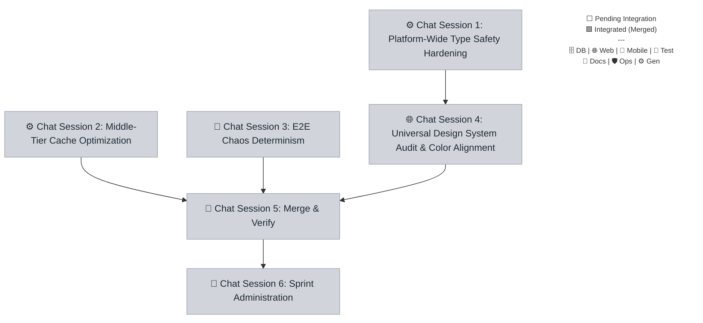

# Sprint 044 Playbook: Global Style & Engineering Health

> **Playbook Path:** docs/sprints/sprint-044/playbook.md
>
> **Protocol Version:** v3.4.0
>
> **Objective:** This sprint focuses on universal design system alignment,
> establishing a consistent color palette, eradicating type safety
> vulnerabilities, and improving system robustness via decoupled chaos test
> determinism and edge cache optimization.

## Sprint Summary

This sprint focuses on universal design system alignment, establishing a
consistent color palette, eradicating type safety vulnerabilities, and improving
system robustness via decoupled chaos test determinism and edge cache
optimization.

## Fan-Out Execution Flow



## 📋 Execution Plan

### ⚙️ Chat Session 1: Platform-Wide Type Safety Hardening

[ ] **044.1.1** Platform-Wide Type Safety Hardening

- **Mode**: Fast
- **Model**: Gemini 3.1 Pro (High) OR Gemini 3 Flash
- **Scope**: `@repo/shared`
- **Dependencies**: None

```markdown
=== SYSTEM PROTOCOL & CAPABILITIES === **AGENT EXECUTION PROTOCOL:** Before
beginning work, you MUST run the pre-flight verification script to ensure all
dependencies are committed. Read and strictly follow the steps defined in
`.agents/workflows/sprint-verify-task-prerequisites.md` or run the manual
verification script for your specific task. If the script fails, STOP
immediately and ask the user to complete the blocking tasks.

**Branching:** All task work MUST occur on the branch specified in your
instructions. If this task depends on previous tasks, ensure you have merged or
checked out their respective feature branches before beginning work.

**Close-out:**

1. Commit your changes: Stage your files and execute a conventional commit
   (e.g., git commit -m "feat(ui): update colors"). If the working tree is
   clean, skip this step.
2. Push your branch: `git push -u origin HEAD`
3. Read and strictly follow the steps defined in
   `.agents/workflows/sprint-finalize-task.md` to track state.
4. If you encounter an unresolvable error, execute:
   `node .agents/scripts/update-task-state.js 044.1.1 blocked` and alert the
   user.

=== VOLATILE TASK CONTEXT === **Persona**: engineer **Loaded Skills**:
`architecture/structured-output-zod` **Sprint / Session**: Sprint 044 | Chat
Session 1

**Pre-flight Task Validation (Run this first):**
`node .agents/scripts/verify-prereqs.js docs/sprints/sprint-044/playbook.md 044.1.1`

**Instructions:**

1. **Task type-safety-hardening:**
   - Audit and remove arbitrary `any` or `as any` type-bypasses across the
     monorepo.
   - Explicitly type Hono RPC responses using Zod schemas.
   - Ensure `tsconfig.json` files enforce stricter checks globally.
   - **Branching**:
     `git checkout sprint-044 && git checkout -b task/sprint-044/type-safety-hardening`
   - **Mark Executing**:
     `node .agents/scripts/update-task-state.js 044.1.1 executing`
```

### ⚙️ Chat Session 2: Middle-Tier Cache Optimization

[ ] **044.2.1** Middle-Tier Cache Optimization

- **Mode**: Planning
- **Model**: Gemini 3.1 Pro (High) OR Gemini 3 Flash
- **Scope**: `@repo/api`
- **Dependencies**: None

```markdown
=== SYSTEM PROTOCOL & CAPABILITIES === **AGENT EXECUTION PROTOCOL:** Before
beginning work, you MUST run the pre-flight verification script to ensure all
dependencies are committed. Read and strictly follow the steps defined in
`.agents/workflows/sprint-verify-task-prerequisites.md` or run the manual
verification script for your specific task. If the script fails, STOP
immediately and ask the user to complete the blocking tasks.

**Branching:** All task work MUST occur on the branch specified in your
instructions. If this task depends on previous tasks, ensure you have merged or
checked out their respective feature branches before beginning work.

**Close-out:**

1. Commit your changes: Stage your files and execute a conventional commit
   (e.g., git commit -m "feat(ui): update colors"). If the working tree is
   clean, skip this step.
2. Push your branch: `git push -u origin HEAD`
3. Read and strictly follow the steps defined in
   `.agents/workflows/sprint-finalize-task.md` to track state.
4. If you encounter an unresolvable error, execute:
   `node .agents/scripts/update-task-state.js 044.2.1 blocked` and alert the
   user.

=== VOLATILE TASK CONTEXT === **Persona**: engineer **Loaded Skills**:
`backend/cloudflare-workers` **Sprint / Session**: Sprint 044 | Chat Session 2

**Pre-flight Task Validation (Run this first):**
`node .agents/scripts/verify-prereqs.js docs/sprints/sprint-044/playbook.md 044.2.1`

**Instructions:**

1. **Task cache-optimization:**
   - Refactor the edge routing cache to utilize a robust LRU eviction policy.
   - Ensure usage remains beneath the Cloudflare Worker 128MB memory limit.
   - Add telemetry for cache hits and evictions.
   - **Branching**:
     `git checkout sprint-044 && git checkout -b task/sprint-044/cache-optimization`
   - **Mark Executing**:
     `node .agents/scripts/update-task-state.js 044.2.1 executing`
```

### 🧪 Chat Session 3: E2E Chaos Determinism

[ ] **044.3.1** E2E Chaos Determinism

- **Mode**: Planning
- **Model**: Gemini 3.1 Pro (High) OR Gemini 3 Flash
- **Scope**: `e2e`
- **Dependencies**: None

```markdown
=== SYSTEM PROTOCOL & CAPABILITIES === **AGENT EXECUTION PROTOCOL:** Before
beginning work, you MUST run the pre-flight verification script to ensure all
dependencies are committed. Read and strictly follow the steps defined in
`.agents/workflows/sprint-verify-task-prerequisites.md` or run the manual
verification script for your specific task. If the script fails, STOP
immediately and ask the user to complete the blocking tasks.

**Branching:** All task work MUST occur on the branch specified in your
instructions. If this task depends on previous tasks, ensure you have merged or
checked out their respective feature branches before beginning work.

**Close-out:**

1. Commit your changes: Stage your files and execute a conventional commit
   (e.g., git commit -m "feat(ui): update colors"). If the working tree is
   clean, skip this step.
2. Push your branch: `git push -u origin HEAD`
3. Read and strictly follow the steps defined in
   `.agents/workflows/sprint-finalize-task.md` to track state.
4. If you encounter an unresolvable error, execute:
   `node .agents/scripts/update-task-state.js 044.3.1 blocked` and alert the
   user.

=== VOLATILE TASK CONTEXT === **Persona**: qa-engineer **Loaded Skills**:
`qa/playwright` **Sprint / Session**: Sprint 044 | Chat Session 3

**Pre-flight Task Validation (Run this first):**
`node .agents/scripts/verify-prereqs.js docs/sprints/sprint-044/playbook.md 044.3.1`

**Instructions:**

1. **Task chaos-determinism:**
   - Replace `Math.random()` in chaos injection utilities with a seeded
     pseudo-random number generator (PRNG).
   - Log the seed value to `stdout` for test reproducibility.
   - Ensure chaos simulations cleanly respect test execution flags.
   - **Branching**:
     `git checkout sprint-044 && git checkout -b task/sprint-044/chaos-determinism`
   - **Mark Executing**:
     `node .agents/scripts/update-task-state.js 044.3.1 executing`
```

### 🌐 Chat Session 4: Universal Design System Audit & Color Alignment

> **⚠️ PREREQUISITE:** Do not start this session until the tasks in **Chat(s)
> 1** are finished (this is verified automatically by your pre-flight script).

[ ] **044.4.1** Universal Design System Audit & Color Alignment

- **Mode**: Planning
- **Model**: Gemini 3.1 Pro (High) OR Gemini 3 Flash
- **Scope**: `@repo/web`
- **Dependencies**: `044.1.1`

```markdown
=== SYSTEM PROTOCOL & CAPABILITIES === **AGENT EXECUTION PROTOCOL:** Before
beginning work, you MUST run the pre-flight verification script to ensure all
dependencies are committed. Read and strictly follow the steps defined in
`.agents/workflows/sprint-verify-task-prerequisites.md` or run the manual
verification script for your specific task. If the script fails, STOP
immediately and ask the user to complete the blocking tasks.

**Branching:** All task work MUST occur on the branch specified in your
instructions. If this task depends on previous tasks, ensure you have merged or
checked out their respective feature branches before beginning work.

**Close-out:**

1. Commit your changes: Stage your files and execute a conventional commit
   (e.g., git commit -m "feat(ui): update colors"). If the working tree is
   clean, skip this step.
2. Push your branch: `git push -u origin HEAD`
3. Read and strictly follow the steps defined in
   `.agents/workflows/sprint-finalize-task.md` to track state.
4. If you encounter an unresolvable error, execute:
   `node .agents/scripts/update-task-state.js 044.4.1 blocked` and alert the
   user.

=== VOLATILE TASK CONTEXT === **Persona**: engineer-web **Loaded Skills**:
`frontend/tailwind-v4` **Sprint / Session**: Sprint 044 | Chat Session 4

**Pre-flight Task Validation (Run this first):**
`node .agents/scripts/verify-prereqs.js docs/sprints/sprint-044/playbook.md 044.4.1`

**Instructions:**

1. **Task design-system-audit-and-color:**
   - Audit and map disjointed frontend components to the formalized
     `docs/style-guide.md`.
   - Standardize buttons, inputs, and cards.
   - Apply robust HSL/RGB design tokens from the guide, including dark mode
     support.
   - Ensure WCAG AA consistency across all color pairings.
   - **Branching**:
     `git checkout task/sprint-044/type-safety-hardening && git checkout -b task/sprint-044/design-system-audit-and-color`
   - **Mark Executing**:
     `node .agents/scripts/update-task-state.js 044.4.1 executing`
```

### 🧪 Chat Session 5: Merge & Verify

> **⚠️ PREREQUISITE:** Do not start this session until the tasks in **Chat(s) 2,
> 3, 4** are finished (this is verified automatically by your pre-flight
> script).

[ ] **044.5.1** Sprint Integration

- **Mode**: Fast
- **Model**: Gemini 3.1 Pro (High) OR Gemini 3 Flash
- **HITL Check**: ⚠️ Requires explicit user approval before execution.
- **Dependencies**: `044.2.1`, `044.3.1`, `044.4.1`

```markdown
=== SYSTEM PROTOCOL & CAPABILITIES === **AGENT EXECUTION PROTOCOL:** Before
beginning work, you MUST run the pre-flight verification script to ensure all
dependencies are committed. Read and strictly follow the steps defined in
`.agents/workflows/sprint-verify-task-prerequisites.md` or run the manual
verification script for your specific task. If the script fails, STOP
immediately and ask the user to complete the blocking tasks.

**Branching:** All task work MUST occur on the branch specified in your
instructions. If this task depends on previous tasks, ensure you have merged or
checked out their respective feature branches before beginning work.

**Close-out:**

1. Commit your changes: Stage your files and execute a conventional commit
   (e.g., git commit -m "feat(ui): update colors"). If the working tree is
   clean, skip this step.
2. Push your branch: `git push -u origin HEAD`
3. Read and strictly follow the steps defined in
   `.agents/workflows/sprint-finalize-task.md` to track state.
4. If you encounter an unresolvable error, execute:
   `node .agents/scripts/update-task-state.js 044.5.1 blocked` and alert the
   user.

=== VOLATILE TASK CONTEXT === **Persona**: engineer **Loaded Skills**:
`architecture/monorepo-path-strategist`, `devops/git-flow-specialist` **Sprint /
Session**: Sprint 044 | Chat Session 5

> **🚨 HITL REQUIRED:** STOP and explicitly ask the user for approval via chat
> before proceeding with execution or commits.

**Pre-flight Task Validation (Run this first):**
`node .agents/scripts/verify-prereqs.js docs/sprints/sprint-044/playbook.md 044.5.1`

**Instructions:**

1. **Task sprint-integration:**
   - Execute the `sprint-integration` workflow for `044`.
   - **Branching**: `git checkout sprint-044`
   - **Mark Executing**:
     `node .agents/scripts/update-task-state.js 044.5.1 executing`
```

[ ] **044.5.2** Sprint Code Review

- **Mode**: Planning
- **Model**: Gemini 3.1 Pro (High) OR Gemini 3 Flash
- **Dependencies**: `044.5.1`

````markdown
=== SYSTEM PROTOCOL & CAPABILITIES === **AGENT EXECUTION PROTOCOL:** Before
beginning work, you MUST run the pre-flight verification script to ensure all
dependencies are committed. Read and strictly follow the steps defined in
`.agents/workflows/sprint-verify-task-prerequisites.md` or run the manual
verification script for your specific task. If the script fails, STOP
immediately and ask the user to complete the blocking tasks.

**Branching:** All task work MUST occur on the branch specified in your
instructions. If this task depends on previous tasks, ensure you have merged or
checked out their respective feature branches before beginning work.

**Close-out:**

1. Commit your changes: Stage your files and execute a conventional commit
   (e.g., git commit -m "feat(ui): update colors"). If the working tree is
   clean, skip this step.
2. Push your branch: `git push -u origin HEAD`
3. Read and strictly follow the steps defined in
   `.agents/workflows/sprint-finalize-task.md` to track state.
4. If you encounter an unresolvable error, execute:
   `node .agents/scripts/update-task-state.js 044.5.2 blocked` and alert the
   user.

=== VOLATILE TASK CONTEXT === **Persona**: architect **Loaded Skills**:
`architecture/autonomous-coding-standards`, `devops/git-flow-specialist`
**Sprint / Session**: Sprint 044 | Chat Session 5

**Pre-flight Task Validation (Run this first):**
`node .agents/scripts/verify-prereqs.js docs/sprints/sprint-044/playbook.md 044.5.2`

**Instructions:**

1. **Task sprint-code-review:**
   - Execute the `sprint-code-review` workflow for `044`.
   - **Branching**: `git checkout sprint-044`
   - **Mark Executing**:
     `node .agents/scripts/update-task-state.js 044.5.2 executing`

**Manual Fix Finalization (AGENT PROMPT):** If manual fixes were implemented
during this review, YOU MUST run this realignment prompt to synchronize them
before proceeding to QA:

```markdown
=== VOLATILE TASK CONTEXT === **Persona**: devops-engineer **Loaded Skills**:
`devops/git-flow-specialist`

=== INSTRUCTIONS === I have completed the manual implementation of architectural
fixes from the Code Review. Please execute the final synchronization to align
the repository:

1. **Commit Review Fixes**: Stage and commit any uncommitted architectural
   fixes:
   `git add . && (git diff --staged --quiet || git commit -m "fix(review): implement architectural code review feedback")`
2. **Push Default Base**: Push your fixes natively to the integration branch:
   `git push origin HEAD`
3. **Update State**: Mark the code review task as passed to generate the test
   receipt: `node .agents/scripts/update-task-state.js 044.5.2 passed`
```
````

[ ] **044.5.3** Sprint QA

- **Mode**: Fast
- **Model**: Gemini 3.1 Pro (High) OR Gemini 3 Flash
- **Dependencies**: `044.5.2`

```markdown
=== SYSTEM PROTOCOL & CAPABILITIES === **AGENT EXECUTION PROTOCOL:** Before
beginning work, you MUST run the pre-flight verification script to ensure all
dependencies are committed. Read and strictly follow the steps defined in
`.agents/workflows/sprint-verify-task-prerequisites.md` or run the manual
verification script for your specific task. If the script fails, STOP
immediately and ask the user to complete the blocking tasks.

**Branching:** All task work MUST occur on the branch specified in your
instructions. If this task depends on previous tasks, ensure you have merged or
checked out their respective feature branches before beginning work.

**Close-out:**

1. Commit your changes: Stage your files and execute a conventional commit
   (e.g., git commit -m "feat(ui): update colors"). If the working tree is
   clean, skip this step.
2. Push your branch: `git push -u origin HEAD`
3. Read and strictly follow the steps defined in
   `.agents/workflows/sprint-finalize-task.md` to track state.
4. If you encounter an unresolvable error, execute:
   `node .agents/scripts/update-task-state.js 044.5.3 blocked` and alert the
   user.

=== VOLATILE TASK CONTEXT === **Persona**: qa-engineer **Loaded Skills**:
`qa/resilient-qa-automation`, `qa/playwright`, `qa/vitest` **Sprint / Session**:
Sprint 044 | Chat Session 5

**Pre-flight Task Validation (Run this first):**
`node .agents/scripts/verify-prereqs.js docs/sprints/sprint-044/playbook.md 044.5.3`

**Instructions:**

1. **Task sprint-qa:**
   - Execute the `sprint-testing` workflow for `044`.
   - **Branching**: `git checkout sprint-044`
   - **Mark Executing**:
     `node .agents/scripts/update-task-state.js 044.5.3 executing`
```

### 📝 Chat Session 6: Sprint Administration

> **⚠️ PREREQUISITE:** Do not start this session until the tasks in **Chat(s)
> 5** are finished (this is verified automatically by your pre-flight script).

[ ] **044.6.1** Sprint Retrospective

- **Mode**: Fast
- **Model**: Gemini 3.1 Pro (High) OR Gemini 3 Flash
- **Dependencies**: `044.5.3`

```markdown
=== SYSTEM PROTOCOL & CAPABILITIES === **AGENT EXECUTION PROTOCOL:** Before
beginning work, you MUST run the pre-flight verification script to ensure all
dependencies are committed. Read and strictly follow the steps defined in
`.agents/workflows/sprint-verify-task-prerequisites.md` or run the manual
verification script for your specific task. If the script fails, STOP
immediately and ask the user to complete the blocking tasks.

**Branching:** All task work MUST occur on the branch specified in your
instructions. If this task depends on previous tasks, ensure you have merged or
checked out their respective feature branches before beginning work.

**Close-out:**

1. Commit your changes: Stage your files and execute a conventional commit
   (e.g., git commit -m "feat(ui): update colors"). If the working tree is
   clean, skip this step.
2. Push your branch: `git push -u origin HEAD`
3. Read and strictly follow the steps defined in
   `.agents/workflows/sprint-finalize-task.md` to track state.
4. If you encounter an unresolvable error, execute:
   `node .agents/scripts/update-task-state.js 044.6.1 blocked` and alert the
   user.

=== VOLATILE TASK CONTEXT === **Persona**: product **Loaded Skills**:
`architecture/markdown` **Sprint / Session**: Sprint 044 | Chat Session 6

**Pre-flight Task Validation (Run this first):**
`node .agents/scripts/verify-prereqs.js docs/sprints/sprint-044/playbook.md 044.6.1`

**Instructions:**

1. **Task sprint-retro:**
   - Execute the `sprint-retro` workflow for `044`.
   - **Branching**: `git checkout sprint-044`
   - **Mark Executing**:
     `node .agents/scripts/update-task-state.js 044.6.1 executing`
```

[ ] **044.6.2** Sprint Close-Out

- **Mode**: Fast
- **Model**: Gemini 3.1 Pro (High) OR Gemini 3 Flash
- **HITL Check**: ⚠️ Requires explicit user approval before execution.
- **Dependencies**: `044.6.1`

```markdown
=== SYSTEM PROTOCOL & CAPABILITIES === **AGENT EXECUTION PROTOCOL:** Before
beginning work, you MUST run the pre-flight verification script to ensure all
dependencies are committed. Read and strictly follow the steps defined in
`.agents/workflows/sprint-verify-task-prerequisites.md` or run the manual
verification script for your specific task. If the script fails, STOP
immediately and ask the user to complete the blocking tasks.

**Branching:** All task work MUST occur on the branch specified in your
instructions. If this task depends on previous tasks, ensure you have merged or
checked out their respective feature branches before beginning work.

**Close-out:**

1. Commit your changes: Stage your files and execute a conventional commit
   (e.g., git commit -m "feat(ui): update colors"). If the working tree is
   clean, skip this step.
2. Push your branch: `git push -u origin HEAD`
3. Read and strictly follow the steps defined in
   `.agents/workflows/sprint-finalize-task.md` to track state.
4. If you encounter an unresolvable error, execute:
   `node .agents/scripts/update-task-state.js 044.6.2 blocked` and alert the
   user.

=== VOLATILE TASK CONTEXT === **Persona**: devops-engineer **Loaded Skills**:
`devops/git-flow-specialist` **Sprint / Session**: Sprint 044 | Chat Session 6

> **🚨 HITL REQUIRED:** STOP and explicitly ask the user for approval via chat
> before proceeding with execution or commits.

**Pre-flight Task Validation (Run this first):**
`node .agents/scripts/verify-prereqs.js docs/sprints/sprint-044/playbook.md 044.6.2`

**Instructions:**

1. **Task sprint-close:**
   - Execute the `sprint-close-out` workflow for `044`.
   - **Branching**: `git checkout sprint-044`
   - **Mark Executing**:
     `node .agents/scripts/update-task-state.js 044.6.2 executing`
```
