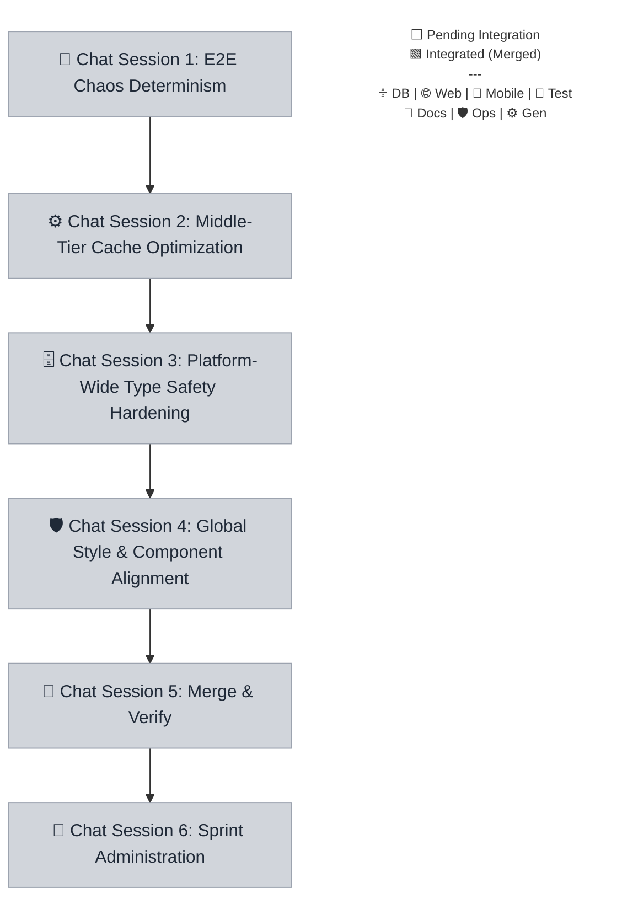

# Sprint 044 Playbook: Global Style & Engineering Health

> **Playbook Path:** docs/sprints/sprint-044/playbook.md
>
> **Protocol Version:** v3.4.3
>
> **Objective:** This sprint focuses on visual excellence and system durability.
> Key initiatives include a universal design system audit and color refresh,
> platform-wide type safety hardening, edge cache optimization, and E2E chaos
> determinism.

## Sprint Summary

This sprint focuses on visual excellence and system durability. Key initiatives
include a universal design system audit and color refresh, platform-wide type
safety hardening, edge cache optimization, and E2E chaos determinism.

## Fan-Out Execution Flow



## 📋 Execution Plan

### 🧪 Chat Session 1: E2E Chaos Determinism

[ ] **044.1.1** E2E Chaos Determinism

- **Mode**: Planning
- **Model**: Gemini 3.1 Pro (High) OR Gemini 3 Flash
- **Scope**: `root`
- **Dependencies**: None

```markdown
=== SYSTEM PROTOCOL & CAPABILITIES === **AGENT EXECUTION PROTOCOL:** Before
beginning work, you MUST run the pre-flight verification script to ensure all
dependencies are committed. Read and strictly follow the steps defined in
`.agents/workflows/sprint-verify-task-prerequisites.md` or run the manual
verification script for your specific task. If the script fails, STOP
immediately and ask the user to complete the blocking tasks.

**Branching:** All task work MUST occur on the branch specified in your
instructions. If this task depends on previous tasks, ensure you have fetched
the latest remote state (`git fetch origin`) and merged or checked out their
respective feature branches before beginning work.

**Close-out:**

1. Commit your changes:
   `git add . && (git diff --staged --quiet || git commit -m "<dynamically generate your conventional commit here>")`
2. Push your branch: `git push -u origin HEAD`
3. Read and strictly follow the steps defined in
   `.agents/workflows/sprint-finalize-task.md` to track state.
4. If you encounter an unresolvable error, execute:
   `node .agents/scripts/update-task-state.js 044.1.1 blocked` and alert the
   user.

=== VOLATILE TASK CONTEXT === **Persona**: qa-engineer **Loaded Skills**:
`qa/playwright` **Sprint / Session**: Sprint 044 | Chat Session 1

**Pre-flight Task Validation (Run this first):**
`node .agents/scripts/verify-prereqs.js docs/sprints/sprint-044/playbook.md 044.1.1`

**Instructions:**

1. **Task e2e-chaos-determinism:**
   - Refactor the E2E chaos engineering toolkit.
   - Replace `Math.random()` randomization with a deterministic seeded
     generator.
   - Expose an initial environment parameter for seeding.
   - Validate that subsequent runs with the identical seed produce the exact
     same injected failures.
   - Target `apps/web/e2e` Playwright configurations.
   - **Branching**:
     `git fetch origin && git checkout sprint-044 && git checkout -b task/sprint-044/e2e-chaos-determinism`
   - **Mark Executing**:
     `node .agents/scripts/update-task-state.js 044.1.1 executing`
```

### ⚙️ Chat Session 2: Middle-Tier Cache Optimization

> **⚠️ PREREQUISITE:** Do not start this session until the tasks in **Chat(s)
> 1** are finished (this is verified automatically by your pre-flight script).

[ ] **044.2.1** Middle-Tier Cache Optimization

- **Mode**: Planning
- **Model**: Claude Sonnet 4.6 (Think) OR Gemini 3.1 Pro (High) OR Gemini 3.1
  Pro (High)
- **Scope**: `@repo/api`
- **Dependencies**: `044.1.1`

```markdown
=== SYSTEM PROTOCOL & CAPABILITIES === **AGENT EXECUTION PROTOCOL:** Before
beginning work, you MUST run the pre-flight verification script to ensure all
dependencies are committed. Read and strictly follow the steps defined in
`.agents/workflows/sprint-verify-task-prerequisites.md` or run the manual
verification script for your specific task. If the script fails, STOP
immediately and ask the user to complete the blocking tasks.

**Branching:** All task work MUST occur on the branch specified in your
instructions. If this task depends on previous tasks, ensure you have fetched
the latest remote state (`git fetch origin`) and merged or checked out their
respective feature branches before beginning work.

**Close-out:**

1. Commit your changes:
   `git add . && (git diff --staged --quiet || git commit -m "<dynamically generate your conventional commit here>")`
2. Push your branch: `git push -u origin HEAD`
3. Read and strictly follow the steps defined in
   `.agents/workflows/sprint-finalize-task.md` to track state.
4. If you encounter an unresolvable error, execute:
   `node .agents/scripts/update-task-state.js 044.2.1 blocked` and alert the
   user.

=== VOLATILE TASK CONTEXT === **Persona**: engineer **Loaded Skills**:
`architecture/monorepo-path-strategist` **Sprint / Session**: Sprint 044 | Chat
Session 2

**Pre-flight Task Validation (Run this first):**
`node .agents/scripts/verify-prereqs.js docs/sprints/sprint-044/playbook.md 044.2.1`

**Instructions:**

1. **Task middle-tier-cache:**
   - Optimize the Cloudflare Edge caching strategy.
   - Refactor `customDomainMiddleware` in `apps/api` to use a Least Recently
     Used (LRU) eviction algorithm instead of a basic Map FIFO queue.
   - Configure memory boundaries to restrict RAM footprint under heavy WaaS
     loads.
   - Add telemetry to trace hits, misses, and evictions.
   - **Branching**:
     `git fetch origin && git checkout task/sprint-044/e2e-chaos-determinism && git checkout -b task/sprint-044/middle-tier-cache`
   - **Mark Executing**:
     `node .agents/scripts/update-task-state.js 044.2.1 executing`
```

### 🗄️ Chat Session 3: Platform-Wide Type Safety Hardening

> **⚠️ PREREQUISITE:** Do not start this session until the tasks in **Chat(s)
> 2** are finished (this is verified automatically by your pre-flight script).

[ ] **044.3.1** Platform-Wide Type Safety Hardening

- **Mode**: Planning
- **Model**: Gemini 3.1 Pro (High) OR Gemini 3 Flash
- **Scope**: `root`
- **HITL Check**: ⚠️ Requires explicit user approval before execution.
- **Dependencies**: `044.2.1`

```markdown
=== SYSTEM PROTOCOL & CAPABILITIES === **AGENT EXECUTION PROTOCOL:** Before
beginning work, you MUST run the pre-flight verification script to ensure all
dependencies are committed. Read and strictly follow the steps defined in
`.agents/workflows/sprint-verify-task-prerequisites.md` or run the manual
verification script for your specific task. If the script fails, STOP
immediately and ask the user to complete the blocking tasks.

**Branching:** All task work MUST occur on the branch specified in your
instructions. If this task depends on previous tasks, ensure you have fetched
the latest remote state (`git fetch origin`) and merged or checked out their
respective feature branches before beginning work.

**Close-out:**

1. Commit your changes:
   `git add . && (git diff --staged --quiet || git commit -m "<dynamically generate your conventional commit here>")`
2. Push your branch: `git push -u origin HEAD`
3. Read and strictly follow the steps defined in
   `.agents/workflows/sprint-finalize-task.md` to track state.
4. If you encounter an unresolvable error, execute:
   `node .agents/scripts/update-task-state.js 044.3.1 blocked` and alert the
   user.

=== VOLATILE TASK CONTEXT === **Persona**: architect **Loaded Skills**:
`architecture/autonomous-coding-standards`,
`architecture/monorepo-path-strategist` **Sprint / Session**: Sprint 044 | Chat
Session 3

> **🚨 HITL REQUIRED:** STOP and explicitly ask the user for approval via chat
> before proceeding with execution or commits.

**Pre-flight Task Validation (Run this first):**
`node .agents/scripts/verify-prereqs.js docs/sprints/sprint-044/playbook.md 044.3.1`

**Instructions:**

1. **Task platform-type-safety:**
   - Eliminate structural type vulnerabilities across the monorepo.
   - Sweep Hono and client RPC boundaries (`apps/api`, `apps/web`,
     `apps/mobile`) to eliminate `any` casting.
   - Inject explicit `Zod` or `Drizzle` parsers for all critical edge payloads.
   - IMPORTANT: You must run `pnpm turbo run typecheck` to verify strict typing
     passes with zero warnings before considering this task complete.
   - **Branching**:
     `git fetch origin && git checkout task/sprint-044/middle-tier-cache && git checkout -b task/sprint-044/platform-type-safety`
   - **Mark Executing**:
     `node .agents/scripts/update-task-state.js 044.3.1 executing`
```

### 🛡️ Chat Session 4: Global Style & Component Alignment

> **⚠️ PREREQUISITE:** Do not start this session until the tasks in **Chat(s)
> 3** are finished (this is verified automatically by your pre-flight script).

[ ] **044.4.1** Global Style & Component Alignment

- **Mode**: Planning
- **Model**: Gemini 3.1 Pro (High) OR Gemini 3 Flash
- **Scope**: `root`
- **HITL Check**: ⚠️ Requires explicit user approval before execution.
- **Dependencies**: `044.3.1`

```markdown
=== SYSTEM PROTOCOL & CAPABILITIES === **AGENT EXECUTION PROTOCOL:** Before
beginning work, you MUST run the pre-flight verification script to ensure all
dependencies are committed. Read and strictly follow the steps defined in
`.agents/workflows/sprint-verify-task-prerequisites.md` or run the manual
verification script for your specific task. If the script fails, STOP
immediately and ask the user to complete the blocking tasks.

**Branching:** All task work MUST occur on the branch specified in your
instructions. If this task depends on previous tasks, ensure you have fetched
the latest remote state (`git fetch origin`) and merged or checked out their
respective feature branches before beginning work.

**Close-out:**

1. Commit your changes:
   `git add . && (git diff --staged --quiet || git commit -m "<dynamically generate your conventional commit here>")`
2. Push your branch: `git push -u origin HEAD`
3. Read and strictly follow the steps defined in
   `.agents/workflows/sprint-finalize-task.md` to track state.
4. If you encounter an unresolvable error, execute:
   `node .agents/scripts/update-task-state.js 044.4.1 blocked` and alert the
   user.

=== VOLATILE TASK CONTEXT === **Persona**: engineer-web **Loaded Skills**:
`frontend/tailwind-v4`, `architecture/autonomous-coding-standards` **Sprint /
Session**: Sprint 044 | Chat Session 4

> **🚨 HITL REQUIRED:** STOP and explicitly ask the user for approval via chat
> before proceeding with execution or commits.

**Pre-flight Task Validation (Run this first):**
`node .agents/scripts/verify-prereqs.js docs/sprints/sprint-044/playbook.md 044.4.1`

**Instructions:**

1. **Task global-style-alignment:**
   - Refactor platform-wide styling logic to align strictly with
     `docs/style-guide.md`.
   - Update `tailwind.config` in `apps/web` and Expo styling config in
     `apps/mobile` with new design tokens.
   - Strip out all instances of manually hardcoded hex colors from TSX files,
     replacing them with proper Tailwind/theme tokens.
   - Ensure complete cross-device dark-mode consistency for primary UI
     components.
   - IMPORTANT: Run the compiler via `pnpm turbo run typecheck` to verify no
     syntax boundaries were broken.
   - **Branching**:
     `git fetch origin && git checkout task/sprint-044/platform-type-safety && git checkout -b task/sprint-044/global-style-alignment`
   - **Mark Executing**:
     `node .agents/scripts/update-task-state.js 044.4.1 executing`
```

### 🧪 Chat Session 5: Merge & Verify

> **⚠️ PREREQUISITE:** Do not start this session until the tasks in **Chat(s)
> 4** are finished (this is verified automatically by your pre-flight script).

[ ] **044.5.1** Sprint Integration

- **Mode**: Planning
- **Model**: Gemini 3.1 Pro (High) OR Gemini 3 Flash
- **HITL Check**: ⚠️ Requires explicit user approval before execution.
- **Dependencies**: `044.4.1`

```markdown
=== SYSTEM PROTOCOL & CAPABILITIES === **AGENT EXECUTION PROTOCOL:** Before
beginning work, you MUST run the pre-flight verification script to ensure all
dependencies are committed. Read and strictly follow the steps defined in
`.agents/workflows/sprint-verify-task-prerequisites.md` or run the manual
verification script for your specific task. If the script fails, STOP
immediately and ask the user to complete the blocking tasks.

**Branching:** All task work MUST occur on the branch specified in your
instructions. If this task depends on previous tasks, ensure you have fetched
the latest remote state (`git fetch origin`) and merged or checked out their
respective feature branches before beginning work.

**Close-out:**

1. Commit your changes:
   `git add . && (git diff --staged --quiet || git commit -m "<dynamically generate your conventional commit here>")`
2. Push your branch: `git push -u origin HEAD`
3. Read and strictly follow the steps defined in
   `.agents/workflows/sprint-finalize-task.md` to track state.
4. If you encounter an unresolvable error, execute:
   `node .agents/scripts/update-task-state.js 044.5.1 blocked` and alert the
   user.

=== VOLATILE TASK CONTEXT === **Persona**: engineer **Loaded Skills**:
`architecture/monorepo-path-strategist`, `devops/git-flow-specialist` **Sprint /
Session**: Sprint 044 | Chat Session 5

> **🚨 HITL REQUIRED:** STOP and explicitly ask the user for approval via chat
> before proceeding with execution or commits.

**Pre-flight Task Validation (Run this first):**
`node .agents/scripts/verify-prereqs.js docs/sprints/sprint-044/playbook.md 044.5.1`

**Instructions:**

1. **Task integration:**
   - Execute the `sprint-integration` workflow for `044`.
   - **Branching**: `git fetch origin && git checkout sprint-044`
   - **Mark Executing**:
     `node .agents/scripts/update-task-state.js 044.5.1 executing`
```

[ ] **044.5.2** Sprint Code Review

- **Mode**: Planning
- **Model**: Claude Sonnet 4.6 (Think) OR Gemini 3.1 Pro (High) OR Gemini 3.1
  Pro (High)
- **Dependencies**: `044.5.1`

````markdown
=== SYSTEM PROTOCOL & CAPABILITIES === **AGENT EXECUTION PROTOCOL:** Before
beginning work, you MUST run the pre-flight verification script to ensure all
dependencies are committed. Read and strictly follow the steps defined in
`.agents/workflows/sprint-verify-task-prerequisites.md` or run the manual
verification script for your specific task. If the script fails, STOP
immediately and ask the user to complete the blocking tasks.

**Branching:** All task work MUST occur on the branch specified in your
instructions. If this task depends on previous tasks, ensure you have fetched
the latest remote state (`git fetch origin`) and merged or checked out their
respective feature branches before beginning work.

**Close-out:**

1. Commit your changes:
   `git add . && (git diff --staged --quiet || git commit -m "<dynamically generate your conventional commit here>")`
2. Push your branch: `git push -u origin HEAD`
3. Read and strictly follow the steps defined in
   `.agents/workflows/sprint-finalize-task.md` to track state.
4. If you encounter an unresolvable error, execute:
   `node .agents/scripts/update-task-state.js 044.5.2 blocked` and alert the
   user.

=== VOLATILE TASK CONTEXT === **Persona**: architect **Loaded Skills**:
`architecture/autonomous-coding-standards`, `devops/git-flow-specialist`
**Sprint / Session**: Sprint 044 | Chat Session 5

**Pre-flight Task Validation (Run this first):**
`node .agents/scripts/verify-prereqs.js docs/sprints/sprint-044/playbook.md 044.5.2`

**Instructions:**

1. **Task code-review:**
   - Execute the `sprint-code-review` workflow for `044`.
   - **Branching**: `git fetch origin && git checkout sprint-044`
   - **Mark Executing**:
     `node .agents/scripts/update-task-state.js 044.5.2 executing`

**Manual Fix Finalization (AGENT PROMPT):** If manual fixes were implemented
during this review, YOU MUST run this realignment prompt to synchronize them
before proceeding to QA:

```markdown
=== VOLATILE TASK CONTEXT === **Persona**: devops-engineer **Loaded Skills**:
`devops/git-flow-specialist`

=== INSTRUCTIONS === I have completed the manual implementation of architectural
fixes from the Code Review. Please execute the final synchronization to align
the repository:

1. **Commit Review Fixes**: Stage and commit any uncommitted architectural
   fixes:
   `git add . && (git diff --staged --quiet || git commit -m "fix(review): implement architectural code review feedback")`
2. **Push Default Base**: Push your fixes natively to the integration branch:
   `git push origin HEAD`
3. **Update State**: Mark the code review task as passed to generate the test
   receipt: `node .agents/scripts/update-task-state.js 044.5.2 passed`
```
````

[ ] **044.5.3** Sprint QA & Testing

- **Mode**: Planning
- **Model**: Claude Sonnet 4.6 (Think) OR Gemini 3.1 Pro (High) OR Gemini 3.1
  Pro (High)
- **Dependencies**: `044.5.2`

```markdown
=== SYSTEM PROTOCOL & CAPABILITIES === **AGENT EXECUTION PROTOCOL:** Before
beginning work, you MUST run the pre-flight verification script to ensure all
dependencies are committed. Read and strictly follow the steps defined in
`.agents/workflows/sprint-verify-task-prerequisites.md` or run the manual
verification script for your specific task. If the script fails, STOP
immediately and ask the user to complete the blocking tasks.

**Branching:** All task work MUST occur on the branch specified in your
instructions. If this task depends on previous tasks, ensure you have fetched
the latest remote state (`git fetch origin`) and merged or checked out their
respective feature branches before beginning work.

**Close-out:**

1. Commit your changes:
   `git add . && (git diff --staged --quiet || git commit -m "<dynamically generate your conventional commit here>")`
2. Push your branch: `git push -u origin HEAD`
3. Read and strictly follow the steps defined in
   `.agents/workflows/sprint-finalize-task.md` to track state.
4. If you encounter an unresolvable error, execute:
   `node .agents/scripts/update-task-state.js 044.5.3 blocked` and alert the
   user.

=== VOLATILE TASK CONTEXT === **Persona**: qa-engineer **Loaded Skills**:
`qa/playwright`, `qa/vitest` **Sprint / Session**: Sprint 044 | Chat Session 5

**Pre-flight Task Validation (Run this first):**
`node .agents/scripts/verify-prereqs.js docs/sprints/sprint-044/playbook.md 044.5.3`

**Instructions:**

1. **Task qa:**
   - Execute the `sprint-testing` workflow for `044`.
   - **Branching**: `git fetch origin && git checkout sprint-044`
   - **Mark Executing**:
     `node .agents/scripts/update-task-state.js 044.5.3 executing`
```

### 📝 Chat Session 6: Sprint Administration

> **⚠️ PREREQUISITE:** Do not start this session until the tasks in **Chat(s)
> 5** are finished (this is verified automatically by your pre-flight script).

[ ] **044.6.1** Sprint Retrospective

- **Mode**: Planning
- **Model**: Claude Sonnet 4.6 (Think) OR Gemini 3.1 Pro (High) OR Gemini 3.1
  Pro (High)
- **Dependencies**: `044.5.3`

```markdown
=== SYSTEM PROTOCOL & CAPABILITIES === **AGENT EXECUTION PROTOCOL:** Before
beginning work, you MUST run the pre-flight verification script to ensure all
dependencies are committed. Read and strictly follow the steps defined in
`.agents/workflows/sprint-verify-task-prerequisites.md` or run the manual
verification script for your specific task. If the script fails, STOP
immediately and ask the user to complete the blocking tasks.

**Branching:** All task work MUST occur on the branch specified in your
instructions. If this task depends on previous tasks, ensure you have fetched
the latest remote state (`git fetch origin`) and merged or checked out their
respective feature branches before beginning work.

**Close-out:**

1. Commit your changes:
   `git add . && (git diff --staged --quiet || git commit -m "<dynamically generate your conventional commit here>")`
2. Push your branch: `git push -u origin HEAD`
3. Read and strictly follow the steps defined in
   `.agents/workflows/sprint-finalize-task.md` to track state.
4. If you encounter an unresolvable error, execute:
   `node .agents/scripts/update-task-state.js 044.6.1 blocked` and alert the
   user.

=== VOLATILE TASK CONTEXT === **Persona**: product **Loaded Skills**:
`architecture/markdown` **Sprint / Session**: Sprint 044 | Chat Session 6

**Pre-flight Task Validation (Run this first):**
`node .agents/scripts/verify-prereqs.js docs/sprints/sprint-044/playbook.md 044.6.1`

**Instructions:**

1. **Task retro:**
   - Execute the `sprint-retro` workflow for `044`.
   - **Branching**: `git fetch origin && git checkout sprint-044`
   - **Mark Executing**:
     `node .agents/scripts/update-task-state.js 044.6.1 executing`
```

[ ] **044.6.2** Close Sprint

- **Mode**: Planning
- **Model**: Gemini 3.1 Pro (High) OR Gemini 3 Flash
- **HITL Check**: ⚠️ Requires explicit user approval before execution.
- **Dependencies**: `044.6.1`

```markdown
=== SYSTEM PROTOCOL & CAPABILITIES === **AGENT EXECUTION PROTOCOL:** Before
beginning work, you MUST run the pre-flight verification script to ensure all
dependencies are committed. Read and strictly follow the steps defined in
`.agents/workflows/sprint-verify-task-prerequisites.md` or run the manual
verification script for your specific task. If the script fails, STOP
immediately and ask the user to complete the blocking tasks.

**Branching:** All task work MUST occur on the branch specified in your
instructions. If this task depends on previous tasks, ensure you have fetched
the latest remote state (`git fetch origin`) and merged or checked out their
respective feature branches before beginning work.

**Close-out:**

1. Commit your changes:
   `git add . && (git diff --staged --quiet || git commit -m "<dynamically generate your conventional commit here>")`
2. Push your branch: `git push -u origin HEAD`
3. Read and strictly follow the steps defined in
   `.agents/workflows/sprint-finalize-task.md` to track state.
4. If you encounter an unresolvable error, execute:
   `node .agents/scripts/update-task-state.js 044.6.2 blocked` and alert the
   user.

=== VOLATILE TASK CONTEXT === **Persona**: devops-engineer **Loaded Skills**:
`devops/git-flow-specialist` **Sprint / Session**: Sprint 044 | Chat Session 6

> **🚨 HITL REQUIRED:** STOP and explicitly ask the user for approval via chat
> before proceeding with execution or commits.

**Pre-flight Task Validation (Run this first):**
`node .agents/scripts/verify-prereqs.js docs/sprints/sprint-044/playbook.md 044.6.2`

**Instructions:**

1. **Task close-sprint:**
   - Execute the `sprint-close-out` workflow for `044`.
   - **Branching**: `git fetch origin && git checkout sprint-044`
   - **Mark Executing**:
     `node .agents/scripts/update-task-state.js 044.6.2 executing`
```
