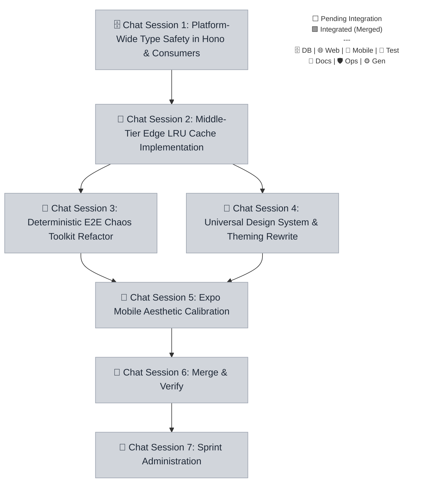

# Sprint 044 Playbook: Global Style & Engineering Health

> **Playbook Path:** docs/sprints/sprint-044/playbook.md
>
> **Protocol Version:** v3.4.4
>
> **Objective:** Implement platform-wide visual style improvements, strict type
> safety, predictable testing, and improved LRU cache.

## Sprint Summary

Implement platform-wide visual style improvements, strict type safety,
predictable testing, and improved LRU cache.

## Fan-Out Execution Flow



## 📋 Execution Plan

### 🗄️ Chat Session 1: Platform-Wide Type Safety in Hono & Consumers

[ ] **044.1.1** Platform-Wide Type Safety in Hono & Consumers

- **Mode**: Planning
- **Model**: Gemini 3.1 Pro (High)
- **Scope**: `root`
- **Dependencies**: None

```markdown
=== SYSTEM PROTOCOL & CAPABILITIES === **AGENT EXECUTION PROTOCOL:** Before
beginning work, you MUST run the pre-flight verification script to ensure all
dependencies are committed. Read and strictly follow the steps defined in
`.agents/workflows/sprint-verify-task-prerequisites.md` or run the manual
verification script for your specific task. If the script fails, STOP
immediately and ask the user to complete the blocking tasks.

**Branching:** All task work MUST occur on the branch specified in your
instructions. If this task depends on previous tasks, ensure you have fetched
the latest remote state (`git fetch origin`) and merged or checked out their
respective feature branches before beginning work.

**Close-out:**

1. Commit your changes: Analyze your diff, then run this command with your
   generated message:
   `git add . && (git diff --staged --quiet || git commit -m "<INSERT_MESSAGE>")`
2. Push your branch: `git push -u origin HEAD`
3. Read and strictly follow the steps defined in
   `.agents/workflows/sprint-finalize-task.md` to track state.
4. If you encounter an unresolvable error, execute:
   `node .agents/scripts/update-task-state.js 044.1.1 blocked` and alert the
   user.

=== VOLATILE TASK CONTEXT === **Persona**: engineer **Loaded Skills**:
`architecture/monorepo-path-strategist`, `backend/cloudflare-hono-architect`,
`architecture/structured-output-zod` **Sprint / Session**: Sprint 044 | Chat
Session 1

**Pre-flight Task Validation (Run this first):**
`node .agents/scripts/verify-prereqs.js docs/sprints/sprint-044/playbook.md 044.1.1`

**Instructions:**

1. **Task type-safety-sweep:**
   - Locate all `as any` type castings in the Hono API routes and RPC consumers.
   - Replace implicit or explicit `any` usages with exact inferred types from
     `@repo/shared/schemas`.
   - Refactor internal middleware or utilities to respect Drizzle/Zod typings
     directly.
   - Run `pnpm turbo run typecheck` monorepo-wide to guarantee absolutely zero
     compiler warnings.
   - **Branching**:
     `git fetch origin && git checkout sprint-044 && git checkout -b task/sprint-044/type-safety-sweep`
   - **Mark Executing**:
     `node .agents/scripts/update-task-state.js 044.1.1 executing`
```

### 🧪 Chat Session 2: Middle-Tier Edge LRU Cache Implementation

> **⚠️ PREREQUISITE:** Do not start this session until the tasks in **Chat(s)
> 1** are finished (this is verified automatically by your pre-flight script).

[ ] **044.2.1** Middle-Tier Edge LRU Cache Implementation

- **Mode**: Planning
- **Model**: Gemini 3.1 Pro (High)
- **Scope**: `root`
- **Dependencies**: `044.1.1`

```markdown
=== SYSTEM PROTOCOL & CAPABILITIES === **AGENT EXECUTION PROTOCOL:** Before
beginning work, you MUST run the pre-flight verification script to ensure all
dependencies are committed. Read and strictly follow the steps defined in
`.agents/workflows/sprint-verify-task-prerequisites.md` or run the manual
verification script for your specific task. If the script fails, STOP
immediately and ask the user to complete the blocking tasks.

**Branching:** All task work MUST occur on the branch specified in your
instructions. If this task depends on previous tasks, ensure you have fetched
the latest remote state (`git fetch origin`) and merged or checked out their
respective feature branches before beginning work.

**Close-out:**

1. Commit your changes: Analyze your diff, then run this command with your
   generated message:
   `git add . && (git diff --staged --quiet || git commit -m "<INSERT_MESSAGE>")`
2. Push your branch: `git push -u origin HEAD`
3. Read and strictly follow the steps defined in
   `.agents/workflows/sprint-finalize-task.md` to track state.
4. If you encounter an unresolvable error, execute:
   `node .agents/scripts/update-task-state.js 044.2.1 blocked` and alert the
   user.

=== VOLATILE TASK CONTEXT === **Persona**: sre **Loaded Skills**:
`backend/cloudflare-workers`, `qa/vitest` **Sprint / Session**: Sprint 044 |
Chat Session 2

**Pre-flight Task Validation (Run this first):**
`node .agents/scripts/verify-prereqs.js docs/sprints/sprint-044/playbook.md 044.2.1`

**Instructions:**

1. **Task lru-cache-optimization:**
   - Refactor `customDomainMiddleware` to abandon the native map object in favor
     of an LRU (Least Recently Used) caching policy.
   - Establish explicit thresholds for max cache size and implement item
     eviction on boundary limits.
   - Write programmatic Vitest assertions demonstrating the eviction behavior
     under stress/saturation.
   - Ensure `pnpm turbo run test` passes for the API workspace.
   - **Branching**:
     `git fetch origin && git checkout task/sprint-044/type-safety-sweep && git checkout -b task/sprint-044/lru-cache-optimization`
   - **Mark Executing**:
     `node .agents/scripts/update-task-state.js 044.2.1 executing`
```

### 🧪 Chat Session 3: Deterministic E2E Chaos Toolkit Refactor

> **⚠️ PREREQUISITE:** Do not start this session until the tasks in **Chat(s)
> 2** are finished (this is verified automatically by your pre-flight script).

[ ] **044.3.1** Deterministic E2E Chaos Toolkit Refactor

- **Mode**: Planning
- **Model**: Gemini 3.1 Pro (High)
- **Scope**: `@repo/shared`
- **Dependencies**: `044.2.1`

```markdown
=== SYSTEM PROTOCOL & CAPABILITIES === **AGENT EXECUTION PROTOCOL:** Before
beginning work, you MUST run the pre-flight verification script to ensure all
dependencies are committed. Read and strictly follow the steps defined in
`.agents/workflows/sprint-verify-task-prerequisites.md` or run the manual
verification script for your specific task. If the script fails, STOP
immediately and ask the user to complete the blocking tasks.

**Branching:** All task work MUST occur on the branch specified in your
instructions. If this task depends on previous tasks, ensure you have fetched
the latest remote state (`git fetch origin`) and merged or checked out their
respective feature branches before beginning work.

**Close-out:**

1. Commit your changes: Analyze your diff, then run this command with your
   generated message:
   `git add . && (git diff --staged --quiet || git commit -m "<INSERT_MESSAGE>")`
2. Push your branch: `git push -u origin HEAD`
3. Read and strictly follow the steps defined in
   `.agents/workflows/sprint-finalize-task.md` to track state.
4. If you encounter an unresolvable error, execute:
   `node .agents/scripts/update-task-state.js 044.3.1 blocked` and alert the
   user.

=== VOLATILE TASK CONTEXT === **Persona**: qa-engineer **Loaded Skills**:
`qa/resilient-qa-automation` **Sprint / Session**: Sprint 044 | Chat Session 3

**Pre-flight Task Validation (Run this first):**
`node .agents/scripts/verify-prereqs.js docs/sprints/sprint-044/playbook.md 044.3.1`

**Instructions:**

1. **Task chaos-determinism:**
   - Locate the chaos testing utilities and remove all usages of
     `Math.random()`.
   - Replace with a PRNG configured via a `TEST_SEED` environment variable so
     outcomes are perfectly reproducible.
   - Integrate an explicit log `stdout` mechanism that prints the exact seed
     when tests fail, facilitating pipeline replays.
   - Validate functionality by generating a deterministic seed locally and
     verifying repeated fault sequences.
   - **Branching**:
     `git fetch origin && git checkout task/sprint-044/lru-cache-optimization && git checkout -b task/sprint-044/chaos-determinism`
   - **Mark Executing**:
     `node .agents/scripts/update-task-state.js 044.3.1 executing`
```

### 🧪 Chat Session 4: Universal Design System & Theming Rewrite

> **⚠️ PREREQUISITE:** Do not start this session until the tasks in **Chat(s)
> 2** are finished (this is verified automatically by your pre-flight script).

[ ] **044.4.1** Universal Design System & Theming Rewrite

- **Mode**: Planning
- **Model**: Gemini 3.1 Pro (High)
- **Scope**: `@repo/web`
- **Dependencies**: `044.2.1`

```markdown
=== SYSTEM PROTOCOL & CAPABILITIES === **AGENT EXECUTION PROTOCOL:** Before
beginning work, you MUST run the pre-flight verification script to ensure all
dependencies are committed. Read and strictly follow the steps defined in
`.agents/workflows/sprint-verify-task-prerequisites.md` or run the manual
verification script for your specific task. If the script fails, STOP
immediately and ask the user to complete the blocking tasks.

**Branching:** All task work MUST occur on the branch specified in your
instructions. If this task depends on previous tasks, ensure you have fetched
the latest remote state (`git fetch origin`) and merged or checked out their
respective feature branches before beginning work.

**Close-out:**

1. Commit your changes: Analyze your diff, then run this command with your
   generated message:
   `git add . && (git diff --staged --quiet || git commit -m "<INSERT_MESSAGE>")`
2. Push your branch: `git push -u origin HEAD`
3. Read and strictly follow the steps defined in
   `.agents/workflows/sprint-finalize-task.md` to track state.
4. If you encounter an unresolvable error, execute:
   `node .agents/scripts/update-task-state.js 044.4.1 blocked` and alert the
   user.

=== VOLATILE TASK CONTEXT === **Persona**: ux-designer **Loaded Skills**:
`frontend/tailwind-v4`, `frontend/ui-accessibility-engineer` **Sprint /
Session**: Sprint 044 | Chat Session 4

**Pre-flight Task Validation (Run this first):**
`node .agents/scripts/verify-prereqs.js docs/sprints/sprint-044/playbook.md 044.4.1`

**Instructions:**

1. **Task design-system-audit-colors:**
   - Audit and align CSS tokens, Tailwind classes, and generic color values
     across `@repo/web` matching the new style guide.
   - Implement the harmonized dark mode palette alongside the standard premium
     palette.
   - Run existing programmatic visual regression tests and Vitest UI tests to
     ensure no layout regressions.
   - Verify WCAG 2.1 AA automated checks pass.
   - **Branching**:
     `git fetch origin && git checkout task/sprint-044/lru-cache-optimization && git checkout -b task/sprint-044/design-system-audit-colors`
   - **Mark Executing**:
     `node .agents/scripts/update-task-state.js 044.4.1 executing`
```

### 📱 Chat Session 5: Expo Mobile Aesthetic Calibration

> **⚠️ PREREQUISITE:** Do not start this session until the tasks in **Chat(s) 3,
> 4** are finished (this is verified automatically by your pre-flight script).

[ ] **044.5.1** Expo Mobile Aesthetic Calibration

- **Mode**: Planning
- **Model**: Gemini 3.1 Pro (High)
- **Scope**: `root`
- **Dependencies**: `044.4.1`, `044.3.1`

```markdown
=== SYSTEM PROTOCOL & CAPABILITIES === **AGENT EXECUTION PROTOCOL:** Before
beginning work, you MUST run the pre-flight verification script to ensure all
dependencies are committed. Read and strictly follow the steps defined in
`.agents/workflows/sprint-verify-task-prerequisites.md` or run the manual
verification script for your specific task. If the script fails, STOP
immediately and ask the user to complete the blocking tasks.

**Branching:** All task work MUST occur on the branch specified in your
instructions. If this task depends on previous tasks, ensure you have fetched
the latest remote state (`git fetch origin`) and merged or checked out their
respective feature branches before beginning work.

**Close-out:**

1. Commit your changes: Analyze your diff, then run this command with your
   generated message:
   `git add . && (git diff --staged --quiet || git commit -m "<INSERT_MESSAGE>")`
2. Push your branch: `git push -u origin HEAD`
3. Read and strictly follow the steps defined in
   `.agents/workflows/sprint-finalize-task.md` to track state.
4. If you encounter an unresolvable error, execute:
   `node .agents/scripts/update-task-state.js 044.5.1 blocked` and alert the
   user.

=== VOLATILE TASK CONTEXT === **Persona**: engineer-mobile **Loaded Skills**:
`frontend/expo-react-native-developer`, `frontend/ui-accessibility-engineer`
**Sprint / Session**: Sprint 044 | Chat Session 5

**Pre-flight Task Validation (Run this first):**
`node .agents/scripts/verify-prereqs.js docs/sprints/sprint-044/playbook.md 044.5.1`

**Instructions:**

1. **Task mobile-design-system-alignment:**
   - Sync the newly defined color tokens and typography from the web/shared
     package to `@repo/mobile`.
   - Remove hardcoded styling strings and replace them with synchronized
     context/token values.
   - Verify both Light and Dark mode rendering throughout the core mobile
     layouts.
   - Ensure Jest unit tests simulating presentation logic pass.
   - **Branching**:
     `git fetch origin && git checkout task/sprint-044/design-system-audit-colors && git checkout -b task/sprint-044/mobile-design-system-alignment && git merge task/sprint-044/chaos-determinism -m "chore: merge dependency chaos-determinism"`
   - **Mark Executing**:
     `node .agents/scripts/update-task-state.js 044.5.1 executing`
```

### 🧪 Chat Session 6: Merge & Verify

> **⚠️ PREREQUISITE:** Do not start this session until the tasks in **Chat(s)
> 5** are finished (this is verified automatically by your pre-flight script).

[ ] **044.6.1** Branch Protocol Integration

- **Mode**: Fast
- **Model**: Gemini 3.1 Pro (High) OR Gemini 3 Flash
- **HITL Check**: ⚠️ Requires explicit user approval before execution.
- **Dependencies**: `044.5.1`

```markdown
=== SYSTEM PROTOCOL & CAPABILITIES === **AGENT EXECUTION PROTOCOL:** Before
beginning work, you MUST run the pre-flight verification script to ensure all
dependencies are committed. Read and strictly follow the steps defined in
`.agents/workflows/sprint-verify-task-prerequisites.md` or run the manual
verification script for your specific task. If the script fails, STOP
immediately and ask the user to complete the blocking tasks.

**Branching:** All task work MUST occur on the branch specified in your
instructions. If this task depends on previous tasks, ensure you have fetched
the latest remote state (`git fetch origin`) and merged or checked out their
respective feature branches before beginning work.

**Close-out:**

1. Commit your changes: Analyze your diff, then run this command with your
   generated message:
   `git add . && (git diff --staged --quiet || git commit -m "<INSERT_MESSAGE>")`
2. Push your branch: `git push -u origin HEAD`
3. Read and strictly follow the steps defined in
   `.agents/workflows/sprint-finalize-task.md` to track state.
4. If you encounter an unresolvable error, execute:
   `node .agents/scripts/update-task-state.js 044.6.1 blocked` and alert the
   user.

=== VOLATILE TASK CONTEXT === **Persona**: engineer **Loaded Skills**:
`architecture/monorepo-path-strategist`, `devops/git-flow-specialist` **Sprint /
Session**: Sprint 044 | Chat Session 6

> **🚨 HITL REQUIRED:** STOP and explicitly ask the user for approval via chat
> before proceeding with execution or commits.

**Pre-flight Task Validation (Run this first):**
`node .agents/scripts/verify-prereqs.js docs/sprints/sprint-044/playbook.md 044.6.1`

**Instructions:**

1. **Task sprint-integration:**
   - Execute the `sprint-integration` workflow for `044`.
   - **Branching**: `git fetch origin && git checkout sprint-044`
   - **Mark Executing**:
     `node .agents/scripts/update-task-state.js 044.6.1 executing`
```

[ ] **044.6.2** Clean Code Architecture Scan

- **Mode**: Planning
- **Model**: Claude Sonnet 4.6 (Think) OR Gemini 3.1 Pro (High)
- **Dependencies**: `044.6.1`

````markdown
=== SYSTEM PROTOCOL & CAPABILITIES === **AGENT EXECUTION PROTOCOL:** Before
beginning work, you MUST run the pre-flight verification script to ensure all
dependencies are committed. Read and strictly follow the steps defined in
`.agents/workflows/sprint-verify-task-prerequisites.md` or run the manual
verification script for your specific task. If the script fails, STOP
immediately and ask the user to complete the blocking tasks.

**Branching:** All task work MUST occur on the branch specified in your
instructions. If this task depends on previous tasks, ensure you have fetched
the latest remote state (`git fetch origin`) and merged or checked out their
respective feature branches before beginning work.

**Close-out:**

1. Commit your changes: Analyze your diff, then run this command with your
   generated message:
   `git add . && (git diff --staged --quiet || git commit -m "<INSERT_MESSAGE>")`
2. Push your branch: `git push -u origin HEAD`
3. Read and strictly follow the steps defined in
   `.agents/workflows/sprint-finalize-task.md` to track state.
4. If you encounter an unresolvable error, execute:
   `node .agents/scripts/update-task-state.js 044.6.2 blocked` and alert the
   user.

=== VOLATILE TASK CONTEXT === **Persona**: architect **Loaded Skills**:
`devops/git-flow-specialist` **Sprint / Session**: Sprint 044 | Chat Session 6

**Pre-flight Task Validation (Run this first):**
`node .agents/scripts/verify-prereqs.js docs/sprints/sprint-044/playbook.md 044.6.2`

**Instructions:**

1. **Task architect-code-review:**
   - Execute the `sprint-code-review` workflow for `044`.
   - **Branching**: `git fetch origin && git checkout sprint-044`
   - **Mark Executing**:
     `node .agents/scripts/update-task-state.js 044.6.2 executing`

**Manual Fix Finalization (AGENT PROMPT):** If manual fixes were implemented
during this review, YOU MUST run this realignment prompt to synchronize them
before proceeding to QA:

```markdown
=== VOLATILE TASK CONTEXT === **Persona**: devops-engineer **Loaded Skills**:
`devops/git-flow-specialist`

=== INSTRUCTIONS === I have completed the manual implementation of architectural
fixes from the Code Review. Please execute the final synchronization to align
the repository:

1. **Commit Review Fixes**: Stage and commit any uncommitted architectural
   fixes:
   `git add . && (git diff --staged --quiet || git commit -m "fix(review): implement architectural code review feedback")`
2. **Push Default Base**: Push your fixes natively to the integration branch:
   `git push origin HEAD`
3. **Update State**: Mark the code review task as passed to generate the test
   receipt: `node .agents/scripts/update-task-state.js 044.6.2 passed`
```
````

[ ] **044.6.3** End-to-End Regression Validation

- **Mode**: Planning
- **Model**: Claude Sonnet 4.6 (Think) OR Gemini 3.1 Pro (High)
- **Dependencies**: `044.6.2`

```markdown
=== SYSTEM PROTOCOL & CAPABILITIES === **AGENT EXECUTION PROTOCOL:** Before
beginning work, you MUST run the pre-flight verification script to ensure all
dependencies are committed. Read and strictly follow the steps defined in
`.agents/workflows/sprint-verify-task-prerequisites.md` or run the manual
verification script for your specific task. If the script fails, STOP
immediately and ask the user to complete the blocking tasks.

**Branching:** All task work MUST occur on the branch specified in your
instructions. If this task depends on previous tasks, ensure you have fetched
the latest remote state (`git fetch origin`) and merged or checked out their
respective feature branches before beginning work.

**Close-out:**

1. Commit your changes: Analyze your diff, then run this command with your
   generated message:
   `git add . && (git diff --staged --quiet || git commit -m "<INSERT_MESSAGE>")`
2. Push your branch: `git push -u origin HEAD`
3. Read and strictly follow the steps defined in
   `.agents/workflows/sprint-finalize-task.md` to track state.
4. If you encounter an unresolvable error, execute:
   `node .agents/scripts/update-task-state.js 044.6.3 blocked` and alert the
   user.

=== VOLATILE TASK CONTEXT === **Persona**: qa-engineer **Sprint / Session**:
Sprint 044 | Chat Session 6

**Pre-flight Task Validation (Run this first):**
`node .agents/scripts/verify-prereqs.js docs/sprints/sprint-044/playbook.md 044.6.3`

**Instructions:**

1. **Task qa-certification:**
   - Execute the `sprint-testing` workflow for `044`.
   - **Branching**: `git fetch origin && git checkout sprint-044`
   - **Mark Executing**:
     `node .agents/scripts/update-task-state.js 044.6.3 executing`
```

### 📝 Chat Session 7: Sprint Administration

> **⚠️ PREREQUISITE:** Do not start this session until the tasks in **Chat(s)
> 6** are finished (this is verified automatically by your pre-flight script).

[ ] **044.7.1** Sprint 044 Retro & Roadmap Synchronization

- **Mode**: Planning
- **Model**: Claude Sonnet 4.6 (Think) OR Gemini 3.1 Pro (High)
- **Dependencies**: `044.6.3`

```markdown
=== SYSTEM PROTOCOL & CAPABILITIES === **AGENT EXECUTION PROTOCOL:** Before
beginning work, you MUST run the pre-flight verification script to ensure all
dependencies are committed. Read and strictly follow the steps defined in
`.agents/workflows/sprint-verify-task-prerequisites.md` or run the manual
verification script for your specific task. If the script fails, STOP
immediately and ask the user to complete the blocking tasks.

**Branching:** All task work MUST occur on the branch specified in your
instructions. If this task depends on previous tasks, ensure you have fetched
the latest remote state (`git fetch origin`) and merged or checked out their
respective feature branches before beginning work.

**Close-out:**

1. Commit your changes: Analyze your diff, then run this command with your
   generated message:
   `git add . && (git diff --staged --quiet || git commit -m "<INSERT_MESSAGE>")`
2. Push your branch: `git push -u origin HEAD`
3. Read and strictly follow the steps defined in
   `.agents/workflows/sprint-finalize-task.md` to track state.
4. If you encounter an unresolvable error, execute:
   `node .agents/scripts/update-task-state.js 044.7.1 blocked` and alert the
   user.

=== VOLATILE TASK CONTEXT === **Persona**: product **Loaded Skills**:
`architecture/markdown` **Sprint / Session**: Sprint 044 | Chat Session 7

**Pre-flight Task Validation (Run this first):**
`node .agents/scripts/verify-prereqs.js docs/sprints/sprint-044/playbook.md 044.7.1`

**Instructions:**

1. **Task sprint-retro:**
   - Execute the `sprint-retro` workflow for `044`.
   - **Branching**: `git fetch origin && git checkout sprint-044`
   - **Mark Executing**:
     `node .agents/scripts/update-task-state.js 044.7.1 executing`
```

[ ] **044.7.2** Pipeline Completion & Delivery

- **Mode**: Fast
- **Model**: Gemini 3.1 Pro (High) OR Gemini 3 Flash
- **HITL Check**: ⚠️ Requires explicit user approval before execution.
- **Dependencies**: `044.7.1`

```markdown
=== SYSTEM PROTOCOL & CAPABILITIES === **AGENT EXECUTION PROTOCOL:** Before
beginning work, you MUST run the pre-flight verification script to ensure all
dependencies are committed. Read and strictly follow the steps defined in
`.agents/workflows/sprint-verify-task-prerequisites.md` or run the manual
verification script for your specific task. If the script fails, STOP
immediately and ask the user to complete the blocking tasks.

**Branching:** All task work MUST occur on the branch specified in your
instructions. If this task depends on previous tasks, ensure you have fetched
the latest remote state (`git fetch origin`) and merged or checked out their
respective feature branches before beginning work.

**Close-out:**

1. Commit your changes: Analyze your diff, then run this command with your
   generated message:
   `git add . && (git diff --staged --quiet || git commit -m "<INSERT_MESSAGE>")`
2. Push your branch: `git push -u origin HEAD`
3. Read and strictly follow the steps defined in
   `.agents/workflows/sprint-finalize-task.md` to track state.
4. If you encounter an unresolvable error, execute:
   `node .agents/scripts/update-task-state.js 044.7.2 blocked` and alert the
   user.

=== VOLATILE TASK CONTEXT === **Persona**: devops-engineer **Loaded Skills**:
`devops/git-flow-specialist` **Sprint / Session**: Sprint 044 | Chat Session 7

> **🚨 HITL REQUIRED:** STOP and explicitly ask the user for approval via chat
> before proceeding with execution or commits.

**Pre-flight Task Validation (Run this first):**
`node .agents/scripts/verify-prereqs.js docs/sprints/sprint-044/playbook.md 044.7.2`

**Instructions:**

1. **Task close-sprint:**
   - Execute the `sprint-close-out` workflow for `044`.
   - **Branching**: `git fetch origin && git checkout sprint-044`
   - **Mark Executing**:
     `node .agents/scripts/update-task-state.js 044.7.2 executing`
```
