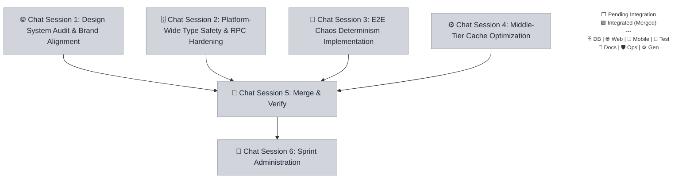

# Sprint 044 Playbook: Global Style & Engineering Health

> **Playbook Path:** docs/sprints/sprint-044/playbook.md
>
> **Protocol Version:** v3.4.1
>
> **Objective:** This sprint focuses on resetting the engineering baseline by
> auditing the design system across all workspaces, hardening type safety,
> enforcing deterministic CI test sequences, and implementing robust LRU caching
> for edge routes.

## Sprint Summary

This sprint focuses on resetting the engineering baseline by auditing the design
system across all workspaces, hardening type safety, enforcing deterministic CI
test sequences, and implementing robust LRU caching for edge routes.

## Fan-Out Execution Flow



## 📋 Execution Plan

### 🌐 Chat Session 1: Design System Audit & Brand Alignment

[ ] **044.1.1** Design System Audit & Brand Alignment

- **Mode**: Planning
- **Model**: Claude Sonnet 4.6 (Think) OR Gemini 3.1 Pro (Low)
- **Scope**: `root`
- **Dependencies**: None

```markdown
=== SYSTEM PROTOCOL & CAPABILITIES === **AGENT EXECUTION PROTOCOL:** Before
beginning work, you MUST run the pre-flight verification script to ensure all
dependencies are committed. Read and strictly follow the steps defined in
`.agents/workflows/sprint-verify-task-prerequisites.md` or run the manual
verification script for your specific task. If the script fails, STOP
immediately and ask the user to complete the blocking tasks.

**Branching:** All task work MUST occur on the branch specified in your
instructions. If this task depends on previous tasks, ensure you have fetched
the latest remote state (`git fetch origin`) and merged or checked out their
respective feature branches before beginning work.

**Close-out:**

1. Commit your changes: Stage your files and execute a conventional commit
   (e.g., git commit -m "feat(ui): update colors"). If the working tree is
   clean, skip this step.
2. Push your branch: `git push -u origin HEAD`
3. Read and strictly follow the steps defined in
   `.agents/workflows/sprint-finalize-task.md` to track state.
4. If you encounter an unresolvable error, execute:
   `node .agents/scripts/update-task-state.js 044.1.1 blocked` and alert the
   user.

=== VOLATILE TASK CONTEXT === **Persona**: engineer-web **Loaded Skills**:
`frontend/tailwind-v4`, `architecture/autonomous-coding-standards` **Sprint /
Session**: Sprint 044 | Chat Session 1

**Pre-flight Task Validation (Run this first):**
`node .agents/scripts/verify-prereqs.js docs/sprints/sprint-044/playbook.md 044.1.1`

**Instructions:**

1. **Task design-system-audit:**
   - Traverse Tailwind/CSS configuration and React component props (Astro/Expo).
   - Extract and standardize all hardcoded hex strings into semantic design
     tokens as per `docs/style-guide.md`.
   - Update administrative interfaces to match the B2C premium aesthetic.
   - **Branching**:
     `git checkout sprint-044 && git checkout -b task/sprint-044/design-system-audit`
   - **Mark Executing**:
     `node .agents/scripts/update-task-state.js 044.1.1 executing`
```

### 🗄️ Chat Session 2: Platform-Wide Type Safety & RPC Hardening

[ ] **044.2.1** Platform-Wide Type Safety & RPC Hardening

- **Mode**: Planning
- **Model**: Claude Sonnet 4.6 (Think) OR Gemini 3.1 Pro (Low)
- **Scope**: `root`
- **Dependencies**: None

```markdown
=== SYSTEM PROTOCOL & CAPABILITIES === **AGENT EXECUTION PROTOCOL:** Before
beginning work, you MUST run the pre-flight verification script to ensure all
dependencies are committed. Read and strictly follow the steps defined in
`.agents/workflows/sprint-verify-task-prerequisites.md` or run the manual
verification script for your specific task. If the script fails, STOP
immediately and ask the user to complete the blocking tasks.

**Branching:** All task work MUST occur on the branch specified in your
instructions. If this task depends on previous tasks, ensure you have fetched
the latest remote state (`git fetch origin`) and merged or checked out their
respective feature branches before beginning work.

**Close-out:**

1. Commit your changes: Stage your files and execute a conventional commit
   (e.g., git commit -m "feat(ui): update colors"). If the working tree is
   clean, skip this step.
2. Push your branch: `git push -u origin HEAD`
3. Read and strictly follow the steps defined in
   `.agents/workflows/sprint-finalize-task.md` to track state.
4. If you encounter an unresolvable error, execute:
   `node .agents/scripts/update-task-state.js 044.2.1 blocked` and alert the
   user.

=== VOLATILE TASK CONTEXT === **Persona**: engineer **Loaded Skills**:
`backend/cloudflare-workers`, `architecture/structured-output-zod` **Sprint /
Session**: Sprint 044 | Chat Session 2

**Pre-flight Task Validation (Run this first):**
`node .agents/scripts/verify-prereqs.js docs/sprints/sprint-044/playbook.md 044.2.1`

**Instructions:**

1. **Task type-safety-hardening:**
   - Enforce strict generic instantiation inside the shared schema registry.
   - Replace naive `as any` blocks with statically typed API integration utility
     hooks in Hono RPC consumers.
   - Ensure `pnpm turbo run typecheck` passes with zero warnings.
   - **Branching**:
     `git checkout sprint-044 && git checkout -b task/sprint-044/type-safety-hardening`
   - **Mark Executing**:
     `node .agents/scripts/update-task-state.js 044.2.1 executing`
```

### 🧪 Chat Session 3: E2E Chaos Determinism Implementation

[ ] **044.3.1** E2E Chaos Determinism Implementation

- **Mode**: Fast
- **Model**: Gemini 3 Flash OR GPT-OSS 120B (Medium)
- **Scope**: `root`
- **Dependencies**: None

```markdown
=== SYSTEM PROTOCOL & CAPABILITIES === **AGENT EXECUTION PROTOCOL:** Before
beginning work, you MUST run the pre-flight verification script to ensure all
dependencies are committed. Read and strictly follow the steps defined in
`.agents/workflows/sprint-verify-task-prerequisites.md` or run the manual
verification script for your specific task. If the script fails, STOP
immediately and ask the user to complete the blocking tasks.

**Branching:** All task work MUST occur on the branch specified in your
instructions. If this task depends on previous tasks, ensure you have fetched
the latest remote state (`git fetch origin`) and merged or checked out their
respective feature branches before beginning work.

**Close-out:**

1. Commit your changes: Stage your files and execute a conventional commit
   (e.g., git commit -m "feat(ui): update colors"). If the working tree is
   clean, skip this step.
2. Push your branch: `git push -u origin HEAD`
3. Read and strictly follow the steps defined in
   `.agents/workflows/sprint-finalize-task.md` to track state.
4. If you encounter an unresolvable error, execute:
   `node .agents/scripts/update-task-state.js 044.3.1 blocked` and alert the
   user.

=== VOLATILE TASK CONTEXT === **Persona**: qa-engineer **Loaded Skills**:
`qa/playwright` **Sprint / Session**: Sprint 044 | Chat Session 3

**Pre-flight Task Validation (Run this first):**
`node .agents/scripts/verify-prereqs.js docs/sprints/sprint-044/playbook.md 044.3.1`

**Instructions:**

1. **Task chaos-determinism:**
   - Implement a seeded PRNG algorithm to replace `Math.random()` in the chaos
     testing toolkit.
   - Expose the initial seed to `console.log()` upon execution to ensure
     reproducibility.
   - Verify test runs trigger faults cleanly based on the injected seed.
   - **Branching**:
     `git checkout sprint-044 && git checkout -b task/sprint-044/chaos-determinism`
   - **Mark Executing**:
     `node .agents/scripts/update-task-state.js 044.3.1 executing`
```

### ⚙️ Chat Session 4: Middle-Tier Cache Optimization

[ ] **044.4.1** Middle-Tier Cache Optimization

- **Mode**: Planning
- **Model**: Gemini 3.1 Pro (High) OR Claude Sonnet 4.6 (Think)
- **Scope**: `@repo/api`
- **Dependencies**: None

```markdown
=== SYSTEM PROTOCOL & CAPABILITIES === **AGENT EXECUTION PROTOCOL:** Before
beginning work, you MUST run the pre-flight verification script to ensure all
dependencies are committed. Read and strictly follow the steps defined in
`.agents/workflows/sprint-verify-task-prerequisites.md` or run the manual
verification script for your specific task. If the script fails, STOP
immediately and ask the user to complete the blocking tasks.

**Branching:** All task work MUST occur on the branch specified in your
instructions. If this task depends on previous tasks, ensure you have fetched
the latest remote state (`git fetch origin`) and merged or checked out their
respective feature branches before beginning work.

**Close-out:**

1. Commit your changes: Stage your files and execute a conventional commit
   (e.g., git commit -m "feat(ui): update colors"). If the working tree is
   clean, skip this step.
2. Push your branch: `git push -u origin HEAD`
3. Read and strictly follow the steps defined in
   `.agents/workflows/sprint-finalize-task.md` to track state.
4. If you encounter an unresolvable error, execute:
   `node .agents/scripts/update-task-state.js 044.4.1 blocked` and alert the
   user.

=== VOLATILE TASK CONTEXT === **Persona**: engineer **Loaded Skills**:
`backend/cloudflare-workers` **Sprint / Session**: Sprint 044 | Chat Session 4

**Pre-flight Task Validation (Run this first):**
`node .agents/scripts/verify-prereqs.js docs/sprints/sprint-044/playbook.md 044.4.1`

**Instructions:**

1. **Task lru-cache-optimization:**
   - Refactor `customDomainMiddleware` mapping from a naive FIFO Map to an LRU
     eviction policy implementation.
   - Ensure the edge caching logic prevents unbounded memory expansion during
     traffic spikes.
   - Add tests verifying eviction boundaries.
   - **Branching**:
     `git checkout sprint-044 && git checkout -b task/sprint-044/lru-cache-optimization`
   - **Mark Executing**:
     `node .agents/scripts/update-task-state.js 044.4.1 executing`
```

### 🧪 Chat Session 5: Merge & Verify

> **⚠️ PREREQUISITE:** Do not start this session until the tasks in **Chat(s) 1,
> 2, 3, 4** are finished (this is verified automatically by your pre-flight
> script).

[ ] **044.5.1** Sprint Integration

- **Mode**: Fast
- **Model**: Gemini 3.1 Pro (High) OR Gemini 3 Flash
- **HITL Check**: ⚠️ Requires explicit user approval before execution.
- **Dependencies**: `044.1.1`, `044.2.1`, `044.3.1`, `044.4.1`

```markdown
=== SYSTEM PROTOCOL & CAPABILITIES === **AGENT EXECUTION PROTOCOL:** Before
beginning work, you MUST run the pre-flight verification script to ensure all
dependencies are committed. Read and strictly follow the steps defined in
`.agents/workflows/sprint-verify-task-prerequisites.md` or run the manual
verification script for your specific task. If the script fails, STOP
immediately and ask the user to complete the blocking tasks.

**Branching:** All task work MUST occur on the branch specified in your
instructions. If this task depends on previous tasks, ensure you have fetched
the latest remote state (`git fetch origin`) and merged or checked out their
respective feature branches before beginning work.

**Close-out:**

1. Commit your changes: Stage your files and execute a conventional commit
   (e.g., git commit -m "feat(ui): update colors"). If the working tree is
   clean, skip this step.
2. Push your branch: `git push -u origin HEAD`
3. Read and strictly follow the steps defined in
   `.agents/workflows/sprint-finalize-task.md` to track state.
4. If you encounter an unresolvable error, execute:
   `node .agents/scripts/update-task-state.js 044.5.1 blocked` and alert the
   user.

=== VOLATILE TASK CONTEXT === **Persona**: engineer **Loaded Skills**:
`architecture/monorepo-path-strategist`, `devops/git-flow-specialist` **Sprint /
Session**: Sprint 044 | Chat Session 5

> **🚨 HITL REQUIRED:** STOP and explicitly ask the user for approval via chat
> before proceeding with execution or commits.

**Pre-flight Task Validation (Run this first):**
`node .agents/scripts/verify-prereqs.js docs/sprints/sprint-044/playbook.md 044.5.1`

**Instructions:**

1. **Task integration:**
   - Execute the `sprint-integration` workflow for `044`.
   - **Branching**: `git checkout sprint-044`
   - **Mark Executing**:
     `node .agents/scripts/update-task-state.js 044.5.1 executing`
```

[ ] **044.5.2** Sprint Code Review

- **Mode**: Planning
- **Model**: Claude Opus 4.6 (Think) OR Gemini 3.1 Pro (High)
- **Dependencies**: `044.5.1`

````markdown
=== SYSTEM PROTOCOL & CAPABILITIES === **AGENT EXECUTION PROTOCOL:** Before
beginning work, you MUST run the pre-flight verification script to ensure all
dependencies are committed. Read and strictly follow the steps defined in
`.agents/workflows/sprint-verify-task-prerequisites.md` or run the manual
verification script for your specific task. If the script fails, STOP
immediately and ask the user to complete the blocking tasks.

**Branching:** All task work MUST occur on the branch specified in your
instructions. If this task depends on previous tasks, ensure you have fetched
the latest remote state (`git fetch origin`) and merged or checked out their
respective feature branches before beginning work.

**Close-out:**

1. Commit your changes: Stage your files and execute a conventional commit
   (e.g., git commit -m "feat(ui): update colors"). If the working tree is
   clean, skip this step.
2. Push your branch: `git push -u origin HEAD`
3. Read and strictly follow the steps defined in
   `.agents/workflows/sprint-finalize-task.md` to track state.
4. If you encounter an unresolvable error, execute:
   `node .agents/scripts/update-task-state.js 044.5.2 blocked` and alert the
   user.

=== VOLATILE TASK CONTEXT === **Persona**: architect **Loaded Skills**:
`architecture/autonomous-coding-standards`, `devops/git-flow-specialist`
**Sprint / Session**: Sprint 044 | Chat Session 5

**Pre-flight Task Validation (Run this first):**
`node .agents/scripts/verify-prereqs.js docs/sprints/sprint-044/playbook.md 044.5.2`

**Instructions:**

1. **Task code-review:**
   - Execute the `sprint-code-review` workflow for `044`.
   - **Branching**: `git checkout sprint-044`
   - **Mark Executing**:
     `node .agents/scripts/update-task-state.js 044.5.2 executing`

**Manual Fix Finalization (AGENT PROMPT):** If manual fixes were implemented
during this review, YOU MUST run this realignment prompt to synchronize them
before proceeding to QA:

```markdown
=== VOLATILE TASK CONTEXT === **Persona**: devops-engineer **Loaded Skills**:
`devops/git-flow-specialist`

=== INSTRUCTIONS === I have completed the manual implementation of architectural
fixes from the Code Review. Please execute the final synchronization to align
the repository:

1. **Commit Review Fixes**: Stage and commit any uncommitted architectural
   fixes:
   `git add . && (git diff --staged --quiet || git commit -m "fix(review): implement architectural code review feedback")`
2. **Push Default Base**: Push your fixes natively to the integration branch:
   `git push origin HEAD`
3. **Update State**: Mark the code review task as passed to generate the test
   receipt: `node .agents/scripts/update-task-state.js 044.5.2 passed`
```
````

[ ] **044.5.3** Sprint Quality Assurance Test

- **Mode**: Fast
- **Model**: Gemini 3.1 Pro (High) OR Gemini 3 Flash
- **Dependencies**: `044.5.2`

```markdown
=== SYSTEM PROTOCOL & CAPABILITIES === **AGENT EXECUTION PROTOCOL:** Before
beginning work, you MUST run the pre-flight verification script to ensure all
dependencies are committed. Read and strictly follow the steps defined in
`.agents/workflows/sprint-verify-task-prerequisites.md` or run the manual
verification script for your specific task. If the script fails, STOP
immediately and ask the user to complete the blocking tasks.

**Branching:** All task work MUST occur on the branch specified in your
instructions. If this task depends on previous tasks, ensure you have fetched
the latest remote state (`git fetch origin`) and merged or checked out their
respective feature branches before beginning work.

**Close-out:**

1. Commit your changes: Stage your files and execute a conventional commit
   (e.g., git commit -m "feat(ui): update colors"). If the working tree is
   clean, skip this step.
2. Push your branch: `git push -u origin HEAD`
3. Read and strictly follow the steps defined in
   `.agents/workflows/sprint-finalize-task.md` to track state.
4. If you encounter an unresolvable error, execute:
   `node .agents/scripts/update-task-state.js 044.5.3 blocked` and alert the
   user.

=== VOLATILE TASK CONTEXT === **Persona**: qa-engineer **Loaded Skills**:
`qa/vitest`, `qa/playwright` **Sprint / Session**: Sprint 044 | Chat Session 5

**Pre-flight Task Validation (Run this first):**
`node .agents/scripts/verify-prereqs.js docs/sprints/sprint-044/playbook.md 044.5.3`

**Instructions:**

1. **Task qa:**
   - Execute the `sprint-testing` workflow for `044`.
   - **Branching**: `git checkout sprint-044`
   - **Mark Executing**:
     `node .agents/scripts/update-task-state.js 044.5.3 executing`
```

### 📝 Chat Session 6: Sprint Administration

> **⚠️ PREREQUISITE:** Do not start this session until the tasks in **Chat(s)
> 5** are finished (this is verified automatically by your pre-flight script).

[ ] **044.6.1** Sprint Retrospective

- **Mode**: Planning
- **Model**: Claude Opus 4.6 (Think) OR Gemini 3.1 Pro (High)
- **Dependencies**: `044.5.3`

```markdown
=== SYSTEM PROTOCOL & CAPABILITIES === **AGENT EXECUTION PROTOCOL:** Before
beginning work, you MUST run the pre-flight verification script to ensure all
dependencies are committed. Read and strictly follow the steps defined in
`.agents/workflows/sprint-verify-task-prerequisites.md` or run the manual
verification script for your specific task. If the script fails, STOP
immediately and ask the user to complete the blocking tasks.

**Branching:** All task work MUST occur on the branch specified in your
instructions. If this task depends on previous tasks, ensure you have fetched
the latest remote state (`git fetch origin`) and merged or checked out their
respective feature branches before beginning work.

**Close-out:**

1. Commit your changes: Stage your files and execute a conventional commit
   (e.g., git commit -m "feat(ui): update colors"). If the working tree is
   clean, skip this step.
2. Push your branch: `git push -u origin HEAD`
3. Read and strictly follow the steps defined in
   `.agents/workflows/sprint-finalize-task.md` to track state.
4. If you encounter an unresolvable error, execute:
   `node .agents/scripts/update-task-state.js 044.6.1 blocked` and alert the
   user.

=== VOLATILE TASK CONTEXT === **Persona**: product **Loaded Skills**:
`architecture/markdown` **Sprint / Session**: Sprint 044 | Chat Session 6

**Pre-flight Task Validation (Run this first):**
`node .agents/scripts/verify-prereqs.js docs/sprints/sprint-044/playbook.md 044.6.1`

**Instructions:**

1. **Task retro:**
   - Execute the `sprint-retro` workflow for `044`.
   - **Branching**: `git checkout sprint-044`
   - **Mark Executing**:
     `node .agents/scripts/update-task-state.js 044.6.1 executing`
```

[ ] **044.6.2** Close Sprint 044

- **Mode**: Fast
- **Model**: Gemini 3.1 Pro (High) OR Gemini 3 Flash
- **HITL Check**: ⚠️ Requires explicit user approval before execution.
- **Dependencies**: `044.6.1`

```markdown
=== SYSTEM PROTOCOL & CAPABILITIES === **AGENT EXECUTION PROTOCOL:** Before
beginning work, you MUST run the pre-flight verification script to ensure all
dependencies are committed. Read and strictly follow the steps defined in
`.agents/workflows/sprint-verify-task-prerequisites.md` or run the manual
verification script for your specific task. If the script fails, STOP
immediately and ask the user to complete the blocking tasks.

**Branching:** All task work MUST occur on the branch specified in your
instructions. If this task depends on previous tasks, ensure you have fetched
the latest remote state (`git fetch origin`) and merged or checked out their
respective feature branches before beginning work.

**Close-out:**

1. Commit your changes: Stage your files and execute a conventional commit
   (e.g., git commit -m "feat(ui): update colors"). If the working tree is
   clean, skip this step.
2. Push your branch: `git push -u origin HEAD`
3. Read and strictly follow the steps defined in
   `.agents/workflows/sprint-finalize-task.md` to track state.
4. If you encounter an unresolvable error, execute:
   `node .agents/scripts/update-task-state.js 044.6.2 blocked` and alert the
   user.

=== VOLATILE TASK CONTEXT === **Persona**: devops-engineer **Loaded Skills**:
`devops/git-flow-specialist` **Sprint / Session**: Sprint 044 | Chat Session 6

> **🚨 HITL REQUIRED:** STOP and explicitly ask the user for approval via chat
> before proceeding with execution or commits.

**Pre-flight Task Validation (Run this first):**
`node .agents/scripts/verify-prereqs.js docs/sprints/sprint-044/playbook.md 044.6.2`

**Instructions:**

1. **Task close-sprint:**
   - Execute the `sprint-close-out` workflow for `044`.
   - **Branching**: `git checkout sprint-044`
   - **Mark Executing**:
     `node .agents/scripts/update-task-state.js 044.6.2 executing`
```
