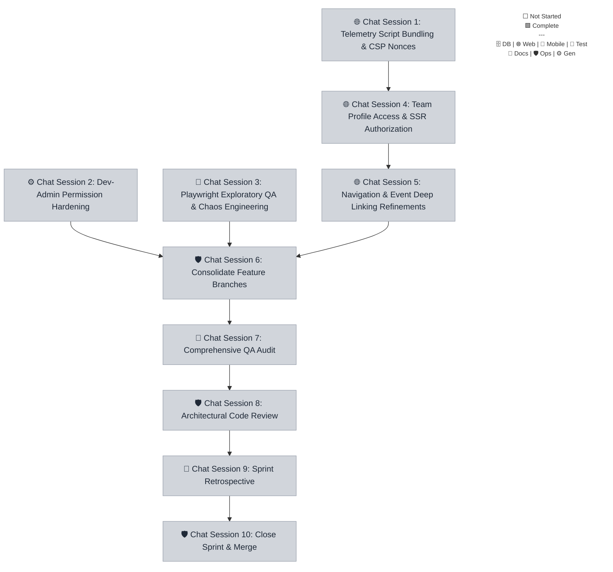

# Sprint 043 Playbook: Bugfix + Telemetry & Security Refinement

> **Playbook Path:** docs/sprints/sprint-043/playbook.md
>
> **Objective:** A technical debt and bugfix sprint focused on stabilizing CSP,
> telemetry routing, multi-tenant RBAC logic for dev-admins, and UX navigation
> flows. Also implements chaos engineering for resilience testing.

## Sprint Summary

A technical debt and bugfix sprint focused on stabilizing CSP, telemetry
routing, multi-tenant RBAC logic for dev-admins, and UX navigation flows. Also
implements chaos engineering for resilience testing.

## Fan-Out Execution Flow



## 📋 Execution Plan

### 🌐 Chat Session 1: Telemetry Script Bundling & CSP Nonces

[ ] **043.1.1** Telemetry Script Bundling & CSP Nonces

- **Mode**: Planning
- **Model**: Gemini 3.1 Pro (High) OR Gemini 3 Flash
- **Scope**: `@repo/web`
- **Dependencies**: None

```markdown
=== SYSTEM PROTOCOL & CAPABILITIES === **AGENT EXECUTION PROTOCOL:**
**Branching:** All task work MUST occur on the branch specified in your
instructions. If this task depends on previous tasks, ensure you have merged or
checked out their respective feature branches before beginning work.

**Close-out:**

1. Push your branch: `git push -u origin <branch-name>`
2. Read and strictly follow the steps defined in
   `.agents/workflows/sprint-finalize-task.md` to track state.
3. If you encounter an unresolvable error, execute:
   `node .agents/scripts/update-task-state.js 043.1.1 blocked` and alert the
   user.

=== VOLATILE TASK CONTEXT === **Persona**: engineer-web **Loaded Skills**:
`frontend/astro` **Sprint / Session**: Sprint 043 | Chat Session 1

**Instructions:**

1. **Task telemetry-csp-fix:**
   - Analyze Astro layouts and middleware to intercept requests and generate
     cryptographic nonces.
   - Inject nonces into Sentry, PostHog, and GrowthBook script tags to ensure
     strict CSP adherence without 404s.
   - Verify script execution ordering for performance optimization.
   - **Branching**: `git checkout -b task/sprint-043/telemetry-csp-fix`
   - **Mark Executing**:
     `node .agents/scripts/update-task-state.js 043.1.1 executing`
```

### ⚙️ Chat Session 2: Dev-Admin Permission Hardening

[ ] **043.2.1** Dev-Admin Permission Hardening

- **Mode**: Planning
- **Model**: Gemini 3.1 Pro (High) OR Gemini 3 Flash
- **Scope**: `@repo/api`
- **HITL Check**: ⚠️ Requires explicit user approval before execution.
- **Dependencies**: None

```markdown
=== SYSTEM PROTOCOL & CAPABILITIES === **AGENT EXECUTION PROTOCOL:**
**Branching:** All task work MUST occur on the branch specified in your
instructions. If this task depends on previous tasks, ensure you have merged or
checked out their respective feature branches before beginning work.

**Close-out:**

1. Push your branch: `git push -u origin <branch-name>`
2. Read and strictly follow the steps defined in
   `.agents/workflows/sprint-finalize-task.md` to track state.
3. If you encounter an unresolvable error, execute:
   `node .agents/scripts/update-task-state.js 043.2.1 blocked` and alert the
   user.

=== VOLATILE TASK CONTEXT === **Persona**: engineer **Loaded Skills**:
`backend/cloudflare-hono-architect`, `architecture/structured-output-zod`
**Sprint / Session**: Sprint 043 | Chat Session 2

> **🚨 HITL REQUIRED:** STOP and explicitly ask the user for approval via chat
> before proceeding with execution or commits.

**Instructions:**

1. **Task dev-admin-rbac:**
   - Update `requireRole` and `withTenantScope` utility functions to bypass
     tenant filtering for the `dev-admin` role.
   - Ensure regression testing covers standard admin/coach users to prevent
     privilege escalation.
   - Validate creation of events via dev-admin successfully bypasses strict
     tenant locks.
   - **Branching**: `git checkout -b task/sprint-043/dev-admin-rbac`
   - **Mark Executing**:
     `node .agents/scripts/update-task-state.js 043.2.1 executing`
```

### 🧪 Chat Session 3: Playwright Exploratory QA & Chaos Engineering

[ ] **043.3.1** Playwright Exploratory QA & Chaos Engineering

- **Mode**: Planning
- **Model**: Gemini 3.1 Pro (High) OR Gemini 3 Flash
- **Scope**: `root`
- **Dependencies**: None

```markdown
=== SYSTEM PROTOCOL & CAPABILITIES === **AGENT EXECUTION PROTOCOL:**
**Branching:** All task work MUST occur on the branch specified in your
instructions. If this task depends on previous tasks, ensure you have merged or
checked out their respective feature branches before beginning work.

**Close-out:**

1. Push your branch: `git push -u origin <branch-name>`
2. Read and strictly follow the steps defined in
   `.agents/workflows/sprint-finalize-task.md` to track state.
3. If you encounter an unresolvable error, execute:
   `node .agents/scripts/update-task-state.js 043.3.1 blocked` and alert the
   user.

=== VOLATILE TASK CONTEXT === **Persona**: qa-engineer **Loaded Skills**:
`qa/playwright` **Sprint / Session**: Sprint 043 | Chat Session 3

**Instructions:**

1. **Task chaos-engineering:**
   - Introduce a chaos testing toolkit into Playwright to randomly inject
     network timeouts and 500 status codes for `/v1` endpoints.
   - Verify fallback behaviors and User Error Toasts in crucial paths (Events,
     Media Upload) when requests abort.
   - Ensure documented exploratory scenarios are recorded for complex
     multi-persona flows.
   - **Branching**: `git checkout -b task/sprint-043/chaos-engineering`
   - **Mark Executing**:
     `node .agents/scripts/update-task-state.js 043.3.1 executing`
```

### 🌐 Chat Session 4: Team Profile Access & SSR Authorization

> **⚠️ PREREQUISITE:** Do not start this session until **Chat(s) 1** are fully
> marked as Complete.

[ ] **043.4.1** Team Profile Access & SSR Authorization

- **Mode**: Planning
- **Model**: Gemini 3.1 Pro (High) OR Gemini 3 Flash
- **Scope**: `@repo/web`
- **Dependencies**: `043.1.1`

```markdown
=== SYSTEM PROTOCOL & CAPABILITIES === **AGENT EXECUTION PROTOCOL:** Before
beginning work, you MUST run the pre-flight verification script to ensure all
dependencies are committed. Read and strictly follow the steps defined in
`.agents/workflows/sprint-verify-task-prerequisites.md` or run the manual
verification script for your specific task. If the script fails, STOP
immediately and ask the user to complete the blocking tasks.

**Branching:** All task work MUST occur on the branch specified in your
instructions. If this task depends on previous tasks, ensure you have merged or
checked out their respective feature branches before beginning work.

**Close-out:**

1. Push your branch: `git push -u origin <branch-name>`
2. Read and strictly follow the steps defined in
   `.agents/workflows/sprint-finalize-task.md` to track state.
3. If you encounter an unresolvable error, execute:
   `node .agents/scripts/update-task-state.js 043.4.1 blocked` and alert the
   user.

=== VOLATILE TASK CONTEXT === **Persona**: engineer-web **Loaded Skills**:
`frontend/astro-react-island-strategist` **Sprint / Session**: Sprint 043 | Chat
Session 4

**Pre-flight Task Validation (Run this first):**
`node .agents/scripts/verify-prereqs.js docs/sprints/sprint-043/playbook.md 043.4.1`

**Instructions:**

1. **Task team-roster-ssr:**
   - Harden `getTeamRosterRoute` in Astro SSR logic to pass the current JWT
     context/headers from `Astro.locals`.
   - Verify that tenant-scoped routes cleanly resolve without throwing 'Team not
     found' errors.
   - Check component hydration on the Team Profile page.
   - **Branching**: `git checkout -b task/sprint-043/team-roster-ssr`
   - **Mark Executing**:
     `node .agents/scripts/update-task-state.js 043.4.1 executing`
```

### 🌐 Chat Session 5: Navigation & Event Deep Linking Refinements

> **⚠️ PREREQUISITE:** Do not start this session until **Chat(s) 4** are fully
> marked as Complete.

[ ] **043.5.1** Navigation & Event Deep Linking Refinements

- **Mode**: Planning
- **Model**: Gemini 3.1 Pro (High) OR Gemini 3 Flash
- **Scope**: `@repo/web`
- **Dependencies**: `043.4.1`

```markdown
=== SYSTEM PROTOCOL & CAPABILITIES === **AGENT EXECUTION PROTOCOL:** Before
beginning work, you MUST run the pre-flight verification script to ensure all
dependencies are committed. Read and strictly follow the steps defined in
`.agents/workflows/sprint-verify-task-prerequisites.md` or run the manual
verification script for your specific task. If the script fails, STOP
immediately and ask the user to complete the blocking tasks.

**Branching:** All task work MUST occur on the branch specified in your
instructions. If this task depends on previous tasks, ensure you have merged or
checked out their respective feature branches before beginning work.

**Close-out:**

1. Push your branch: `git push -u origin <branch-name>`
2. Read and strictly follow the steps defined in
   `.agents/workflows/sprint-finalize-task.md` to track state.
3. If you encounter an unresolvable error, execute:
   `node .agents/scripts/update-task-state.js 043.5.1 blocked` and alert the
   user.

=== VOLATILE TASK CONTEXT === **Persona**: engineer-web **Loaded Skills**:
`frontend/astro`, `frontend/ui-accessibility-engineer` **Sprint / Session**:
Sprint 043 | Chat Session 5

**Pre-flight Task Validation (Run this first):**
`node .agents/scripts/verify-prereqs.js docs/sprints/sprint-043/playbook.md 043.5.1`

**Instructions:**

1. **Task ux-navigation-polishing:**
   - Migrate core links (Forms, Roster, Schedule, Locker Room) to the primary
     left sidebar.
   - Restore the Inbox notification icon to the top utility header.
   - Fix Dashboard event clicks to correctly populate `#id` or `?eventId` and
     highlight target events in the Schedule view.
   - Formalize 'Site Admin Dashboard' access in `CustomUserMenu` for admin
     roles.
   - **Branching**: `git checkout -b task/sprint-043/ux-navigation-polishing`
   - **Mark Executing**:
     `node .agents/scripts/update-task-state.js 043.5.1 executing`
```

### 🛡️ Chat Session 6: Consolidate Feature Branches

> **⚠️ PREREQUISITE:** Do not start this session until **Chat(s) 2, 3, 5** are
> fully marked as Complete.

[ ] **043.6.1** Consolidate Feature Branches

- **Mode**: Fast
- **Model**: Gemini 3.1 Pro (High) OR Gemini 3 Flash
- **HITL Check**: ⚠️ Requires explicit user approval before execution.
- **Dependencies**: `043.2.1`, `043.3.1`, `043.5.1`

```markdown
=== SYSTEM PROTOCOL & CAPABILITIES === **AGENT EXECUTION PROTOCOL:** Before
beginning work, you MUST run the pre-flight verification script to ensure all
dependencies are committed. Read and strictly follow the steps defined in
`.agents/workflows/sprint-verify-task-prerequisites.md` or run the manual
verification script for your specific task. If the script fails, STOP
immediately and ask the user to complete the blocking tasks.

**Branching:** All task work MUST occur on the branch specified in your
instructions. If this task depends on previous tasks, ensure you have merged or
checked out their respective feature branches before beginning work.

**Close-out:**

1. Push your branch: `git push -u origin <branch-name>`
2. Read and strictly follow the steps defined in
   `.agents/workflows/sprint-finalize-task.md` to track state.
3. If you encounter an unresolvable error, execute:
   `node .agents/scripts/update-task-state.js 043.6.1 blocked` and alert the
   user.

=== VOLATILE TASK CONTEXT === **Persona**: engineer **Loaded Skills**:
`architecture/monorepo-path-strategist`, `devops/git-flow-specialist` **Sprint /
Session**: Sprint 043 | Chat Session 6

> **🚨 HITL REQUIRED:** STOP and explicitly ask the user for approval via chat
> before proceeding with execution or commits.

**Pre-flight Task Validation (Run this first):**
`node .agents/scripts/verify-prereqs.js docs/sprints/sprint-043/playbook.md 043.6.1`

**Instructions:**

1. **Task sprint-integration:**
   - Execute the `sprint-integration` workflow for `043`.
   - **Branching**: `git checkout -b task/sprint-043/integration`
   - **Mark Executing**:
     `node .agents/scripts/update-task-state.js 043.6.1 executing`
```

### 🧪 Chat Session 7: Comprehensive QA Audit

> **⚠️ PREREQUISITE:** Do not start this session until **Chat(s) 6** are fully
> marked as Complete.

[ ] **043.7.1** Comprehensive QA Audit

- **Mode**: Fast
- **Model**: Gemini 3.1 Pro (High) OR Gemini 3 Flash
- **Dependencies**: `043.6.1`

```markdown
=== SYSTEM PROTOCOL & CAPABILITIES === **AGENT EXECUTION PROTOCOL:** Before
beginning work, you MUST run the pre-flight verification script to ensure all
dependencies are committed. Read and strictly follow the steps defined in
`.agents/workflows/sprint-verify-task-prerequisites.md` or run the manual
verification script for your specific task. If the script fails, STOP
immediately and ask the user to complete the blocking tasks.

**Branching:** All task work MUST occur on the branch specified in your
instructions. If this task depends on previous tasks, ensure you have merged or
checked out their respective feature branches before beginning work.

**Close-out:**

1. Push your branch: `git push -u origin <branch-name>`
2. Read and strictly follow the steps defined in
   `.agents/workflows/sprint-finalize-task.md` to track state.
3. If you encounter an unresolvable error, execute:
   `node .agents/scripts/update-task-state.js 043.7.1 blocked` and alert the
   user.

=== VOLATILE TASK CONTEXT === **Persona**: qa-engineer **Loaded Skills**:
`qa/playwright`, `qa/vitest` **Sprint / Session**: Sprint 043 | Chat Session 7

**Pre-flight Task Validation (Run this first):**
`node .agents/scripts/verify-prereqs.js docs/sprints/sprint-043/playbook.md 043.7.1`

**Instructions:**

1. **Task qa-audit:**
   - Execute the `sprint-testing` workflow for `043`.
   - **Branching**: `git checkout task/sprint-043/integration`
   - **Mark Executing**:
     `node .agents/scripts/update-task-state.js 043.7.1 executing`
```

### 🛡️ Chat Session 8: Architectural Code Review

> **⚠️ PREREQUISITE:** Do not start this session until **Chat(s) 7** are fully
> marked as Complete.

[ ] **043.8.1** Architectural Code Review

- **Mode**: Fast
- **Model**: Gemini 3.1 Pro (High) OR Gemini 3 Flash
- **Dependencies**: `043.7.1`

```markdown
=== SYSTEM PROTOCOL & CAPABILITIES === **AGENT EXECUTION PROTOCOL:** Before
beginning work, you MUST run the pre-flight verification script to ensure all
dependencies are committed. Read and strictly follow the steps defined in
`.agents/workflows/sprint-verify-task-prerequisites.md` or run the manual
verification script for your specific task. If the script fails, STOP
immediately and ask the user to complete the blocking tasks.

**Branching:** All task work MUST occur on the branch specified in your
instructions. If this task depends on previous tasks, ensure you have merged or
checked out their respective feature branches before beginning work.

**Close-out:**

1. Push your branch: `git push -u origin <branch-name>`
2. Read and strictly follow the steps defined in
   `.agents/workflows/sprint-finalize-task.md` to track state.
3. If you encounter an unresolvable error, execute:
   `node .agents/scripts/update-task-state.js 043.8.1 blocked` and alert the
   user.

=== VOLATILE TASK CONTEXT === **Persona**: architect **Loaded Skills**:
`architecture/autonomous-coding-standards`, `devops/git-flow-specialist`
**Sprint / Session**: Sprint 043 | Chat Session 8

**Pre-flight Task Validation (Run this first):**
`node .agents/scripts/verify-prereqs.js docs/sprints/sprint-043/playbook.md 043.8.1`

**Instructions:**

1. **Task code-review:**
   - Execute the `sprint-code-review` workflow for `043`.
   - **Branching**: `git checkout task/sprint-043/integration`
   - **Mark Executing**:
     `node .agents/scripts/update-task-state.js 043.8.1 executing`
```

### 📝 Chat Session 9: Sprint Retrospective

> **⚠️ PREREQUISITE:** Do not start this session until **Chat(s) 8** are fully
> marked as Complete.

[ ] **043.9.1** Sprint Retrospective

- **Mode**: Fast
- **Model**: Gemini 3.1 Pro (High) OR Gemini 3 Flash
- **Dependencies**: `043.8.1`

```markdown
=== SYSTEM PROTOCOL & CAPABILITIES === **AGENT EXECUTION PROTOCOL:** Before
beginning work, you MUST run the pre-flight verification script to ensure all
dependencies are committed. Read and strictly follow the steps defined in
`.agents/workflows/sprint-verify-task-prerequisites.md` or run the manual
verification script for your specific task. If the script fails, STOP
immediately and ask the user to complete the blocking tasks.

**Branching:** All task work MUST occur on the branch specified in your
instructions. If this task depends on previous tasks, ensure you have merged or
checked out their respective feature branches before beginning work.

**Close-out:**

1. Push your branch: `git push -u origin <branch-name>`
2. Read and strictly follow the steps defined in
   `.agents/workflows/sprint-finalize-task.md` to track state.
3. If you encounter an unresolvable error, execute:
   `node .agents/scripts/update-task-state.js 043.9.1 blocked` and alert the
   user.

=== VOLATILE TASK CONTEXT === **Persona**: product **Loaded Skills**:
`architecture/markdown` **Sprint / Session**: Sprint 043 | Chat Session 9

**Pre-flight Task Validation (Run this first):**
`node .agents/scripts/verify-prereqs.js docs/sprints/sprint-043/playbook.md 043.9.1`

**Instructions:**

1. **Task sprint-retro:**
   - Execute the `sprint-retro` workflow for `043`.
   - **Branching**: `git checkout -b task/sprint-043/sprint-retro`
   - **Mark Executing**:
     `node .agents/scripts/update-task-state.js 043.9.1 executing`
```

### 🛡️ Chat Session 10: Close Sprint & Merge

> **⚠️ PREREQUISITE:** Do not start this session until **Chat(s) 9** are fully
> marked as Complete.

[ ] **043.10.1** Close Sprint & Merge

- **Mode**: Fast
- **Model**: Gemini 3.1 Pro (High) OR Gemini 3 Flash
- **HITL Check**: ⚠️ Requires explicit user approval before execution.
- **Dependencies**: `043.9.1`

```markdown
=== SYSTEM PROTOCOL & CAPABILITIES === **AGENT EXECUTION PROTOCOL:** Before
beginning work, you MUST run the pre-flight verification script to ensure all
dependencies are committed. Read and strictly follow the steps defined in
`.agents/workflows/sprint-verify-task-prerequisites.md` or run the manual
verification script for your specific task. If the script fails, STOP
immediately and ask the user to complete the blocking tasks.

**Branching:** All task work MUST occur on the branch specified in your
instructions. If this task depends on previous tasks, ensure you have merged or
checked out their respective feature branches before beginning work.

**Close-out:**

1. Push your branch: `git push -u origin <branch-name>`
2. Read and strictly follow the steps defined in
   `.agents/workflows/sprint-finalize-task.md` to track state.
3. If you encounter an unresolvable error, execute:
   `node .agents/scripts/update-task-state.js 043.10.1 blocked` and alert the
   user.

=== VOLATILE TASK CONTEXT === **Persona**: devops-engineer **Loaded Skills**:
`devops/git-flow-specialist` **Sprint / Session**: Sprint 043 | Chat Session 10

> **🚨 HITL REQUIRED:** STOP and explicitly ask the user for approval via chat
> before proceeding with execution or commits.

**Pre-flight Task Validation (Run this first):**
`node .agents/scripts/verify-prereqs.js docs/sprints/sprint-043/playbook.md 043.10.1`

**Instructions:**

1. **Task close-sprint:**
   - Execute the `sprint-close-out` workflow for `043`.
   - **Branching**: `git checkout -b task/sprint-043/close-sprint`
   - **Mark Executing**:
     `node .agents/scripts/update-task-state.js 043.10.1 executing`
```
