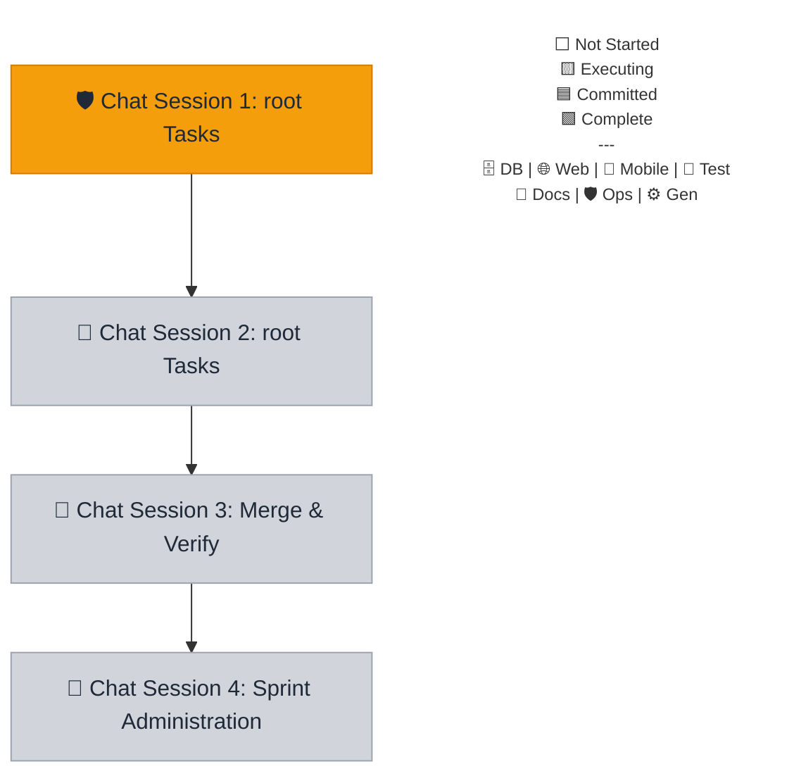

# Sprint 042 Playbook: DevOps & Infrastructure Hardening

> **Playbook Path**: `docs/sprints/sprint-042/playbook.md`

## Sprint Summary

Focuses on optimizing CI/CD build pipelines, hardening security posture, and
improving developer velocity by enforcing boundaries and modularizing actions.

## Fan-Out Execution Flow



### 🛡️ Chat Session 1: root Tasks (Sequential)

_Execution Rule: These tasks must be run sequentially in a single chat window.
This session operates exclusively within `root`._

- [~] **042.1.1 Linter & Formatter Boundary Enforcement**

**Mode:** Fast | **Model (First Choice):** Gemini 3.1 Pro (High) | **Model
(Second Choice):** Gemini 3 Flash

- Agent Prompt:

```text
Sprint 042.1.1: Adopt the `devops-engineer` persona from `.agents/personas/`.

**AGENT EXECUTION PROTOCOL (STRICT ADHERENCE REQUIRED):**
1. **Environment Reset**: Ensure you are on the sprint base branch: `git checkout sprint-042 ; git pull`. Verify with `git branch --show-current`. If the result is `main` or `master`, **STOP** and alert the user.
2. **Mark Executing**: Update the playbook — change your task checkbox to `- [~]` and set the Mermaid class for node `C1` to `executing` (if not already). Commit and push the state change.
3. **Execution**: Perform the task instructions below.
4. **Finalization**: Execute the `sprint-finalize-task` workflow explicitly for sprint step `042.1.1`.

**Active Skills:** `architecture/autonomous-coding-standards`

- Formalize the operational split between Biome (formatting) and ESLint (logic).
- Update package.json scripts globally to reflect this separation.
```

- [~] **042.1.2 CI Workflow Security Hardening**

**Mode:** Fast | **Model (First Choice):** Gemini 3.1 Pro (High) | **Model
(Second Choice):** Gemini 3 Flash

- Agent Prompt:

```text
Sprint 042.1.2: Adopt the `devops-engineer` persona from `.agents/personas/`.

**AGENT EXECUTION PROTOCOL (STRICT ADHERENCE REQUIRED):**
1. **Environment Reset**: Ensure you are on the sprint base branch: `git checkout sprint-042 ; git pull`. Verify with `git branch --show-current`. If the result is `main` or `master`, **STOP** and alert the user.
2. **Mark Executing**: Update the playbook — change your task checkbox to `- [~]` and set the Mermaid class for node `C1` to `executing` (if not already). Commit and push the state change.
3. **Execution**: Perform the task instructions below.
4. **Finalization**: Execute the `sprint-finalize-task` workflow explicitly for sprint step `042.1.2`.

**Active Skills:** `architecture/autonomous-coding-standards`

- Audit all `.github/workflows/*.yml` files to restrict top-level permissions to `contents: read`.
- Add explicit `write` access overrides to individual jobs that require them.
```

- [~] **042.1.3 Explicit Turbo Cache Outputs**

**Mode:** Fast | **Model (First Choice):** Gemini 3.1 Pro (High) | **Model
(Second Choice):** Gemini 3 Flash

- Agent Prompt:

```text
Sprint 042.1.3: Adopt the `devops-engineer` persona from `.agents/personas/`.

**AGENT EXECUTION PROTOCOL (STRICT ADHERENCE REQUIRED):**
1. **Environment Reset**: Ensure you are on the sprint base branch: `git checkout sprint-042 ; git pull`. Verify with `git branch --show-current`. If the result is `main` or `master`, **STOP** and alert the user.
2. **Mark Executing**: Update the playbook — change your task checkbox to `- [~]` and set the Mermaid class for node `C1` to `executing` (if not already). Commit and push the state change.
3. **Execution**: Perform the task instructions below.
4. **Finalization**: Execute the `sprint-finalize-task` workflow explicitly for sprint step `042.1.3`.

**Active Skills:** `architecture/autonomous-coding-standards`

- Update `turbo.json` with exhaustive `outputs` for `test:coverage` and `test:e2e`.
- Ensure output directory configurations match `vitest.config.ts` and `playwright.config.ts`.
```

### 🧪 Chat Session 2: root Tasks (Sequential)

_Execution Rule: These tasks must be run sequentially in a single chat window.
This session operates exclusively within `root`._

- [ ] **042.2.1 CI Environment Modularization**

**Mode:** Planning | **Model (First Choice):** Gemini 3.1 Pro (High) | **Model
(Second Choice):** Claude Sonnet 4.6 (Thinking)

- Agent Prompt:

```text
Sprint 042.2.1: Adopt the `devops-engineer` persona from `.agents/personas/`.

**AGENT EXECUTION PROTOCOL (STRICT ADHERENCE REQUIRED):**
1. **Environment Reset**: Ensure you are on the sprint base branch: `git checkout sprint-042 ; git pull`. Verify with `git branch --show-current`. If the result is `main` or `master`, **STOP** and alert the user.
2. **Mark Executing**: Update the playbook — change your task checkbox to `- [~]` and set the Mermaid class for node `C2` to `executing` (if not already). Commit and push the state change.
3. **Prerequisite Check**: Execute the `sprint-verify-task-prerequisites` workflow for sprint step `042.2.1`.
   - **Dependencies**: `042.1.2`
4. **Execution**: Perform the task instructions below.
5. **Finalization**: Execute the `sprint-finalize-task` workflow explicitly for sprint step `042.2.1`.

**Active Skills:** `architecture/autonomous-coding-standards`

- Extract Playwright setup, browser installations, and environment variable routines into a reusable composite action at `.github/actions/setup-playwright/`.
- Update all relevant workflows to utilize this new composite action.
```

- [ ] **042.2.2 Turborepo CI Caching**

**Mode:** Fast | **Model (First Choice):** Gemini 3.1 Pro (High) | **Model
(Second Choice):** Gemini 3 Flash

- Agent Prompt:

```text
Sprint 042.2.2: Adopt the `devops-engineer` persona from `.agents/personas/`.

**AGENT EXECUTION PROTOCOL (STRICT ADHERENCE REQUIRED):**
1. **Environment Reset**: Ensure you are on the sprint base branch: `git checkout sprint-042 ; git pull`. Verify with `git branch --show-current`. If the result is `main` or `master`, **STOP** and alert the user.
2. **Mark Executing**: Update the playbook — change your task checkbox to `- [~]` and set the Mermaid class for node `C2` to `executing` (if not already). Commit and push the state change.
3. **Prerequisite Check**: Execute the `sprint-verify-task-prerequisites` workflow for sprint step `042.2.2`.
   - **Dependencies**: `042.1.3`
4. **Execution**: Perform the task instructions below.
5. **Finalization**: Execute the `sprint-finalize-task` workflow explicitly for sprint step `042.2.2`.

**Active Skills:** `architecture/autonomous-coding-standards`

- Implement `actions/cache` in GitHub Action workflows for the `.turbo` directory.
- Ensure cache keys properly hash source files and dependency lockfiles to skip redundant compilation.
```

### 🧪 Chat Session 3: Merge & Verify (Sequential)

_Execution Rule: Open a NEW chat window after code complete._

- [ ] **042.3.1 Sprint Integration**

**Mode:** Fast | **Model (First Choice):** Gemini 3.1 Pro (High) | **Model
(Second Choice):** Gemini 3 Flash

- Agent Prompt:

```text
Sprint 042.3.1: Adopt the `engineer` persona from `.agents/personas/`.

**AGENT EXECUTION PROTOCOL (STRICT ADHERENCE REQUIRED):**
1. **Environment Reset**: Ensure you are on the sprint base branch: `git checkout sprint-042 ; git pull`. Verify with `git branch --show-current`. If the result is `main` or `master`, **STOP** and alert the user.
2. **Mark Executing**: Update the playbook — change your task checkbox to `- [~]` and set the Mermaid class for node `C3` to `executing` (if not already). Commit and push the state change.
3. **Prerequisite Check**: Execute the `sprint-verify-task-prerequisites` workflow for sprint step `042.3.1`.
   - **Dependencies**: `042.1.1`, `042.2.1`, `042.2.2`
4. **Execution**: Perform the task instructions below.
5. **Finalization**: Execute the `sprint-finalize-task` workflow explicitly for sprint step `042.3.1`.

**Active Skills:** `architecture/monorepo-path-strategist, devops/git-flow-specialist`

Execute the `sprint-integration` workflow for `42`.
```

- [ ] **042.3.2 Sprint QA & Testing**

**Mode:** Fast | **Model (First Choice):** Gemini 3.1 Pro (High) | **Model
(Second Choice):** Gemini 3 Flash

- Agent Prompt:

```text
Sprint 042.3.2: Adopt the `qa-engineer` persona from `.agents/personas/`.

**AGENT EXECUTION PROTOCOL (STRICT ADHERENCE REQUIRED):**
1. **Environment Reset**: Ensure you are on the sprint base branch: `git checkout sprint-042 ; git pull`. Verify with `git branch --show-current`. If the result is `main` or `master`, **STOP** and alert the user.
2. **Mark Executing**: Update the playbook — change your task checkbox to `- [~]` and set the Mermaid class for node `C3` to `executing` (if not already). Commit and push the state change.
3. **Prerequisite Check**: Execute the `sprint-verify-task-prerequisites` workflow for sprint step `042.3.2`.
   - **Dependencies**: `042.3.1`
4. **Execution**: Perform the task instructions below.
5. **Finalization**: Execute the `sprint-finalize-task` workflow explicitly for sprint step `042.3.2`.

**Active Skills:** `qa/vitest, qa/playwright`

Execute the `sprint-testing` workflow for `42`.
```

### 📝 Chat Session 4: Sprint Administration (Sequential)

_Execution Rule: Run this in the primary PM planning chat once all PRs are
merged._

- [ ] **042.4.1 Sprint Code Review**

**Mode:** Planning | **Model (First Choice):** Gemini 3.1 Pro (High) | **Model
(Second Choice):** Claude Sonnet 4.6 (Thinking)

- Agent Prompt:

```text
Sprint 042.4.1: Adopt the `architect` persona from `.agents/personas/`.

**AGENT EXECUTION PROTOCOL (STRICT ADHERENCE REQUIRED):**
1. **Environment Reset**: Ensure you are on the sprint base branch: `git checkout sprint-042 ; git pull`. Verify with `git branch --show-current`. If the result is `main` or `master`, **STOP** and alert the user.
2. **Mark Executing**: Update the playbook — change your task checkbox to `- [~]` and set the Mermaid class for node `C4` to `executing` (if not already). Commit and push the state change.
3. **Prerequisite Check**: Execute the `sprint-verify-task-prerequisites` workflow for sprint step `042.4.1`.
   - **Dependencies**: `042.3.2`
4. **Execution**: Perform the task instructions below.
5. **Finalization**: Execute the `sprint-finalize-task` workflow explicitly for sprint step `042.4.1`.

**Active Skills:** `devops/git-flow-specialist`

Execute the `sprint-code-review` workflow for `42`.
```

- [ ] **042.4.2 Sprint Retrospective**

**Mode:** Planning | **Model (First Choice):** Gemini 3.1 Pro (High) | **Model
(Second Choice):** Claude Sonnet 4.6 (Thinking)

- Agent Prompt:

```text
Sprint 042.4.2: Adopt the `product` persona from `.agents/personas/`.

**AGENT EXECUTION PROTOCOL (STRICT ADHERENCE REQUIRED):**
1. **Environment Reset**: Ensure you are on the sprint base branch: `git checkout sprint-042 ; git pull`. Verify with `git branch --show-current`. If the result is `main` or `master`, **STOP** and alert the user.
2. **Mark Executing**: Update the playbook — change your task checkbox to `- [~]` and set the Mermaid class for node `C4` to `executing` (if not already). Commit and push the state change.
3. **Prerequisite Check**: Execute the `sprint-verify-task-prerequisites` workflow for sprint step `042.4.2`.
   - **Dependencies**: `042.4.1`
4. **Execution**: Perform the task instructions below.
5. **Finalization**: Execute the `sprint-finalize-task` workflow explicitly for sprint step `042.4.2`.

**Active Skills:** `architecture/markdown`

Execute the `sprint-retro` workflow for `42`.
```

- [ ] **042.4.3 Sprint Close Out**

**Mode:** Fast | **Model (First Choice):** Gemini 3.1 Pro (High) | **Model
(Second Choice):** Gemini 3 Flash

- Agent Prompt:

```text
Sprint 042.4.3: Adopt the `devops-engineer` persona from `.agents/personas/`.

**AGENT EXECUTION PROTOCOL (STRICT ADHERENCE REQUIRED):**
1. **Environment Reset**: Ensure you are on the sprint base branch: `git checkout sprint-042 ; git pull`. Verify with `git branch --show-current`. If the result is `main` or `master`, **STOP** and alert the user.
2. **Mark Executing**: Update the playbook — change your task checkbox to `- [~]` and set the Mermaid class for node `C4` to `executing` (if not already). Commit and push the state change.
3. **Prerequisite Check**: Execute the `sprint-verify-task-prerequisites` workflow for sprint step `042.4.3`.
   - **Dependencies**: `042.4.2`
4. **Execution**: Perform the task instructions below.
5. **Finalization**: Execute the `sprint-finalize-task` workflow explicitly for sprint step `042.4.3`.

**Active Skills:** `devops/git-flow-specialist`

Execute the `sprint-close-out` workflow for `42`.
```
