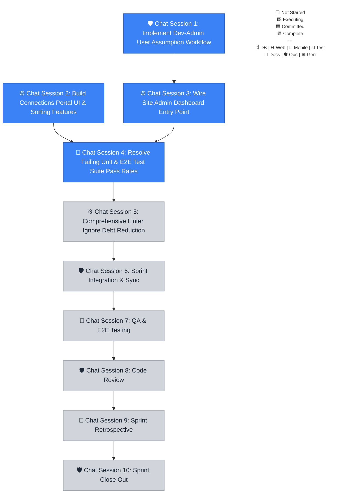

# Sprint 041 Playbook: Exploratory UX & Admin Tooling

> **Playbook Path**: `docs/sprints/sprint-041/playbook.md`

## Sprint Summary

This sprint delivers a dedicated Connections Portal for granular social graph management and introduces critical Dev-Admin tooling for user assumption and dashboard access. Furthermore, it focuses on stabilizing the CI pipeline by resolving test suite flakiness and reducing linter ignore debt.

## Fan-Out Execution Flow



### 🛡️ Chat Session 1: Implement Dev-Admin User Assumption Workflow (Concurrent)

_Execution Rule: Open a NEW chat window. This session runs concurrently with other sessions at the same level. This session operates exclusively within `@repo/api`._

- [/] **041.1.1 Implement Dev-Admin User Assumption Workflow**

**Mode:** Planning | **Model (First Choice):** Claude Sonnet 4.6 (Thinking) | **Model (Second Choice):** Gemini 3.1 Pro (High)

```text
Sprint 041.1.1: Adopt the `engineer` persona from `.agents/personas/`.

**AGENT EXECUTION PROTOCOL (STRICT ADHERENCE REQUIRED):**
1. **Environment Reset**: Ensure you are on the sprint base branch: `git checkout sprint-041 ; git pull`. Verify with `git branch --show-current`. If the result is `main` or `master`, **STOP** and alert the user.
2. **Mark Executing**: Update the playbook — change your task checkbox to `- [~]` and set the Mermaid class for node `C1` to `executing` (if not already). Commit and push the state change.
3. **Execution**: Perform the task instructions below.
4. **Finalization**: Execute the `sprint-finalize-task` workflow explicitly for sprint step `041.1.1`.

**Active Skills:** `backend/clerk-auth, backend/cloudflare-workers`

Implement dynamic role and user assumption capabilities for dev-admins to troubleshoot and verify multi-persona workflows.
- Add secure API routes and Clerk Actor configurations to enable a dev-admin to temporarily assume a standard user role.
- Ensure an immutable audit log writes telemetry data whenever a dev-admin activates this override.
```

### 🌐 Chat Session 2: Build Connections Portal UI & Sorting Features (Concurrent)

_Execution Rule: Open a NEW chat window. This session runs concurrently with other sessions at the same level. This session operates exclusively within `@repo/web`._

- [/] **041.2.1 Build Connections Portal UI & Sorting Features**

**Mode:** Planning | **Model (First Choice):** Claude Sonnet 4.6 (Thinking) | **Model (Second Choice):** Gemini 3.1 Pro (High)

```text
Sprint 041.2.1: Adopt the `engineer-web` persona from `.agents/personas/`.

**AGENT EXECUTION PROTOCOL (STRICT ADHERENCE REQUIRED):**
1. **Environment Reset**: Ensure you are on the sprint base branch: `git checkout sprint-041 ; git pull`. Verify with `git branch --show-current`. If the result is `main` or `master`, **STOP** and alert the user.
2. **Mark Executing**: Update the playbook — change your task checkbox to `- [~]` and set the Mermaid class for node `C2` to `executing` (if not already). Commit and push the state change.
3. **Execution**: Perform the task instructions below.
4. **Finalization**: Execute the `sprint-finalize-task` workflow explicitly for sprint step `041.2.1`.

**Active Skills:** `frontend/astro-react-island-strategist, frontend/tailwind-v4`

Implement a high-fidelity connection management interface allowing users to view, search, sort, filter, and delete connections.
- Add a clickable `# Connections` entry point to the homepage profile card.
- Ensure the new page is fully responsive and leverages optimized directory state calls to manage connections.
- Keep styling fully consistent with the established design system.
```

### 🌐 Chat Session 3: Wire Site Admin Dashboard Entry Point (Sequential)

_Execution Rule: Continue sequentially in the current chat window. This session operates exclusively within `@repo/web`._

- [/] **041.3.1 Wire Site Admin Dashboard Entry Point**

**Mode:** Fast | **Model (First Choice):** Gemini 3 Flash | **Model (Second Choice):** Claude Sonnet 4.6 (Thinking)

```text
Sprint 041.3.1: Adopt the `engineer-web` persona from `.agents/personas/`.

**AGENT EXECUTION PROTOCOL (STRICT ADHERENCE REQUIRED):**
1. **Environment Reset**: Ensure you are on the sprint base branch: `git checkout sprint-041 ; git pull`. Verify with `git branch --show-current`. If the result is `main` or `master`, **STOP** and alert the user.
2. **Mark Executing**: Update the playbook — change your task checkbox to `- [~]` and set the Mermaid class for node `C3` to `executing` (if not already). Commit and push the state change.
3. **Prerequisite Check**: Execute the `sprint-verify-task-prerequisites` workflow for sprint step `041.3.1`.
   - **Dependencies**: `041.1.1`
4. **Execution**: Perform the task instructions below.
5. **Finalization**: Execute the `sprint-finalize-task` workflow explicitly for sprint step `041.3.1`.

**Active Skills:** `frontend/astro-react-island-strategist, security/zero-trust-security-engineer`

Add a dedicated link to the Site Admin Dashboard within the user's profile picture dropdown menu.
- Render this link exclusively when the authenticated user possesses the `dev-admin` role.
- Establish frontend hydration boundaries if dynamic state checking is utilized inside an Astro page.
```

### 🧪 Chat Session 4: Resolve Failing Unit & E2E Test Suite Pass Rates (Sequential)

_Execution Rule: Continue sequentially in the current chat window. This session operates exclusively within `root`._

- [/] **041.4.1 Resolve Failing Unit & E2E Test Suite Pass Rates**

**Mode:** Planning | **Model (First Choice):** Claude Opus 4.6 (Thinking) | **Model (Second Choice):** Gemini 3.1 Pro (High)

```text
Sprint 041.4.1: Adopt the `qa-engineer` persona from `.agents/personas/`.

**AGENT EXECUTION PROTOCOL (STRICT ADHERENCE REQUIRED):**
1. **Environment Reset**: Ensure you are on the sprint base branch: `git checkout sprint-041 ; git pull`. Verify with `git branch --show-current`. If the result is `main` or `master`, **STOP** and alert the user.
2. **Mark Executing**: Update the playbook — change your task checkbox to `- [~]` and set the Mermaid class for node `C4` to `executing` (if not already). Commit and push the state change.
3. **Prerequisite Check**: Execute the `sprint-verify-task-prerequisites` workflow for sprint step `041.4.1`.
   - **Dependencies**: `041.2.1`, `041.3.1`
4. **Execution**: Perform the task instructions below.
5. **Finalization**: Execute the `sprint-finalize-task` workflow explicitly for sprint step `041.4.1`.

**Active Skills:** `qa/playwright, qa/vitest, qa/resilient-qa-automation`

Audit and resolve all failing unit and E2E tests within the monorepo to achieve a consistent 100% pass status.
- Address any regressions introduced by the Sprint 40 architecture refactoring.
- Specifically stabilize flakiness in React Native component tests within the mobile workspace.
- Ensure 100% network isolation for E2E specs.
```

### ⚙️ Chat Session 5: Comprehensive Linter Ignore Debt Reduction (Sequential)

_Execution Rule: Continue sequentially in the current chat window. This session operates exclusively within `root`._

- [ ] **041.5.1 Comprehensive Linter Ignore Debt Reduction**

**Mode:** Planning | **Model (First Choice):** Claude Sonnet 4.6 (Thinking) | **Model (Second Choice):** Gemini 3.1 Pro (High)

```text
Sprint 041.5.1: Adopt the `engineer` persona from `.agents/personas/`.

**AGENT EXECUTION PROTOCOL (STRICT ADHERENCE REQUIRED):**
1. **Environment Reset**: Ensure you are on the sprint base branch: `git checkout sprint-041 ; git pull`. Verify with `git branch --show-current`. If the result is `main` or `master`, **STOP** and alert the user.
2. **Mark Executing**: Update the playbook — change your task checkbox to `- [~]` and set the Mermaid class for node `C5` to `executing` (if not already). Commit and push the state change.
3. **Prerequisite Check**: Execute the `sprint-verify-task-prerequisites` workflow for sprint step `041.5.1`.
   - **Dependencies**: `041.4.1`
4. **Execution**: Perform the task instructions below.
5. **Finalization**: Execute the `sprint-finalize-task` workflow explicitly for sprint step `041.5.1`.

**Active Skills:** `architecture/autonomous-coding-standards`

Conduct a comprehensive audit of all `biome-ignore`, `eslint-disable`, and `ts-ignore` markers across the entire monorepo.
- Eliminate ignores by resolving underlying logic issues and explicitly fixing typescript types.
- Verify structural code health and ensure clean analysis passes without redundant exclusions.
```

### 🛡️ Chat Session 6: Sprint Integration & Sync (Sequential)

_Execution Rule: Continue sequentially in the current chat window after code complete._

- [ ] **041.6.1 Integration**

**Mode:** Fast | **Model (First Choice):** Claude Sonnet 4.6 (Thinking) | **Model (Second Choice):** Gemini 3 Flash

```text
Sprint 041.6.1: Adopt the `engineer` persona from `.agents/personas/`.

**AGENT EXECUTION PROTOCOL (STRICT ADHERENCE REQUIRED):**
1. **Environment Reset**: Ensure you are on the sprint base branch: `git checkout sprint-041 ; git pull`. Verify with `git branch --show-current`. If the result is `main` or `master`, **STOP** and alert the user.
2. **Mark Executing**: Update the playbook — change your task checkbox to `- [~]` and set the Mermaid class for node `C6` to `executing` (if not already). Commit and push the state change.
3. **Prerequisite Check**: Execute the `sprint-verify-task-prerequisites` workflow for sprint step `041.6.1`.
   - **Dependencies**: `041.5.1`
4. **Execution**: Perform the task instructions below.
5. **Finalization**: Execute the `sprint-finalize-task` workflow explicitly for sprint step `041.6.1`.

**Active Skills:** `architecture/monorepo-path-strategist, devops/git-flow-specialist`

Execute the `sprint-integration` workflow for `41`.
```

### 🧪 Chat Session 7: QA & E2E Testing (Sequential)

_Execution Rule: Continue sequentially in the current chat window after code complete._

- [ ] **041.7.1 QA**

**Mode:** Fast | **Model (First Choice):** Claude Sonnet 4.6 (Thinking) | **Model (Second Choice):** Gemini 3 Flash

```text
Sprint 041.7.1: Adopt the `qa-engineer` persona from `.agents/personas/`.

**AGENT EXECUTION PROTOCOL (STRICT ADHERENCE REQUIRED):**
1. **Environment Reset**: Ensure you are on the sprint base branch: `git checkout sprint-041 ; git pull`. Verify with `git branch --show-current`. If the result is `main` or `master`, **STOP** and alert the user.
2. **Mark Executing**: Update the playbook — change your task checkbox to `- [~]` and set the Mermaid class for node `C7` to `executing` (if not already). Commit and push the state change.
3. **Prerequisite Check**: Execute the `sprint-verify-task-prerequisites` workflow for sprint step `041.7.1`.
   - **Dependencies**: `041.6.1`
4. **Execution**: Perform the task instructions below.
5. **Finalization**: Execute the `sprint-finalize-task` workflow explicitly for sprint step `041.7.1`.

**Active Skills:** `qa/resilient-qa-automation`

Execute the `plan-qa-testing` workflow for `41`.
```

### 🛡️ Chat Session 8: Code Review (Sequential)

_Execution Rule: Continue sequentially in the current chat window once all PRs are merged._

- [ ] **041.8.1 Code Review**

**Mode:** Fast | **Model (First Choice):** Claude Opus 4.6 (Thinking) | **Model (Second Choice):** Gemini 3 Flash

```text
Sprint 041.8.1: Adopt the `architect` persona from `.agents/personas/`.

**AGENT EXECUTION PROTOCOL (STRICT ADHERENCE REQUIRED):**
1. **Environment Reset**: Ensure you are on the sprint base branch: `git checkout sprint-041 ; git pull`. Verify with `git branch --show-current`. If the result is `main` or `master`, **STOP** and alert the user.
2. **Mark Executing**: Update the playbook — change your task checkbox to `- [~]` and set the Mermaid class for node `C8` to `executing` (if not already). Commit and push the state change.
3. **Prerequisite Check**: Execute the `sprint-verify-task-prerequisites` workflow for sprint step `041.8.1`.
   - **Dependencies**: `041.7.1`
4. **Execution**: Perform the task instructions below.
5. **Finalization**: Execute the `sprint-finalize-task` workflow explicitly for sprint step `041.8.1`.

**Active Skills:** `architecture/autonomous-coding-standards, devops/git-flow-specialist`

Execute the `sprint-code-review` workflow for `41`.
```

### 📝 Chat Session 9: Sprint Retrospective (Sequential)

_Execution Rule: Continue sequentially in the current chat window once all PRs are merged._

- [ ] **041.9.1 Sprint Retro**

**Mode:** Fast | **Model (First Choice):** Claude Sonnet 4.6 (Thinking) | **Model (Second Choice):** Gemini 3 Flash

```text
Sprint 041.9.1: Adopt the `product` persona from `.agents/personas/`.

**AGENT EXECUTION PROTOCOL (STRICT ADHERENCE REQUIRED):**
1. **Environment Reset**: Ensure you are on the sprint base branch: `git checkout sprint-041 ; git pull`. Verify with `git branch --show-current`. If the result is `main` or `master`, **STOP** and alert the user.
2. **Mark Executing**: Update the playbook — change your task checkbox to `- [~]` and set the Mermaid class for node `C9` to `executing` (if not already). Commit and push the state change.
3. **Prerequisite Check**: Execute the `sprint-verify-task-prerequisites` workflow for sprint step `041.9.1`.
   - **Dependencies**: `041.8.1`
4. **Execution**: Perform the task instructions below.
5. **Finalization**: Execute the `sprint-finalize-task` workflow explicitly for sprint step `041.9.1`.

**Active Skills:** `architecture/markdown`

Execute the `sprint-retro` workflow for `41`.
```

### 🛡️ Chat Session 10: Sprint Close Out (Sequential)

_Execution Rule: Continue sequentially in the current chat window once the Sprint Retrospective is complete._

- [ ] **041.10.1 Sprint Close Out (`close-sprint`)**

**Mode:** Fast | **Model (First Choice):** Claude Sonnet 4.6 (Thinking) | **Model (Second Choice):** Gemini 3 Flash

```text
Sprint 041.10.1: Adopt the `product` persona from `.agents/personas/`.

**AGENT EXECUTION PROTOCOL (STRICT ADHERENCE REQUIRED):**
1. **Environment Reset**: Ensure you are on the sprint base branch: `git checkout sprint-041 ; git pull`. Verify with `git branch --show-current`. If the result is `main` or `master`, **STOP** and alert the user.
2. **Mark Executing**: Update the playbook — change your task checkbox to `- [~]` and set the Mermaid class for node `C10` to `executing` (if not already). Commit and push the state change.
3. **Prerequisite Check**: Execute the `sprint-verify-task-prerequisites` workflow for sprint step `041.10.1`.
   - **Dependencies**: `041.9.1`
4. **Execution**: Perform the task instructions below.
5. **Finalization**: Execute the `sprint-finalize-task` workflow explicitly for sprint step `041.10.1`.

**Active Skills:** `devops/git-flow-specialist`

Execute the `sprint-close-out` workflow for `41`.
```